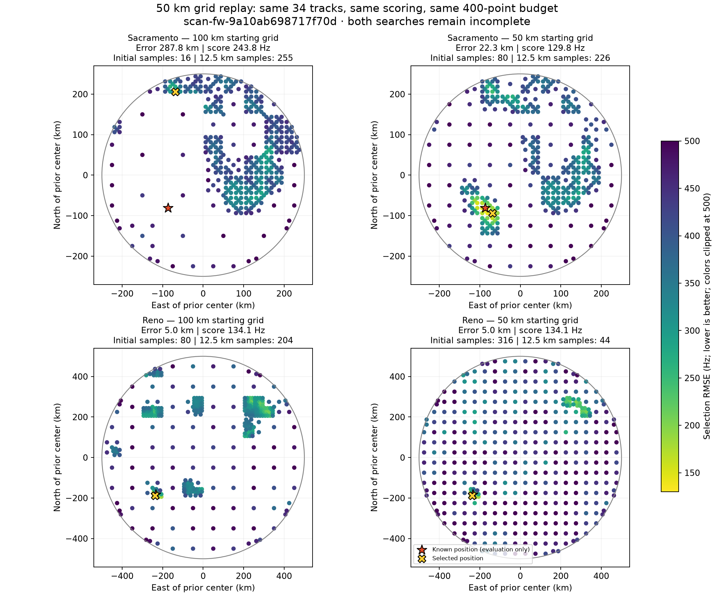

# Sacramento/Reno localization: 50 km starting-grid replay

Date: 2026-09-23. Session: `scan-fw-9a10ab698717f70d`.
This is a bounded replay of existing scan analysis; no new RF was collected.
The experiment changes only the initial spatial grid from 100 km to 50 km.
It does not change or deploy production defaults.

## Result

Starting at 50 km spacing causes Sacramento to explore the previously missed
region containing the known receiver location. Its selected position error
falls from 287.8 km to 22.3 km. Reno selects exactly the same 5.0 km-error
position as before. Both replays stop at the unchanged 400-point budget;
neither is an exhaustive regional search or a validated position fix.

| Prior | Initial grid | Position error | Selection RMSE | Selected-point spacing | Initial samples | 12.5 km samples |
| --- | ---: | ---: | ---: | ---: | ---: | ---: |
| Sacramento | 100 km | 287.814 km | 243.796 Hz | 12.5 km | 16 | 255 |
| Sacramento | 50 km | 22.296 km | 129.753 Hz | 12.5 km | 80 | 226 |
| Reno | 100 km | 4.999 km | 134.063 Hz | 25 km | 80 | 204 |
| Reno | 50 km | 4.999 km | 134.063 Hz | 25 km | 316 | 44 |



Dots are evaluated positions, colored by selection RMSE. The star marks the
known position, used only for evaluation; the cross marks the selected point.
Axes are east/north offsets from each prior center. Sacramento and Reno panels
use different extents to show their respective 250 km and 500 km search radii.

## Why the original Sacramento run failed

The reference location is approximately 87.04 km west and 80.99 km south of
Sacramento, 118.89 km from the center and inside the 250 km search radius.
Its original 100 km cell was sampled at (-50, -50) km, about 48 km away.
That sample scored 473.519 Hz. The search prioritized other cells and never
subdivided this cell before exhausting the budget; it remains in the saved
deferred frontier. Fine resolution elsewhere did not repair missing coverage.

Reno's shifted grid sampled its corresponding cell at (-250, -150) km with
313.707 Hz RMSE. Refinement reached (-225, -175) km at 214.587 Hz and then
(-237.5, -187.5) km at 134.063 Hz. That last point was the selected location.
It is also inside Sacramento's allowed search region.

The 50 km replay evaluates (-75, -75) km from Sacramento in its initial pass,
about 13.4 km from the reference. Its 203.803 Hz score leads to exploration
of the correct region. The selected point is (-68.75, -93.75) km, at
37.7358727834 degrees latitude, -122.2761854813 degrees longitude.

## Inputs and scoring held fixed

- Both priors use all 34 eligible reconstructed tracks and 733 observations.
  There is no longest-track count limit. Eligibility requires at least three
  seconds and six observations; actual spans are 3.25 to 44.84 seconds.
- Track weights count occupied one-second bins, totaling 429. The four largest
  weights are 40, 36, 34, and 28 bins (32.2% of total weight).
- The objective is duration-weighted RMSE with each track RMS capped at 800 Hz.
  The 200 Hz qualifying threshold does not remove poor-fitting tracks from
  the objective.
- The same causal TLE snapshot, candidate catalogue, deterministic training
  partitions, frequency-offset fitting, and time offsets (-5 through +5 s)
  are used. Satellite identity is selected on evaluation RMS; this score is
  not an independent held-out likelihood or calibrated confidence.
- Prior centers and radii remain Sacramento (38.5816, -121.4944), 250 km, and
  Reno (39.5296, -119.8138), 500 km. The region-size parameter remains 1000 km.
- Grid levels change from [100, 50, 25, 12.5] km to [50, 25, 12.5] km. The same
  adaptive best-first algorithm and 400-point budget apply to each prior.

The finer initial grid spends more budget on coverage. Reno uses 316 initial
points rather than 80, leaving only 84 evaluations for refinement. It retains
the original winner in this scan, but this experiment does not establish that
the same budget suffices for other scans.

## Validation and limitations

The replay asserted exact agreement with the saved input-manifest digest,
analysis-manifest digest, evidence digest, and complete track-evidence records,
including randomized partitions. It rebuilt prediction banks using production
pipeline modules. Before each search it rescored the original selected point:
both RMSE values reproduced exactly (243.79555324157198 Hz and
134.06309878187943 Hz). These two checks are recorded in the replay JSON and
are separate from each search's 400-point budget. Runtime was 150.6 seconds
with four worker processes, including bank construction and these checks.

The scoring, prediction, and input-preparation source files were also compared
byte-for-byte with the deployed source while preparing this report and matched
repository revision `bc54994d049eabbbdae10bd2d10600110614b968`.
The original replay invoked the deployed environment through `current-api`;
its exact resolved release revision was not captured in the replay receipt.

Sacramento's new score is lower than Reno's despite its larger position error.
Thus finer initial coverage addresses this search failure, but does not establish
that the score minimum is the true receiver position. Remaining model error,
identity ambiguity, and sensitivity to grid alignment are not separated by
this experiment. No production settings were changed.

## Evidence and reproduction

- [Original saved document](figures/2026_09_23_scan_9a10_50km/position-document.json)
- [50 km replay, traces, frontier, and baseline checks](figures/2026_09_23_scan_9a10_50km/position-50km.json)
- [Replay script](figures/2026_09_23_scan_9a10_50km/replay_50km.py)
- [Plot script](figures/2026_09_23_scan_9a10_50km/plot_50km.py)

From the repository root, using a project environment with its dependencies:

```bash
PYTHONPATH=src OPENBLAS_NUM_THREADS=1 OMP_NUM_THREADS=1 timeout 600 \
  .venv/bin/python reports/figures/2026_09_23_scan_9a10_50km/replay_50km.py \
  --bulk-root /srv/bulk/leo --tle-root /var/lib/leo/tle \
  --output /tmp/scan-9a10-50km-replay-new.json

.venv/bin/python reports/figures/2026_09_23_scan_9a10_50km/plot_50km.py
```

The numerical replay requires read access to the original local scan analysis
and TLE archive. It refuses a pre-existing output path and asserts the recorded
input identity before searching. The plot command uses the committed JSON
evidence and needs no scan storage or radio access. The script wrappers were
adjusted for portable report paths after the recorded replay; the search and
scoring calls are unchanged.
