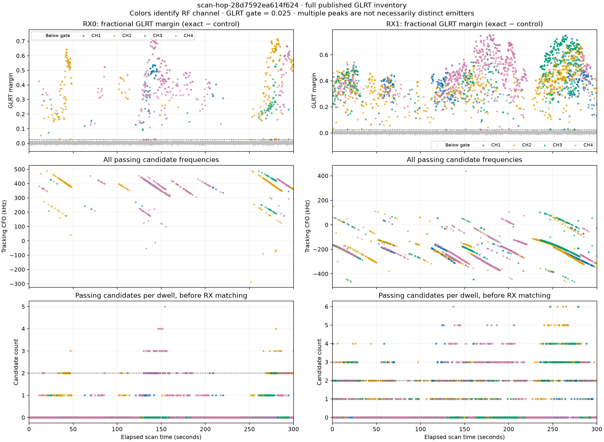

# GLRT versus time and multiple-candidate dwells

There are many more multiple-GLRT-candidate dwells than the five plotted in the
two-source phase replay. Five is the result of the final conservative matching
and frequency-distinctness rules, not the number of multi-detection captures.
This audit reads all published analysis metadata for
`scan-hop-28d7592ea614f624`; it performs no new IQ analysis or RF collection.

The left column is RX0 and the right is RX1. The top row shows every available
fractional GLRT margin (exact pilot score minus control score), with passing
candidates colored by RF channel and below-gate candidates in gray. The margin
gate is 0.025. The middle row shows every passing candidate's tracking CFO;
these values may include pilot-frequency aliases. The bottom row counts passing
candidates in each dwell, including zero counts. No phase score enters this
plot or inventory.

| Inventory over 2,360 dwells | RX0 | RX1 |
|---|---:|---:|
| Passing candidate records | 637 | 2,543 |
| Dwells with at least one passing candidate | 394 | 1,085 |
| Dwells with at least two passing candidates | 199 | 827 |

There are **890 dwells** with at least two passing candidates in either
receiver, and **136 dwells** with at least two in both receivers. Timing and
consistent receiver-frequency-offset matching retain multiple one-to-one
matches in **112 dwells**. The final distinctness rule leaves **five**.

That last rule rejects a second matched candidate when its tracking CFO is
within 5 kHz of an already retained candidate in either receiver, after folding
the approximately 227.27 kHz pilot-symbol frequency aliases. Multiple GLRT peaks
are therefore not automatically multiple independent sources. Conversely,
these filtering rules do not establish the physical absence of a second source.
The [independent gate audit](2026_09_23_glrt_multiplicity_gate_audit.md) examines
the rejected candidates in detail.

That deeper audit materially qualifies the large raw multiplicity: after
grouping alias-equivalent frequencies within 5 kHz, RX0 has multiple frequency
groups in 33 dwells, RX1 in 134, and both receivers in only **nine**. All 112
rejected matched-pair records overlap a retained pair within 5 kHz in both
receivers and within one RX0 source-epoch sample. Their minimum frequency
separation is below 1 Hz for 91 records, 1–100 Hz for nine, and 100–5,000 Hz
for 12. Thus this pruning is predominantly duplicate/alias-like cleanup;
the raw counts do not establish hundreds of independent simultaneous sources.
The close-frequency cases still warrant caution, and five accepted pairs is
not proof that only five dwells physically contain two sources.

The published configuration uses a **20 ms GLRT probe with 120 ms stride** in
each 120 ms dwell. The plot covers the full 300-second scan, but this inventory
is not an exhaustive fresh GLRT search of every sample in each dwell. Candidate
limits, detection thresholds, receiver imbalance, and alias/matching rules all
limit the available phase bindings.

The reproduction script is `tools/research/plot_scan_glrt_multiplicity.py`.
`summary.json` preserves the configuration and capture/analysis identities;
`all-candidates.json.gz` retains every plotted candidate and every dwell count.
