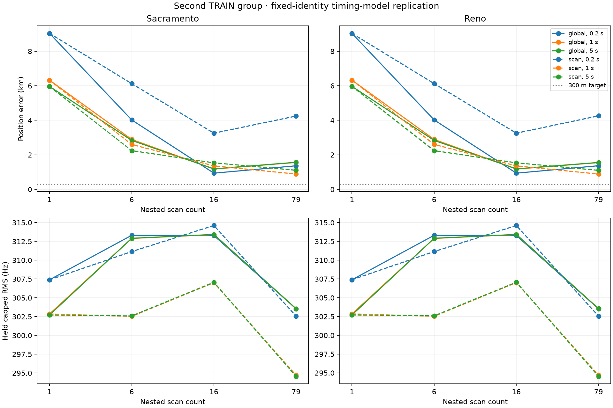

# Timing-model replication on the second TRAIN group

All 48 predefined fits completed. Timing corrections improve the second group's
blind baseline, but none reaches 300 m. The best full-group setting is about
887 m; this is a descriptive TRAIN result, not a selected or validated model.
All fits meet the helpers' declared stopping rule, without a global-optimum or
KKT certificate. No timing-boundary or visibility failures occurred.

| Full 79-scan model | Scale | Sacramento error | Reno error | Held capped RMS, Sac / Reno |
|---|---:|---:|---:|---:|
| Zero-epoch baseline | — | 5.414 km | 5.523 km | 312.96 / 312.95 Hz |
| Global epoch | 0.2 s | 1.365 km | 1.369 km | 303.54 / 303.53 Hz |
| Global epoch | 1 s | 1.561 km | 1.551 km | 303.55 / 303.55 Hz |
| Global epoch | 5 s | 1.568 km | 1.558 km | 303.55 / 303.55 Hz |
| Per-scan epoch | 0.2 s | 4.246 km | 4.258 km | 302.57 / 302.56 Hz |
| Per-scan epoch | 1 s | 0.887 km | 0.886 km | 294.71 / 294.69 Hz |
| Per-scan epoch | 5 s | 1.107 km | 1.102 km | 294.56 / 294.54 Hz |



On the Sacramento start, the shortest view remains 5.96–9.04 km away and the
six-scan view 2.24–6.12 km away. The 16-scan view ranges from 0.94 to 3.25 km.
Both starts give similar outcomes. Nested duration views and starts are
correlated, not independent trials. `summary.json` reports every arm; the full
sealed artifacts preserve fitted coordinates, identities, nuisance terms,
traces, convergence diagnostics, held capped/uncapped RMS and reference errors.

Compared with the first TRAIN group, global timing corrections again produce
roughly 1.5 km full-group error. Per-scan corrections help too, but the scale
giving the smallest geographic error changes between groups. In this group,
scale 5 s fits held frequencies slightly better than scale 1 s yet localizes
worse. This is another reason not to select a model by frequency RMS alone.
No hyperparameter or model winner is selected in this report.

## Scientific scope

The same frozen helper implementations fit one global epoch or one epoch per
scan, with bounded ±5 s corrections and regularization scales 0.2/1/5 s. Every
track retains its original randomized training mask, constant training-profiled
CFO, original visibility rule and zero receiver altitude. The satellite IDs
are reconstructed at the sealed baseline locations using the original
training-only scorer; zero-epoch objective parity is checked before fitting.
No baseline post-seal result file enters the fits. The complete second TRAIN
membership and all cache bindings are verified. VAL/TEST remain unopened.

These corrections are empirical nuisance terms that may absorb orbit or other
model errors; they are not measured clock offsets. Numerical scales across
global/per-scan models imply different total regularization because the number
of terms differs. Receiver truth is used only after all 48 inferences are
sealed. This remains conditional on the baseline identities and local basin.

## Execution and reproduction

Inference took 175.50 s with four workers and single-thread BLAS. The first
launch failed before any fit because baseline inference does not store IDs.
The corrected runner reconstructs them from training rows. The completed run
then sealed all fits, but its inline evaluator stopped on a global-versus-scan
timing-field schema mismatch. Its executed source and sealed inference are
preserved unchanged. `evaluate.py` handles the native schemas and independently
verifies input/source hashes and exact training-objective replay before held
and reference scoring. There was no refitting after outcomes were inspected.

To reproduce, preserve or relocate this report's existing `results` directory
and run from the repository root. The runner deliberately requires a fresh
output directory. Its preserved inline evaluation will raise the documented
`KeyError: taus_s` after successfully sealing inference; then run the separate
evaluator below. Do not interpret that post-seal exception as failed fitting.

```bash
OPENBLAS_NUM_THREADS=1 OMP_NUM_THREADS=1 .venv/bin/python \
  reports/2026_09_23_second_train_epoch_replication/run.py
OPENBLAS_NUM_THREADS=1 OMP_NUM_THREADS=1 .venv/bin/python \
  reports/2026_09_23_second_train_epoch_replication/evaluate.py
.venv/bin/python reports/2026_09_23_second_train_epoch_replication/plot.py
.venv/bin/pytest -q tests/tools/test_second_train_epoch_replication.py
```

Tests verify that all three scales remain represented when a fit fails and that
objective mismatch fails closed. Existing helper tests cover numerical fitting.
The next direct replication is joint catalogue reassignment on this group,
followed by a frozen complete-model validation comparison. The accompanying
validation design is a draft, not authorization to inspect final-test evidence.
