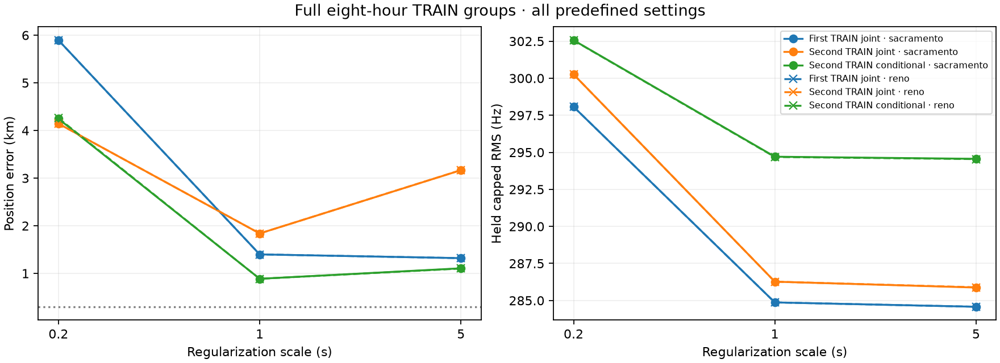

# Joint reassignment does not reproduce its first-group location improvement

The six predefined fits completed in 144.80 s. All reached stable identities
and small objective gain in five to seven cycles; none hit a timing bound or
visibility failure. Nevertheless, reassignment worsens the second TRAIN group's
best conditional location result while improving complementary frequency RMS.
It must not be promoted based on its first-group result or frequency fit alone.

| Scale | Conditional error, Sac / Reno | Joint error, Sac / Reno | Joint held capped RMS |
|---|---:|---:|---:|
| 0.2 s | 4.246 / 4.258 km | 4.144 / 4.144 km | 300.26 Hz |
| 1 s | 0.887 / 0.886 km | 1.838 / 1.838 km | 286.27 Hz |
| 5 s | 1.107 / 1.102 km | 3.167 / 3.168 km | 285.87 / 285.89 Hz |



At scale 1 s, held capped RMS improves from about 294.7 to 286.3 Hz, but
geographic error more than doubles. At scale 5 s, error approaches 3.17 km
despite the lowest held frequency residual. The first TRAIN group had improved
from 1.57 to 1.32 km at that setting. Thus this additional flexibility does not
consistently improve location across the two groups. Both starts agree closely;
that is stability within the same data, not independent accuracy confirmation.
None of these fits satisfies the sub-300 m objective.

All 3,401 eligible tracks in the 79-scan group retain their support. The fitter
alternates full retained-catalogue selection and bounded per-scan epoch/position
polish, profiling CFO only on original randomized training rows. It inherits
the first experiment's ten-cycle ceiling, stable-ID plus <0.001 Hz gain stopping
rule and numerical monotonicity tolerances. This remains local alternating
optimization, not a certificate of correct identities or globally optimal
position. Timing terms are empirical nuisances, not measured clock offsets.

The sealed timing-only inference supplies initial position, timing and IDs.
No source containing post-seal geographic errors is used by the fitter. Exact
second TRAIN membership, exclusion of validation/test, cache hashes and helper
hashes are checked. All six results are sealed before `evaluate.py` replays
their fixed final IDs and training objective, then scores complementary rows
and reference error. No validation/test evidence, RF collection or production
deployment is involved. `summary.json` and full inference/results preserve every
arm, fitted coordinate, final ID, objective trace and held capped/uncapped RMS.

Reproduce after preserving this report's existing `results` directory, because
the runner requires fresh output:

```bash
OPENBLAS_NUM_THREADS=1 OMP_NUM_THREADS=1 .venv/bin/python \
  reports/2026_09_23_second_train_joint_replication/run.py
OPENBLAS_NUM_THREADS=1 OMP_NUM_THREADS=1 .venv/bin/python \
  reports/2026_09_23_second_train_joint_replication/evaluate.py
.venv/bin/python reports/2026_09_23_second_train_joint_replication/plot.py
.venv/bin/pytest -q tests/tools/test_second_train_joint_replication.py \
  tests/tools/test_long_joint_epoch_association.py
```

Six tests pass, covering support/monotonicity rejection plus the original
fractional-epoch assignment, held-row invariance and stopping/source controls.
The next model comparison should retain the simpler fixed-identity/global models
and assess what additional information can distinguish physical orbit/model
error from a location shift. More flexible frequency fitting alone is not a
supported route to accurate position.
