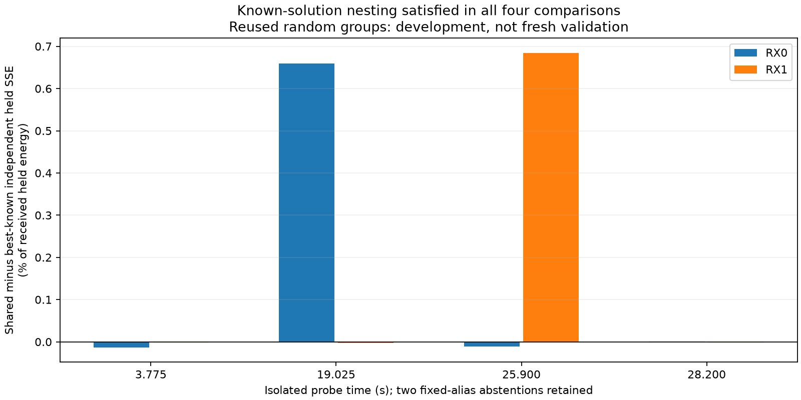

# Shared receiver offset: completed known-solution nesting check

**The 28.200 s snippet remains a useful development example for common-state
phase research.** After initializing the flexible model from the shared fit,
its receiver-offset closure is −1.383 Hz and the shared model has effectively
the same held prediction error: +0.000735 percentage points on RX0 and
−0.001406 on RX1. This is conditional model adequacy, not a calibrated phase
rate, a statistical equivalence result, or satellite association evidence.

The known-solution nesting check now passes in all four feasible snippets.
Each saved shared fit was re-evaluated in independent coordinates; its training
SSE reproduced exactly. The independent arm then retains the lowest training
SSE among the old independent fit, that embedded shared fit, and an independent
refinement initialized from it. Held errors never select the candidate. This
repairs the avoidable comparison flaw in the [v2 results](2026_09_23_shared_cfo_v2_results.md)
without claiming globally optimal fits.

## Frozen comparison and complete results

The [protocol](2026_09_23_shared_cfo_nested_protocol.md), runner, and tests were
frozen at `a3519210` before saved-IQ replay. The v2 numerical optimizer and
shared fits remained unchanged. All four feasible original 20 ms snippets were
read with digest verification; raw hashes and both receivers' random guarded
sample masks matched the original replay. The two fixed-alias abstentions
were retained. This reuses already inspected development responses.

Positive held loss means shared minus best-known independent SSE, divided by
the receiver's held received energy, expressed in percentage points.

| Probe (s) | Selected independent candidate | Shared − independent train SSE | Independent closure (Hz) | RX0 held loss (pp) | RX1 held loss (pp) |
|---:|---|---:|---:|---:|---:|
| 3.775 | Shared-seeded refinement | +0.0000473 | −13.782 | −0.01331 | −0.00153 |
| 19.025 | Previous independent | +0.0253077 | −209.980 | +0.65957 | −0.00318 |
| 25.900 | Previous independent | +0.0152832 | +100.923 | −0.01166 | +0.68442 |
| 26.400 | Fixed-alias abstention | — | — | — | — |
| 28.200 | Shared-seeded refinement | +0.0000467 | −1.383 | +0.000735 | −0.001406 |
| 30.850 | Fixed-alias abstention | — | — | — | — |

The [summary](figures/2026_09_23_shared_receiver_cfo_nested/summary.json),
[binding](figures/2026_09_23_shared_receiver_cfo_nested/binding.json), and adjacent
per-probe JSON files preserve every candidate, coefficient, objective history,
selected name, and response. The verification checks the training-only minimum,
shared inclusion, and all frozen hashes. Two additional tests cover selection
independence from held scores and rejection of nonfinite training scores;
the five v2 numerical qualification tests remain applicable.

## What this changes for phase research

At 28.200 s there is both incremental two-pilot waveform response on both
receivers and a shared-offset fit with negligible prediction cost in this
development comparison. Its previously reported +143 Hz grid-fit closure was
not stable to better training initialization. It must not be interpreted as
satellite motion. The new −1.383 Hz value also has no calibrated uncertainty
and remains dependent on the nominated aliases and constant-channel model.

At 19.025 s the shared constraint still costs held prediction on RX0 despite
two-component waveform evidence. At 3.775 s the common-offset prediction is
adequate in this limited comparison, but the original source-isolation result
did not establish incremental second-component response on RX0. These are
different prerequisites; one does not substitute for the other. At 25.900 s,
RX0 likewise lacked incremental second-component response and the constraint
costs held prediction on RX1.

Further optimizer variants on these same snippets are not the next scientific
gate. Local phase stability can now be examined at the fixed development
example, preserving each source's actual epoch and frequency-dependent channel
response. General claims need a predeclared phase-blind candidate population
and seeded random **whole-probe** outer holdout, with all receivers and source
hypotheses of a probe kept together and failures retained. Those held outcomes
must be new; the six snippets here cannot be relabeled fresh validation.
Absolute speed, direction, and receiver position still require the relevant
calibration and geometry authority. No production tracking code was changed.
