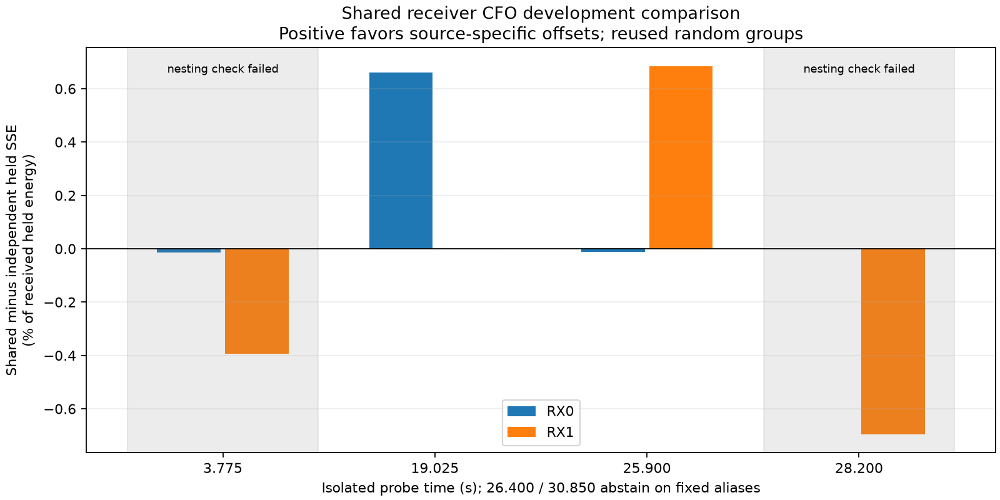

# Shared receiver CFO v2 development comparison

**All eight executed fits now improve training SSE, but two of four comparisons
still fail the nested-model optimization check.** The results do not justify
turning the two-source waveform evidence into calibrated phase or motion.

The new optimizer corrects the v1 failure to preserve and improve training
initializers, but does not establish calibrated two-source phase. Its result
must be assessed as a bounded, local model comparison on already inspected
development data, with an explicit check that the flexible model fits at least
as well as the constrained one.

## Qualification and freeze

The [protocol](2026_09_23_shared_cfo_v2_protocol.md), optimizer, replay runner,
and tests were frozen at `67569cf7` before replay. The v1 code and results remain
unchanged. Five tests cover finite-difference verification of analytic gradients,
nonzero shared-offset recovery, independent-source recovery and held-response
invariance, source-specific rate mismatch, and degenerate-template abstention.
The synthetic data spans 20 ms, uses random guarded physical sample groups,
and has separate complex tone weights for both sources and receivers.

A synthetic shared case initially exposed a wrong-peak coordinate solution.
The fix performs a training-only independent-frequency bootstrap and tests
three shared starts derived from those training peaks. The failing case remains
in the tests. Grid and local stages preserve the lowest feasible training SSE.
SLSQP receives analytic gradients and the coupled constraints on all four
effective residual frequencies. No held error chooses any parameter or start.

The replay reused the original four feasible 20 ms snippets and their exact
random masks, verifying raw snippet hashes and both receivers' support hashes.
The two fixed-alias infeasible snippets remain abstentions. Input, source-code,
template, and protocol hashes are recorded in the
[binding](figures/2026_09_23_shared_receiver_cfo_v2/binding.json).

## Interpretation limits

Independent and shared arms are optimized separately. Because every shared
solution is representable by the independent model, a lower shared training
SSE reveals that the independent arm did not reach the best known feasible
solution. Such a row cannot support an optimized model-comparison claim even
if both solvers report convergence. Monotone objective histories prove only
that returned fits did not worsen their own initializers; they do not prove
global optimization.

Positive held loss below means shared SSE minus independent SSE, divided by
received held energy and expressed in percentage points. No significance or
physical acceptance threshold is inferred from these reused responses. The
shared arm imposes exact equality of total receiver offsets; a physical model
can also contain differential geometric rate and source-dependent channel
evolution. Per-tone complex phases remain uncalibrated.

| Time (s) | Shared − independent training SSE | RX0 held loss (percentage points) | RX1 held loss (percentage points) | Comparison status |
|---:|---:|---:|---:|---|
| 3.775 | −0.000699 | −0.0133 | −0.3937 | Independent fit fails nesting check |
| 19.025 | +0.025308 | +0.6596 | −0.0032 | No detected nesting violation |
| 25.900 | +0.015283 | −0.0117 | +0.6844 | No detected nesting violation |
| 26.400 | — | — | — | Fixed-alias bounds infeasible |
| 28.200 | −0.037908 | +0.0007 | −0.6957 | Independent fit fails nesting check |
| 30.850 | — | — | — | Fixed-alias bounds infeasible |

All local solvers report success; no fit reaches a residual-frequency boundary.
Shared closures satisfy the numerical equality constraint to approximately
1e−10 Hz, which is an arithmetic check, not physical accuracy. At 19.025 s the
constraint costs held prediction principally on RX0; at 25.900 s principally
on RX1. Neither comparison has a calibrated statistical rejection threshold.
The absence of a nesting violation in those rows does not certify global optima.

The next numerical check must initialize the flexible arm from each known
shared solution as well as its independent peaks. This is justified by training
objectives and model inclusion, not by favorable held outcomes. Any such
follow-up must preserve these frozen results and remain labeled development on
reused data. The promising 28.200 s snippet is especially unsuitable for a
physical conclusion until that check is satisfied.

The [summary](figures/2026_09_23_shared_receiver_cfo_v2/summary.json) retains
training improvements, local diagnostics, offset closure, held losses, and
abstentions. Adjacent per-probe files retain coefficients and complete
training-objective histories. This study changes no production tracking code
and does not yet demonstrate satellite identity, orbit, speed, or position.
