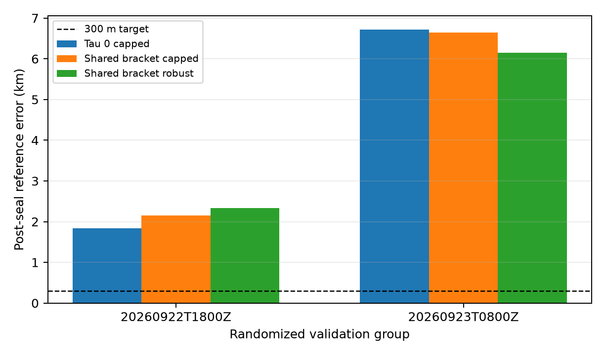

# Shared timing validation and next model experiments

Sub-300 m generalization remains unproven. The earlier roughly 300 m development
result did not reproduce across independent validation groups. This iteration
tests whether replacing flexible per-track timing with one physically constrained
scan-start offset resolves the discrepancy. It does not.

The frozen [random-group dataset](../2026_09_23_position_random_group_split/manifest.json)
contains 68 train, 22 validation and 23 retrospective-test scans in 9/2/2 groups.
All 113 recordings were historically exposed: the test split is a retrospective
audit, not an untouched test. No test recording evidence was opened in this
iteration. Whole groups were randomized; within-track reserved frequency rows
retain the pipeline's randomized masks. Nested singleton views are not additional
independent validation groups. There is no independent contiguous eight-hour
validation group in this cohort.

## Shared timing results

| Validation view | Fixed zero timing | Shared bracket, capped loss | Shared bracket, robust loss |
|---|---:|---:|---:|
| Sep 22 18Z, 10 scans | 1.836 km | 2.154 km | 2.335 km |
| Its first scan | 3.135 km | 2.241 km | 1.432 km |
| Sep 23 08Z, 12 scans | 6.717 km | 6.640 km | 6.148 km |
| Its first scan | 7.042 km | 7.861 km | 8.171 km |

Each scan's shared timing offset is selected on 17 points inside its saved
363–366 ms host bracket. Geographic position, candidate identity, constant track
frequency offset and scan timing use training rows only. Inference is sealed
before reserved-row scoring and reference-coordinate comparison.

Capped-loss reserved frequency RMS improves from 261.83 to 250.61 Hz and from
278.38 to 272.09 Hz. Yet 8/10 and 11/12 scan timing estimates hit bracket edges.
The constrained model is under tension. This cannot identify UTC error alone:
orbit error, wrong identities and receiver frequency evolution remain confounded.
Host uncertainty brackets do not calibrate absolute UTC.

The earlier free per-track fractional-timing model produced 0.631 and 3.741 km,
with reserved RMS near 140 and 148 Hz. Those are different nuisance assumptions,
not evidence that a lower residual necessarily locates the receiver better.
Published candidate pools and starting seeds remain historically conditioned on
observations; these experiments do not validate blind full-catalogue acquisition.

Full coordinates, masks/provenance bindings, convergence, per-scan boundary flags
and receipts are in the [shared timing results](../2026_09_23_shared_bracket_position/results.json)
and [experiment report](../2026_09_23_shared_bracket_position/README.md).

## Inputs for the next experiments

SOL qualified six deterministically selected older recordings, three from each
of two eight-hour groups (72 and 80 scans). All six prepare successfully through
current public input adapters: 279 eligible tracks and 7,529 observations. Their
host brackets are 1.19–1.52 ms, much tighter than the recent firmware recordings.
This qualifies six samples, not all 152 recordings or their geographic accuracy.
See the [qualification report](../2026_09_23_long_block_qualification/README.md).

Terra investigated receiver identity, and the main task implemented and tested
an exact public-contract reconstruction. All 840 cached observation IDs in one
training scan match reconstructed IDs, without conflicts. All selected support
in this example is RX1. This does not imply raw RX0 is absent or other scans have
the same coverage. See the [mapping report](../2026_09_23_receiver_identity_mapping/README.md).

## Recommended next steps

1. Reconstruct exact receiver identities across training support, then fit shared
   per-receiver frequency evolution jointly with bounded scan timing. Train drift
   regularization on training groups; freeze it before validation.
2. Prepare every recording in the older long blocks and freeze complete support
   manifests before fitting. Preserve elapsed duration, capture gaps and summed
   observation duration separately. Seek additional independent long groups for
   train/validation/test rather than treating nested windows as replicates.
3. Compare constrained timing, receiver drift and orbit/identity uncertainty on
   the same support. Rank models using repeated group validation, not a single
   favorable geographic error or frequency-residual improvement.

No production deployment, new RF collection or published contract change was made.
