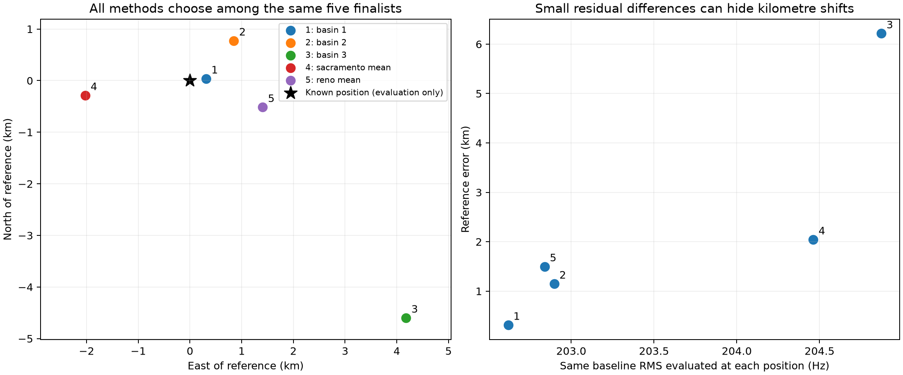
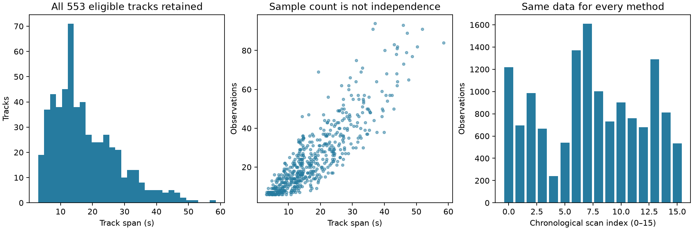
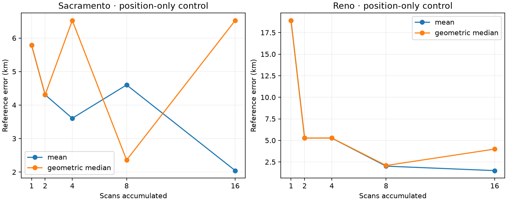
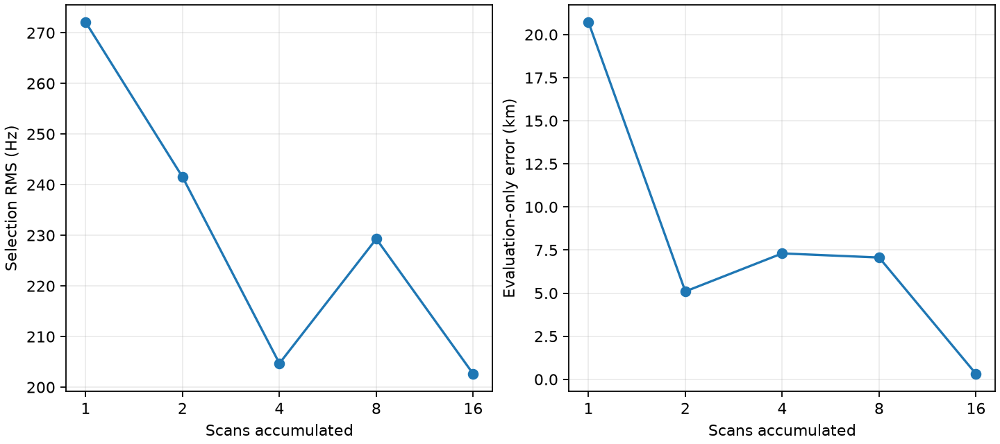
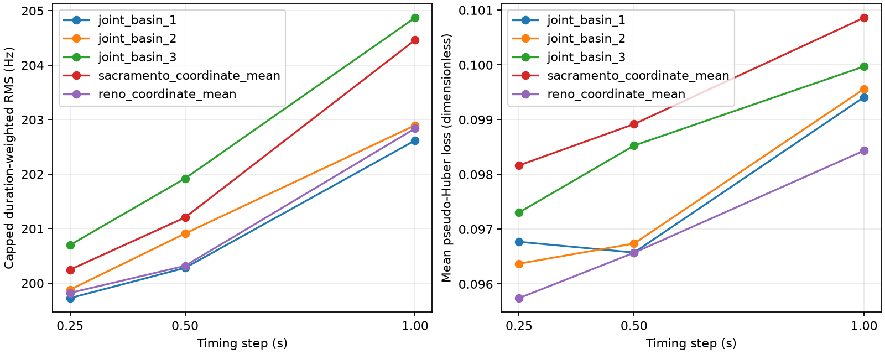
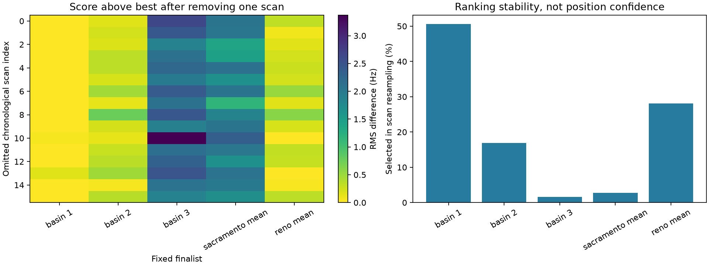

# Sixteen-scan positioning comparison

The joint fit reaches **0.314 km actual error** on these sixteen scans, compared
with **1.498–2.043 km** for averaging the independent scan positions. Soft association
selects the same finalist. However, alternative objectives select locations with
1.149–6.215 km error, and scan resampling does not establish a unique position.
This is a promising conditional result, not independently validated sub-kilometre accuracy.

Two SOL workers ran the joint search and timing/robust-loss comparisons; Terra ran
the association/orbit work and numerical review. The coordinator audited the evidence,
replayed production scores, and generated the common comparison and stability plots.

## Results on the same observations

| Approach | Position error | Finding |
|---|---:|---|
| Joint position, integer timing, production scoring | **0.314 km** | 202.619 Hz capped duration-weighted selection RMS |
| Soft association with a null option, integer timing | **0.314 km** | Selects joint finalist 1 by training marginal evidence |
| Hard identity, uncapped training mean-square objective | 6.215 km | Selects finalist 3; objective choice matters |
| Training-selected identities, capped evaluation score, integer timing | 1.149 km | Selects finalist 2 |
| Same training-selected identities with 0.5/0.25 s timing | 1.498 km | Selects the Reno coordinate mean |
| Robust uncertainty-floor loss, all three timing resolutions | 1.498 km | Selects the Reno coordinate mean; uncertainty model is a sensitivity assumption |
| Legacy evaluation-selected identities with 0.5/0.25 s timing | **0.314 km** | Same finalist; 0.25 s score falls to 199.726 Hz |
| Shared orbit corrections across scans | Not estimated | No selected identity repeats across scans |
| Differential phase / LNB geometry | Not estimated | Frequency exports alone do not provide the required phase evidence |

The joint search performs bounded continuous refinement from several existing
solution regions. All subsequent method ablations use the same five fixed locations:
three joint basins and the two coordinate means. They **do not independently optimize
a new continuous position for every loss or timing variant**. A repeated 0.314 km
entry therefore means methods selected the same frozen point, not independent recovery.
The three joint refinements reached their 35-evaluation caps: the best result is a
bounded-search incumbent, not a converged or globally certified optimum.

The shared search is constrained to the **intersection of Sacramento 250 km and
Reno 500 km regions**, with pooled seeds and candidate identities. It does not test
independent acquisition from each prior. The prior-specific coordinate controls below
remain separate, but no new independent-prior convergence claim is made.

The [full method table](RESULTS_TABLE.md), [CSV](comparison.csv), and
[JSON](comparison.json) preserve each method's native objective and a common
integer-timing RMS evaluated at its selected coordinate. Dimensionless robust losses,
likelihood scores and RMS in Hz must not be compared numerically as equivalent units.

## Common data and validation

We use the same sixteen previously selected scans, beginning 2026-09-23 01:40 UTC
and ending about 04:25 UTC. There are 553 tracks spanning at least three seconds,
14,043 frequency observations, and exactly the original randomized partitions:
8,202 training and 5,841 evaluation observations. Track span ranges from 3.03 to
58.53 seconds (median 14.73 seconds). The scans contain gaps and mixed sample rates.

The published per-scan searches considered the causal catalogue. To make this
comparative refinement inexpensive, the new methods share a per-scan union of
all identities selected under the Sacramento and Reno priors: 15–29 candidates
per scan. This permits reassignment between tracks, but excludes identities that
neither previous search selected. It is a conditional refinement experiment,
not a fresh global catalogue search. All 553 tracks remain in the accounting.

Satellite states are cached on a quarter-second grid using the original qualified
sample epoch and digest-verified causal TLE snapshot. Receiver-dependent geometry
is recomputed at each trial position. An independent replay of 1,106 saved
candidate/tau/location combinations differs from production by a median 0.000715 Hz
and maximum 0.004642 Hz in evaluation RMS. This checks numerical agreement, not
the correctness of the satellite associations.

The known receiver position is introduced only after inference for error plots.
Because historical candidate discovery already used the evaluation rows, those
rows are **selection diagnostics, not an untouched predictive test**. The original
randomized split is retained; no chronological holdout is substituted. Likewise,
the 1/2/4/8/16 scan accumulation plots measure evidence accumulation, not temporal
out-of-sample performance. See [protocol](PROTOCOL.md) and [evidence audit](evidence_audit.json).

## Position-only controls

| Method | Sacramento 250 km error | Reno 500 km error |
|---|---:|---:|
| Median error of sixteen independent scan solutions | 10.340 km | 9.407 km |
| Mean of the sixteen independent coordinates | 2.043 km | 1.498 km |
| Geometric median of the sixteen coordinates | 6.525 km | 3.994 km |

The first row summarizes sixteen separate answers; the other rows produce one
answer from all sixteen. Neither coordinate fusion method refits the observations.
The means provide a useful low-cost benchmark, but their small actual error is not
a calibrated uncertainty radius. RMS scatter of the independent coordinates around
the means is 13.49 km and 10.45 km respectively, and systematic error can persist.

## Shared orbit and phase limitations

The saved selected identities contain 313 distinct sources for Sacramento and 309
for Reno. None repeats across different scans. Repeated tracks within a scan do
not provide the across-visit evidence needed for the proposed shared-orbit correction.
An extra source-specific degree of freedom can instead absorb receiver-position error.

These frequency-track exports do not contain paired IQ phase or calibrated relative
delay. This comparison therefore does not claim a geometry/phase-derived position.
That requires a separate pairing and calibration/identifiability analysis on existing IQ;
assuming phase continuity across scan dwells would not supply the missing evidence.

## What improves, and what remains fragile

Pooling changing satellite geometry helps in this example, but the gain is not
monotonic: actual errors at 1/2/4/8/16 scans are **20.719 / 5.101 / 7.306 / 7.067 /
0.314 km**. Small scan-count runs also inherit candidate/seed discovery from the
full frozen experiment, so these are accumulation sensitivities rather than standalone
acquisition benchmarks.

At the best joint point, reducing the timing step from 1 to 0.5 to 0.25 seconds
changes the legacy score from **202.619 → 200.281 → 199.726 Hz**. Timing shifts hitting
the ±5-second bounds fall from **57 → 50 → 49 tracks**. Finer timing removes some
discretization error; it does not by itself prove improved location accuracy. The
remaining bound hits motivate a structured clock/orbit model, not an automatic widening
of every track's allowed time shift.

Soft association marginalizes candidate/timing alternatives and includes a null option,
instead of selecting a single identity solely by its best training residual. In this
five-point comparison, marginal evidence selects the close joint solution while hard
training mean-square error selects the 6.215 km alternative. This supports retaining
association ambiguity, but is only one dataset. The fixed 250 Hz signal scale,
30,000 Hz null scale, equal signal/null prior, and candidate/tau priors are not calibrated
probabilities. Hard MAP and soft posterior-mode identities can coincide by construction;
the changed location ranking comes from marginal evidence, not different mode residuals.

Robust weighting uses training-only per-track roughness plus a 250 Hz floor. It is
not a measurement-derived precision model and does not improve actual error here.
Training-only identity selection is also distinct from training-only location selection:
the timing/robust comparisons still rank locations by their recorded evaluation objective.

## Stability and uncertainty

The best joint finalist wins **14/16** leave-one-scan-out rerankings. Removing either
of two influential scans selects the Reno mean instead. In 1,000 scan-resampling trials,
the winner frequencies are:

| Finalist | Actual error | Selection frequency |
|---|---:|---:|
| Joint basin 1 | 0.314 km | 50.6% |
| Joint basin 2 | 1.149 km | 16.9% |
| Joint basin 3 | 6.215 km | 1.6% |
| Sacramento coordinate mean | 2.043 km | 2.8% |
| Reno coordinate mean | 1.498 km | 28.1% |

These are ranking-stability diagnostics on fixed candidates/finalists already selected
using all scans. They are neither calibrated location probabilities nor independent
cross-validation. In particular, **314 metres is an observed error, not a confidence
radius**. The best and Reno-mean locations differ by only 0.220 Hz in the common score.

## Runtime, validation and next experiments

Measured numerical runtime was about **43.5 s** for the shared state cache,
**66.6 s** for joint accumulation/refinement, **25.5 s** for 45 timing/loss evaluations,
and a few seconds for soft association. These costs exclude the earlier full-catalogue
searches that supplied candidates and exclude implementation/report-writing time.
The cache and the selected candidate union are the main reasons the comparison is fast.

Validation includes 15 existing numerical tests, timing scorer parity and synthetic
self-tests, soft equal-candidate/null self-tests, exact evidence accounting, and the
1,106-match production replay. Visibility retains the production-style candidate-level
gate (visible somewhere in the support), not a new per-observation horizon model.

The next useful experiment is to freeze a training-only acquisition/selection protocol
before revealing a new randomized outer evaluation set, then compare the same objectives
with fresh candidate discovery. Also extend the bounded optimizer to check convergence
without selecting stopping criteria from known position error. Preserve multiple basins,
test sensitivity to influential scans, and calibrate the noise/null model before treating
soft weights as probabilities. Shared orbit corrections need repeated-source evidence;
phase constraints need explicit paired IQ support and nuisance-response treatment.

## Reproduction

Run the scripts from the repository root with its qualified `.venv/bin/python`.
`audit_evidence.py` and `replay_audit.py` require read access to the public sidecar
store, e.g. `sudo -n -u mouse9911 -g leo .venv/bin/python ...` on this host.
`ensemble_control.py` uses only the committed frozen baseline JSON.
Additional method commands and results are recorded by the parallel experiments.
No new radio collection or production deployment is part of this comparison.

For an offline replay with the committed numerical cache, run the joint command in
[joint/README.md](joint/README.md), then `freeze_finalists.py`. Run the timing tool with
`--cache reports/2026_09_23_sixteen_scan_comparison/joint/cache --locations
reports/2026_09_23_sixteen_scan_comparison/common_finalists.json --output <fresh-directory>`;
the soft tool accepts the same arguments. The published result directories are immutable
run artifacts; use a fresh directory for replays. Run `stability.py` and `summarize.py`
to regenerate the common plots from the canonical saved outputs. Python scripts under
this report directory and `tools/research/sixteen_*.py` are necessary reproduction support.
