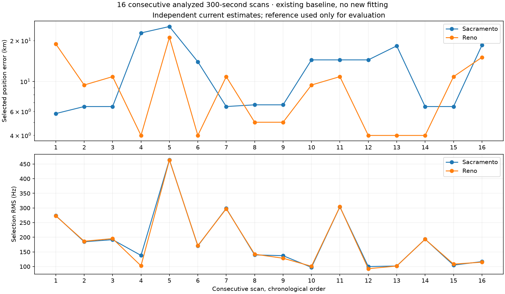

# Position-resolution experiments on sixteen consecutive analyzed scans

This is a baseline review and experiment proposal, not a new joint-position result.
Selection is the newest sixteen adjacent publications in the completed 24-hour backfill,
chosen before inspecting their errors. Exact IDs are in `selection.json`; chronological
capture metadata and baseline diagnostics are in `scans.json`.

The captures begin September 23, 2026 at 01:40:18.759580 UTC and 04:20:01.983420 UTC
for the first and last scan, respectively. Each planned capture is 300 seconds, so the
window ends about 04:25 UTC. These are consecutive published scans, not continuous IQ:
start intervals range from about 559 to 956 seconds. There are 553 eligible tracks and
14,043 frequency observations, with seven lower-edge and nine upper-edge scans at
2.5, 10 and 15 MS/s. Observation count is not a count of independent measurements.

## Existing baseline

| Prior | Median selected-position error | Minimum–maximum | Distinct selected coordinates |
|---|---:|---:|---:|
| Sacramento 250 km | 10.340 km | 5.791–25.408 km | 9 |
| Reno 500 km | 9.407 km | 3.994–21.125 km | 7 |

The finest search spacing is 12.5 km, but six Sacramento and three Reno winners are
still 25 km centres. Always taking the finest winner does not fix accuracy: Sacramento's
median error would increase to 13.985 km in this subset. Refinement must preserve and
re-evaluate the best incumbent rather than assume the smallest cell is best.

The two priors select different NORAD identities for 96/553 tracks (17.4%). This is
disagreement, not proof that either assignment is correct. Selected time shifts hit
the ±5-second bounds in 70 Sacramento and 65 Reno tracks. Near-equal aggregate RMS
can accompany substantially different coordinates. Grid discretization, assignment
ambiguity and position/time/offset confounding all deserve separate tests.

## Prioritized experiments

| Approach | Proposed experiment | Benefit and limitation | Relative cost |
|---|---|---|---|
| One shared position across all scans | Evaluate the same geographic points using all 553 eligible tracks; fit scan/track nuisance parameters within that shared position. Start with the existing score unchanged. | Tests whether changing satellite geometry rules out locations that explain only one scan. Do not average the 16 selected coordinates or interpolate incompatible score maps as though they were exact. | Medium; reuse orbit banks and bounded parallel workers |
| Refine multiple promising regions | Retain several distinct basins and refine 12.5→6.25→3.125→1.5625→0.78125 km, keeping coarse incumbents. Then compare a continuous local fit. | Removes a numerical resolution barrier; it cannot remove orbit, timing or association bias. No guarantee that the coarse search found every good basin. | Low–medium at finalists |
| Continuous timing and structured nuisance parameters | At fixed finalists compare 1, 0.5 and 0.25-second tau steps; separate receiver-clock hypotheses from satellite along-track error. Test shared scan/source structure against independent track offsets. | Could prevent nuisance parameters absorbing location error. Bounds hitting is a diagnostic, not permission to widen them until RMS improves. Do not force all transmitters/channels to share one frequency offset. | Medium |
| Soft catalogue association | Preserve competing identities plus an unmatched/null option at each common position, rather than selecting a winner independently for every track. | Reduces hard switches and exposes uncertainty. Candidate truncation, duplicated correlated tracks and assumed noise distributions can create false confidence. Existing site-conditioned shortlists must not enter blind inference. | Medium–high |
| Uncertainty-aware robust weighting | Compare duration-only weights with frequency uncertainty plus a conservative error floor; group correlated evidence and retain all reasonable-length tracks. | Long precise trajectories should constrain position more than many weak observations. Hard residual capping can make a track locally uninformative; a smooth robust loss is worth an ablation. Estimate weights from training evidence, not reference error. | Low–medium |
| Shared orbit corrections | Once identities stabilize, fit tightly constrained source-specific corrections across repeated appearances, with the prior counted once per source. | Addresses consistent ephemeris error, but excessive freedom can make a wrong location fit. Require nominal-orbit and fixed-identity controls plus exact orbit replay. | High; second phase |
| Differential RX and holder geometry | Use only simultaneously shared RX0/RX1 support, modelling differential delay, receiver phase and pointing uncertainty. Test common/relative frequency and within-dwell phase as additional evidence. | Potentially helps reject identities and constrain direction. Geometric phase attribution needs receiver-response/calibration treatment and phase-ambiguity handling; cross-dwell phase continuity cannot be assumed. | High; selected existing IQ only |

Existing reusable code includes `scan_position_methods.fit_soft_identity_mixture`,
`fit_joint_position_orbit_corrections`, and the research `blind_shared_orbit`,
`formal_orbit`, and `orbit_identity_mixture` modules. They are starting points, not
evidence that these variants already run in the standard all-track v2 product.

For continuous local fitting, linear frequency offsets can be eliminated for each trial
nonlinear location/timing state (variable projection), reducing the optimizer's dimension.
See [O'Leary and Rust, NIST](https://www.nist.gov/publications/variable-projection-nonlinear-least-squares-problems).
Bounded nonlinear least squares and robust losses are available in
[SciPy](https://docs.scipy.org/doc/scipy/reference/generated/scipy.optimize.least_squares.html).
These are implementation options, not claims of demonstrated positioning improvement.

## Recommended first comparison

Run the unchanged joint score at 1, 2, 4, 8 and 16 scans, then refine only its strongest
distinct basins. At finalists, vary timing resolution and association treatment one
factor at a time. Reuse propagated satellite states; recompute receiver-dependent
geometry at every location. Cache exact point scores only when the location, evidence,
catalogue, masks and nuisance configuration all match.

Use fixed randomized partitions, with grouped track/scan validation and leave-one-scan-out
stability checks; do not introduce a chronological train/test boundary. The current
evaluation partition participates in identity and position selection, so a genuinely
untouched assessment is required before calling its score predictive. Freeze model
choices without using the known position. Report actual error only after inference,
alongside prior-to-prior agreement, per-scan residual contributions, nuisance-bound hits,
assignment ambiguity, computation time, and sensitivity to leaving out a scan.

The immediate target is a stable sub-kilometre *numerical estimate*. Whether the recordings
support sub-kilometre accuracy remains an empirical question; reducing grid spacing does
not establish it, and sixteen correlated scans do not guarantee a fourfold error reduction.

## Reproduction

Run `analyze.py` with the qualified `fb152566148e662dc22d7948607fd65998f033a9`
Python environment and read access to `/srv/bulk/leo`, while the local production API is
available on port 8090. It reads the public V2 sidecar store and capture metadata, never
raw IQ. `summary.json` and `scans.json` contain the recorded results. No inference or
production behavior was changed for this review.
