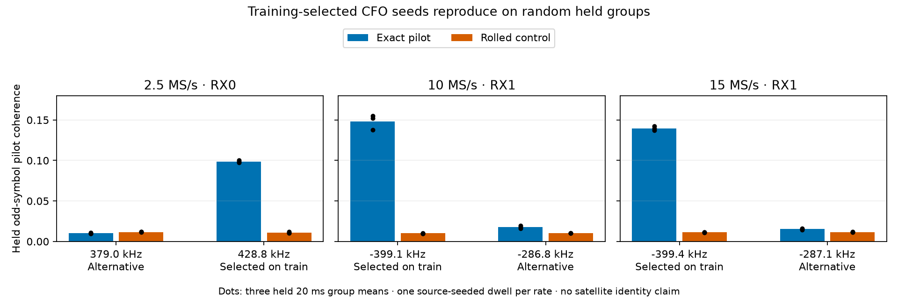

# Source-seeded phase and local CFO qualification

Known-pilot phase measurements provide a useful check on which GLRT frequency
estimate to use. In three representative saved dwells, choosing between the
acquired and refined GLRT seeds using training even-symbol evidence improves
full-pilot coherence on random held odd symbols. This is local waveform and
frequency evidence, not yet a measured improvement in satellite identity or
position accuracy.

## Frozen examples and random validation

The [selection](figures/2026_09_23_source_phase_random/selection.json) takes one
dwell per rate from the previous frozen 24: the greatest paired GLRT margin
among training probes only. The selected examples are 2.5 MS/s visit 544 of
`scan-fw-1aa1d50103d97388`, 10 MS/s visit 760 of `scan-fw-9b88653c7a012fc2`, and
15 MS/s visit 475 of `scan-fw-894676bdae3d7b2c`. Both receivers are retained.

Seed `20260923` assigns complete 20 ms groups to training `[0,3,5]` and held
evaluation `[1,2,4]`. One training-probe timing/CFO pair fixes the source
hypothesis for the full dwell. Every complete pilot frame, including its input
guards, stays inside one group. Frames use their actual sample coordinates;
the 3333/3334-sample intervals at 2.5 MS/s are not replaced by an ideal period.

For each receiver, the two possible seeds are the acquired and refined CFOs
from that same training detection, with duplicates removed. Each frame is
independently fitted to known pilots on even and odd symbols. Seed choice uses
equal-weight training-group means of the even exact-minus-rolled-control
coherence; fits at the search boundary contribute zero. Odd symbols and held
groups cannot influence that choice. The selected seed and frame lattice are
then fixed for evaluation.

This is a retrospective development experiment on previously examined data.
An initial acquired-only run failed on the 2.5 MS/s RX0 example; a refined-only
run weakened the high-rate RX1 examples. Those diagnostics motivated the
two-seed training-only comparison. These are not newly sealed test recordings.

## Independent held-odd evidence



The table includes all 42 held frame opportunities per receiver, without
filtering by held coherence. Three held groups contribute equally.

| Example | Training-selected seed | Selected exact / control coherence | Alternative exact / control coherence |
| --- | ---: | ---: | ---: |
| 2.5 MS/s RX0 | refined, 428.756 kHz | 0.09879 / 0.01105 | 0.01031 / 0.01168 |
| 10 MS/s RX1 | acquired, −399.100 kHz | 0.14838 / 0.01004 | 0.01759 / 0.01036 |
| 15 MS/s RX1 | acquired, −399.400 kHz | 0.13971 / 0.01118 | 0.01531 / 0.01162 |

The selected fits have zero held-odd search-boundary hits in these three
receivers. The remaining receiver at each rate has identical acquired/refined
seeds, so no two-seed comparison is possible there. Seed values are search
initializations; fitted frame CFOs and their uncertainties are retained in the
[full frame evidence](figures/2026_09_23_source_phase_random/frames.json.gz).

This supports using known-pilot evidence to qualify local CFO alternatives
before associating trajectories. It does not prove a unique physical alias:
the alternatives differ by approximately 49.7 or 112.3 kHz, and the finite
two-choice search is not exhaustive. A source-seeded frame is also not proven
to belong to one emitter throughout the dwell. Repeated pilots, interference,
source changes, and oscillator drift remain possible.

## Phase evolution and the association boundary

The [evaluation](figures/2026_09_23_source_phase_random/evaluation.json) compares
constant and linear CFO models fitted to training even-symbol measurements.
Nonoverlapping adjacent frame pairs supply training even phase advances and
held odd advances. A constant local phase-rate bias is fitted on training
groups only. Each response uses its exact reference-sample interval, and no
pair bridges an unsupported frame gap. Held phase coverage is conditional on
even-symbol support; odd response values never set eligibility.

| Rate / receiver | Held phase RMS: constant → linear | Held CFO RMS: constant → linear |
| --- | ---: | ---: |
| 2.5 MS/s RX0 | 52.2° → 14.4° | 103.9 → 25.9 Hz |
| 2.5 MS/s RX1 | 55.6° → 18.1° | 105.6 → 48.7 Hz |
| 10 MS/s RX0 | 60.5° → 13.1° | 104.9 → 27.4 Hz |
| 10 MS/s RX1 | 59.2° → 19.3° | 79.9 → 36.2 Hz |
| 15 MS/s RX0 | 57.2° → 9.6° | 100.7 → 30.8 Hz |
| 15 MS/s RX1 | 53.6° → 15.4° | 117.8 → 33.9 Hz |

Thus independent held phase supports frequency evolution in all six examples.
These errors measure internal prediction agreement, not satellite speed or
position error. Both models use known-pilot frequency estimates; this table
does not compare against the production GLRT position solver.

A further test asks whether phase should *correct* the pilot-CFO slope. A
41-point rate grid spanning ±5000 Hz/s around the training-even frequency line
is selected using training-even phase only. The frequency intercept stays
fixed: the nontransferable phase bias cannot become a CFO correction. This
phase-informed rate fit produces **no held phase improvement** in any of the
six cases. Three rates stay unchanged; the other three change by −250, −500,
and −250 Hz/s. Held CFO RMS changes from 27.37 to 26.79 Hz, 36.24 to 43.12 Hz,
and 30.77 to 30.76 Hz, respectively. No selected rate hits the grid boundary.
The tested phase-feedback method therefore lacks consistent incremental benefit
and is not promoted. Phase is currently useful for local branch qualification
and an independent motion-consistency check.

Modulo-pi scoring follows the frame extractor's declared pilot-phase ambiguity.
The ±187.5 Hz nuisance search is a finite principal-branch hypothesis, not a
claim that 375 Hz is an exact ambiguity period on the rounded sample lattice.
The scorer rejects shared frame endpoints across groups and reports candidate
contrast after nuisance fitting. Its synthetic tests require constant-CFO
alternatives to remain indistinguishable when a free frequency bias absorbs
their difference. These safeguards prevent a nuisance fit from masquerading
as satellite information.

No causal TLE candidate bank is attached to these three dwells. The immediate
remaining step is to bind individual source observations to a longer RF
episode with a frozen candidate bank, then compare Doppler-only and
phase-augmented scoring on the same random groups. A separate accessible
49.96-second episode in `scan-fw-f0af018448538a4c` has eight frozen catalogue
candidates and retained TLE authority. Its cached phase-state bank lacks exact
observation/visit IDs, but the original evidence was located at
`/tmp/leo-sky-position-48h/evidence-v2/evidence/scan-fw-f0af018448538a4c.json`
(SHA-256 `278464b4d2821786de6a833686b4ef17f3abd996f6ac8014a95e36d66e1ca183`).
It retains the 78 historical observation IDs. Fractional GLRT support-center
reconstruction matches their times to the public tracking input; full field
and provenance checks must seal that binding before phase replay. Current
canonical IDs differ from the historical projection version, so nearest-time
matching or substituting current IDs would be insufficient. Its existing
randomized per-observation split will not be reused; the new validation will
freeze random whole groups explicitly.

The extraction retains fractional GLRT epoch metadata but uses an integer
frame lattice. Fractional timing and sample-shift sensitivity remain untested;
these raw phase values must not be promoted to geometric angles or velocity.
Sampling rate is confounded with source, RF edge, recording time, and receiver
balance. This three-example study cannot rank rates by position accuracy.

## Reproduction

Run from the repository root with a NumPy/SciPy/Matplotlib environment and
read-only saved-capture access. The extraction is bounded to three saved dwells
and requires no new RF collection.

```sh
PYTHONPATH=src OPENBLAS_NUM_THREADS=1 timeout 180s python tools/research/extract_random_source_phase.py
PYTHONPATH=src OPENBLAS_NUM_THREADS=1 python tools/research/evaluate_random_source_phase.py
MPLBACKEND=Agg python tools/research/plot_source_phase_branches.py
```

The frame artifact binds IQ digests, capture manifests, frozen GLRT comparison
files, the split, seed alternatives, and numerical extraction source hashes.
Tests cover training-only branch selection despite held/odd mutations,
boundary rejection, phase nuisance invariance, and group endpoint leakage.
All 10 focused tests and Ruff checks pass; extraction and evaluation source
hashes were verified against the persisted evidence, and the PNG was inspected.
This work changes research tooling only; no production association or position
result has been modified.
