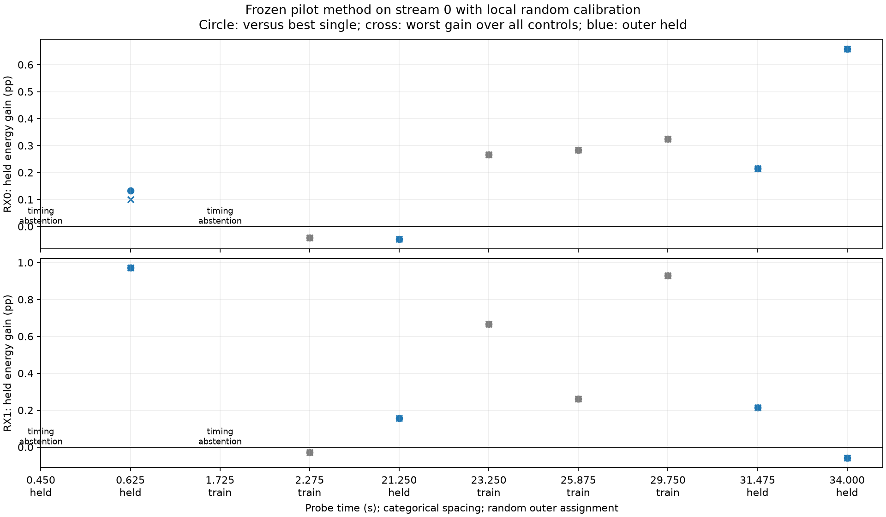

# Random whole-probe pilot replication on stream 0

This experiment tests the frozen two-source pilot method on another stream of
`cap-20260825T010019-89c2889553e0` (2.5 MS/s). It does not measure association
accuracy, orbit error, or receiver-position improvement.

## Frozen method and coverage

The [protocol](2026_09_23_stream0_pilot_replication_protocol.md) and metadata
population were committed before replay (`05d74df6`). All ten probes with two
diagnostic components on each receiver entered a seeded random 5/5 whole-probe
split before timing qualification. Each partition contains four eligible probes
and one timing abstention. No chronological holdout was used.

An initial runner failed before template construction because the receipt stores
candidate ranks rather than full records. It read one training snippet, fitted
no model, and opened no held IQ. The [failure receipt](figures/2026_09_23_stream0_pilot_replication/attempt-1-failure.md)
and original seal are retained. Commit `c16948b3` froze the schema correction;
the models, nominations, partitions, and outcome definitions did not change.
All training outputs were committed at `746a660d` before opening held probes.

The capture profile says lower edge, but explicit per-stream manifest tags say
channel 1 upper edge. The production manifest-tuning resolver gives precedence
to those tags. Both receipt and replay use upper-edge templates. Verified
timeline metadata establishes continuity across 573 refills; continuity alone
does not establish receiver phase calibration.

Each eligible probe uses 20 ms of saved dual-receiver IQ. Eight complex tone
coefficients per source and residual CFO are fitted only on seeded random local
calibration groups. Held local groups score the exact pair, each single source,
rolled-symbol controls, and swapped epochs. The outer held test therefore
measures transfer **with local calibration**, not zero-shot prediction. Candidate
screening already used GLRT measurements of the same recording. All probes are
from one capture and need not be independent physical emitters.

## Frozen all-probe result

The sealed replay completed all five outer-held records. It retained both timing
abstentions, leaving four eligible training and four eligible held probes. The
table reports the smallest exact-pair response-energy gain over every comparator
on that receiver: positive means the exact pair had lower response SSE. `Both`
requires a positive smallest gain on RX0 and RX1.

There are seven total models: the exact pair and six comparators. For clarity,
the plotted gain is `100 × (comparator SSE − joint SSE) / held IQ energy`.
This reverses the protocol's “joint-minus-comparator prediction error” wording
so that positive consistently means improvement; no decision rule changes.

| Time (s) | Outer partition | Result | RX0 minimum gain (pp) | RX1 minimum gain (pp) | Both |
| ---: | --- | --- | ---: | ---: | --- |
| 0.450 | held | timing abstention | — | — | — |
| 0.625 | held | eligible | +0.100 | +0.971 | yes |
| 1.725 | train | timing abstention | — | — | — |
| 2.275 | train | eligible | −0.042 | −0.030 | no |
| 21.250 | held | eligible | −0.047 | +0.156 | no |
| 23.250 | train | eligible | +0.267 | +0.667 | yes |
| 25.875 | train | eligible | +0.284 | +0.260 | yes |
| 29.750 | train | eligible | +0.324 | +0.929 | yes |
| 31.475 | held | eligible | +0.215 | +0.214 | yes |
| 34.000 | held | eligible | +0.658 | −0.060 | no |

Thus the prespecified descriptive condition holds for 3/4 eligible training
probes and 2/4 eligible held probes (5/8 eligible probes overall). It fails on
two of the four held opportunities, so these results do not show a robust
conditional waveform replication across the held population.

## Interpretation for phase-assisted tracking

Positive incremental held energy means the exact two-source model predicts
better than its comparator. Descriptive support requires positive gain against
both single-source models and every control on both receivers. This is a fixed
comparison rule, not a calibrated significance test or a satellite identification.

Two isolated simultaneous sources are useful because differencing their
cross-receiver phases can cancel a receiver phase term common to both sources.
That cancellation still needs testing: source-dependent channel response,
frequency-dependent delay, alias errors, and changing mixtures can survive it.
A successful waveform separation alone therefore cannot supply geometric speed
or direction. The next phase test should preserve the same time/carrier reference
and evaluate local differential-phase stability before fitting an orbit.

Reproducible artifacts: [population](figures/2026_09_23_independent_phase/geometry-sensitivity/stream0-raw-candidate-population.json),
[corrected seal](figures/2026_09_23_stream0_pilot_replication/seal-v2.json),
[training completion](figures/2026_09_23_stream0_pilot_replication/train-v2/completion.json),
[held completion](figures/2026_09_23_stream0_pilot_replication/held-v2/completion.json),
and [summary](figures/2026_09_23_stream0_pilot_replication/summary.json).

Validation: nine targeted tests passed. SOL independently verified the source
and completion hashes, reproduced the counts, and checked full rank (16) and
Gram condition numbers of approximately 1.05–1.19 for all exact-pair fits.
Summary abstentions have `both_rx_support: false` as a non-support indicator;
the explicit status field must be used to distinguish them from evaluated failures.
