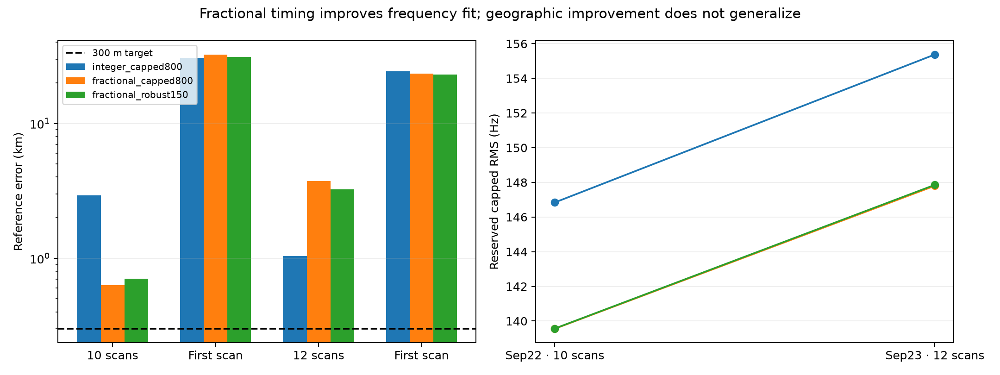
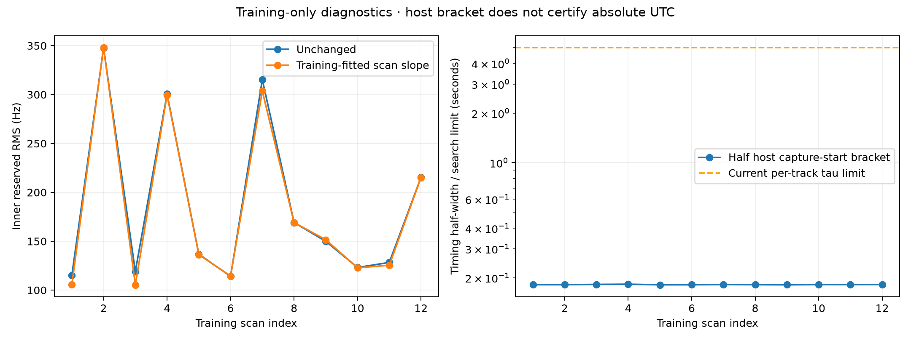

# Timing and drift: mixed position gains, stronger physical constraints

**Sub-300 m generalization remains unachieved.** Fractional timing improves one
full validation group to 631 m, but worsens the other to 3.74 km. A shared scan
frequency slope yields a modest training diagnostic gain. Saved capture-start
brackets suggest a much narrower physical timing model deserves a controlled
test. Two older eight-hour recording groups are available for future qualification.

## Fractional timing versus the integer control

The [declared protocol](PROTOCOL.md) retains the same seed-20260923 validation
groups, candidate pools, geographic seeds, prior intersection and saved randomized
frequency masks. The retrospective-test partition remains excluded. The integer
control reproduces the preceding group's results. Each fractional profile solves
for CFO and timing continuously within 0.25-second Doppler intervals over ±5 s,
using training frequency rows only. Reference errors and reserved scores follow
a hash-sealed inference. Hyperparameters were not selected by geographic error.

| Window | Integer capped error | Fractional capped error | Fractional robust error |
|---|---:|---:|---:|
| Sep22 group, 10 scans | 2.920 km | 0.631 km | 0.704 km |
| Its first scan | 30.537 km | 32.453 km | 31.235 km |
| Sep23 group, 12 scans | 1.042 km | 3.741 km | 3.252 km |
| Its first scan | 24.342 km | 23.479 km | 23.057 km |

Reserved capped RMS improves from 146.84 to 139.56 Hz and from 155.38 to 147.80 Hz
for the fractional capped model on the full groups. Thus it fixes a measurable
frequency-fitting limitation, but it does not reliably identify the true position.
Approximately 96% of selected full-group timings are noninteger. Boundary occupancy
is 3.29% and 3.41%; the first singleton reaches 20.7%, indicating difficult support.
Do not switch between methods by whichever geographic error happens to be smaller.

The extra Doppler-versus-time linear approximation was independently checked at
the selected arbitrary timing values using the original state evaluator on all
track observations. After CFO removal, RMS discrepancy is 0.041–0.092 Hz across
the fractional arms and windows; the maximum absolute discrepancy is 0.387 Hz.
This is larger than the preceding state-interpolation-only audit, but below the
few-hertz local signature discussed there. It is not a certification that the
minimizer is insensitive to approximation. A quadratic curvature proxy is also
reported and is not a rigorous global error bound.

Inference took 292.8 seconds, with 2.9 seconds reported for post-seal scoring.
Separate qualification and synthetic checks are described in the
[worker report](../2026_09_23_fractional_timing_position/README.md).
All coordinates and scores are in [JSON](comparison.json) and [CSV](comparison.csv).
Two groups and their nested singletons cannot establish tail error or eight-hour
performance. Candidate and seed support remain historically response-conditioned.

## Shared drift helps prediction modestly

On twelve random-partition training scans (442 tracks, 4,841 inner reserved rows),
one training-fitted residual slope per scan lowers pooled reserved RMS from
197.19 to 194.66 Hz, improving nine scans. Shared slopes have RMS 4.14 Hz/s and
range −9.18 to +5.35 Hz/s. Within-scan track slope IQR is much wider, 7.6–20.4 Hz/s.

Tracks at the ±5 s timing bounds comprise 8.14%; their boundary indicator correlates
0.445 with absolute disagreement from the scan slope. This supports treating the
slope as a nuisance diagnostic, not identifying it as oscillator drift. Wrong
identities, orbit error and timing/curvature mismatch can contribute. The cached
evidence lacks receiver/channel identifiers, so a per-RX model was not invented.
[Diagnostic and reproduction](../2026_09_23_receiver_drift_audit/README.md).

## Capture-start timing is already bounded more tightly

Using the public read-only tracking-source port, we retrieved saved timing
authorities for those same twelve training scans. Bracket widths are
362.971–366.017 ms, with median 363.717 ms; all are qualified. Their recorded
realtime/monotonic offset spread is at most 0.003374 ms. Exact authorities and
source hashes are in [training_timing.json](training_timing.json).

The midpoint's host-bracket half-width is therefore about 182 ms, far smaller
than the current independent ±5 s track search. These bracket checks constrain
capture start relative to the host clock; they **do not certify absolute UTC**
or TLE timing accuracy. Free track-specific timing is absorbing other errors.
A next predeclared model should separate a shared scan-start offset bounded by
this authority from orbit/identity mismatch, while retaining the unconstrained
profile as a control. It should not pretend all track shifts are receiver clocks.

## Existing longer-duration corpus

A [metadata-only inventory](../2026_09_23_long_group_metadata/README.md) excludes
the current dataset, quarantines and future reserve. Of 397 candidate publications,
200 oldest were inspected and 197 remain uninspected. Two Sep21 UTC eight-hour
blocks contain 72 and 80 verified nominal 300-second captures. Maximum gaps between
capture starts are 1,152.6 and 361.8 seconds. These counts establish availability
only: track quality, IQ completeness, receiver configuration and analysis
compatibility still require qualification. No outcomes selected these groups,
and they are not asserted to be untouched data. No new RF was collected.

Next work should test the constrained shared timing/drift model and qualify the
older blocks for randomized whole-block long-duration validation. The positive
631 m case is worth pursuing, but is not the accuracy result requested by the goal.

## Reproduce

Worker reports provide bounded numerical commands. Run `summarize.py` and
`plot_diagnostics.py` in this directory to regenerate plots from saved results.
`read_training_timing.py` reads only the twelve training timing authorities using
the existing read-only service identity. No production deployment is included.

Ten focused and related regression tests pass, including injected fractional
timing/CFO recovery, bound clipping, nonidentifiable timing behavior, reserved-row
mutation invariance and shared-slope recovery. New tools and report helpers pass
Ruff. These checks validate implementation behavior, not the target accuracy.
