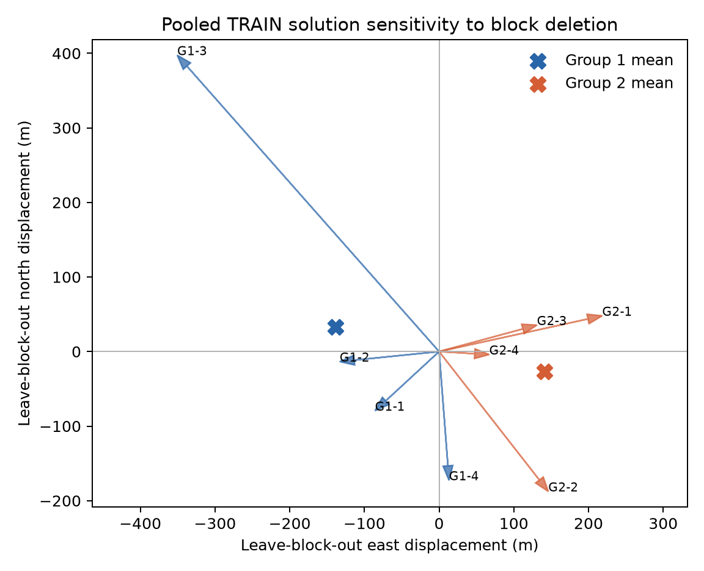

# TRAIN block jackknife: separated groups pull the pooled solution apart

Eight exact deletion refits of the sealed pooled TRAIN scale-5 s fixed-ID
solution show structured between-group disagreement. Leaving out each contiguous
quarter of the first TRAIN group moves the solution by a group mean of
**(-139, +33) m east/north**; deleting quarters of the second group moves it by
**(+141, -27) m**. The two group-mean displacement vectors are nearly opposite
(cosine **-0.999**) and differ by **286 m**. Within-group directional
concentration is 0.60 and 0.86. Individual deletion shifts range from 67 to
530 m, with a median of 154 m.



| Deleted block | Tracks removed | East shift (m) | North shift (m) | Magnitude (m) |
|---|---:|---:|---:|---:|
| Group 1, quarter 1 | 1,235 | -86 | -79 | 117 |
| Group 1, quarter 2 | 842 | -133 | -14 | 134 |
| Group 1, quarter 3 | 775 | -351 | +398 | 530 |
| Group 1, quarter 4 | 735 | +13 | -173 | 173 |
| Group 2, quarter 1 | 945 | +218 | +48 | 224 |
| Group 2, quarter 2 | 855 | +146 | -188 | 238 |
| Group 2, quarter 3 | 858 | +131 | +36 | 136 |
| Group 2, quarter 4 | 743 | +67 | -4 | 67 |

The full-support continuation control moves only **0.135 m**, so the deletion
shifts do not reflect continued numerical drift from the sealed pooled point.
All eight deletion fits and the control satisfy the solver's stopping rule,
with no visibility failures or active timing bounds.

This establishes material local sensitivity and tension between the two TRAIN
groups under the current model, but does not by itself prove systematic bias.
Because the pooled optimum forces the aggregate score near zero, opposite
group-mean deletion directions are partly structural; the -0.999 cosine is a
description, not an independent significance test against random noise. The
third quarter of group 1 is influential and should be examined for a measurable
covariate rather than deleted retrospectively. A common bias shared by all
blocks can move the entire pooled optimum without appearing in a jackknife.

The next bounded diagnostic should attach causal orbit-element age to each
fixed track and test whether block position-score direction and smooth residual
slope vary with age, satellite, and look direction. The compact caches omit
receiver identity, but the exact public tracking-input adapter used by the
sealed exporter retains receiver ID in each probe. A bounded metadata-only
replay can therefore test same-satellite, time-overlapping RX0/RX1 residual
differences without private storage access. Any subsequent physical model
should predict the TRAIN pull direction before geographic scoring. Free group offsets would only
absorb the disagreement, while more scan timing freedom already weakens
position information and lower residuals have not generalized.

The diagnostic uses all 6,988 fixed-ID tracks from the two sealed TRAIN parents,
one four-block contiguous partition inside each group, and the existing bounded
Schur solver. Each refit starts at the pooled Sacramento-prior scale-5 s result,
removes one block, and refits position plus retained scan epoch terms. These are
local deletion sensitivities inside one prior basin. The blocks are not
chronological held-out evaluation, independent accuracy trials, or calibrated
uncertainty intervals. No held-frequency rows, receiver reference coordinate,
VAL/TEST input, or geographic score is read.

The executable verifies both parent inference seals, every receipt and NPZ cache
digest, the numerical sources, and exact `(track, candidate, session)` support.
It binds its own source in the sealed output. Reproduce into a fresh results
directory with:

```bash
OPENBLAS_NUM_THREADS=1 OMP_NUM_THREADS=1 MKL_NUM_THREADS=1 .venv/bin/python \
  reports/2026_09_23_train_bias_diagnostic/run.py
.venv/bin/pytest -q reports/2026_09_23_train_bias_diagnostic/test_run.py
.venv/bin/ruff check reports/2026_09_23_train_bias_diagnostic
```

Four focused tests pass, including coordinate round-trip, block membership,
directional concentration, and cache-tamper rejection. The sealed numbers and
complete block membership are in `results/inference.json`; its adjacent SHA-256
file verifies successfully. The plot is rendered only from that sealed JSON,
and `render_manifest.json` binds its input, renderer, and PNG. Runtime was 23.87
s. No RF was collected, no
production code was changed, and nothing was deployed.
