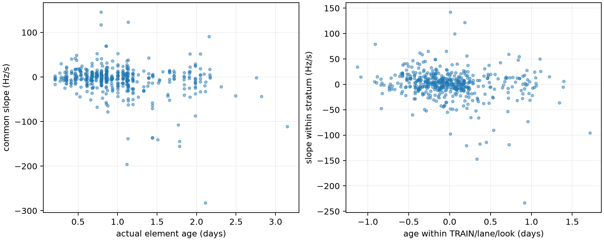

# TRAIN actual-element-age diagnostic

The public read-only TLE archive was available and bounded recovery completed
without RF replay. It validated all 151 TRAIN sessions and recovered the actual
parsed element epoch for all 6,988 exact fixed tracks (2,989 distinct
session/candidate joins) from 12 exact snapshot-content/collection-time
records. Every candidate resolved uniquely in its bound snapshot.

For the sealed paired-residual subset, actual element ages span 0.207 to 3.150
days, with median 0.862 days. The subset contains 486 pairs in 407
session/candidate groups and 138 sessions. This is candidate element age at the
sealed pair reference time, not snapshot collection age.

The marginal association with common residual slope is weak: Pearson
`r = -0.216` and Spearman `rho = -0.166`. After removing the mean within each
TRAIN-group/RF-lane/look stratum, it remains weak (`r = -0.183`,
`rho = -0.156`). Common quadratic residual is weaker: marginal `r = -0.088`,
`rho = -0.169`, and within-stratum `r = -0.066`, `rho = -0.137`.

Slope means by increasing element-age quartile are +0.35, +2.11, -5.38, and
-18.59 Hz/s. The oldest quartile has a more negative mean, but the continuous
associations are weak and the sealed report already showed heterogeneity by RF
lane and TRAIN group. This diagnostic is descriptive and does not show that
age causes the residual, justify an epoch shift, or identify a correction.

The result permits element age as one input to a physically constrained orbit
uncertainty prior, but argues against an ad hoc scalar age correction. The
causal update-history inventory found median current-minus-prior displacement
of 2,693.805 m along-track. This is catalogue-update variability, not error
against orbital truth or a calibrated prior width. The earlier
275 m all-identity phase-rate result remains an exploratory flexibility control.

`recover_epochs.py` uses `TleArchiveReader.list_snapshots()` and `read()` plus
`parse_element_sets()`. Exact selection requires digest and collection UTC
because identical content can occur under multiple archive records.
`results.json` binds those records, recovery export, sealed paired inference,
protocol, helper, and analyzer. No VAL, TEST, truth, geographic fit, RF replay,
or new collection was used.
