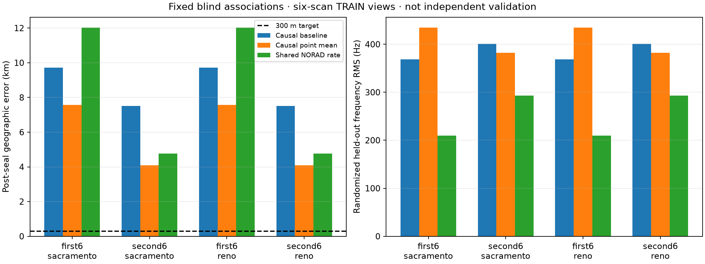

# Blind fixed-assignment causal orbit pilot: completed findings

The shared orbit-rate correction substantially reduces held-out frequency
residuals but does not deliver accurate short-view positioning. The first
six-scan group becomes worse geographically; the second improves relative to
the uncorrected fit but remains worse than the causal point-mean model.
No result is below 300 m. This exposed TRAIN pilot is not independent validation.

All four arms and all three stages converged after increasing the numerical
budget from 60 to 300 evaluations. The first-group rate fits took 93 and 76
evaluations for Sacramento and Reno; both second-group fits took 20. All
1 MHz held-measurement perturbations left fitted parameters invariant.
Direct SGP4 checks differed from the quadratic model by less than 0.02 Hz
in worst per-track profiled training residual RMS. Three satellite rate
corrections hit the declared boundary in each arm.

| TRAIN group | Prior | Model | Position error (km) | Held frequency RMS (Hz) |
|---|---|---|---:|---:|
| First six | Sacramento | Uncorrected causal | 9.716 | 368.27 |
| First six | Sacramento | Causal point mean | 7.569 | 434.78 |
| First six | Sacramento | Shared NORAD rate | 12.025 | 209.42 |
| First six | Reno | Uncorrected causal | 9.716 | 368.27 |
| First six | Reno | Causal point mean | 7.569 | 434.78 |
| First six | Reno | Shared NORAD rate | 12.029 | 209.42 |
| Second six | Sacramento | Uncorrected causal | 7.515 | 400.97 |
| Second six | Sacramento | Causal point mean | 4.096 | 382.37 |
| Second six | Sacramento | Shared NORAD rate | 4.764 | 292.85 |
| Second six | Reno | Uncorrected causal | 7.515 | 400.97 |
| Second six | Reno | Causal point mean | 4.096 | 382.37 |
| Second six | Reno | Shared NORAD rate | 4.764 | 292.85 |



The inference was sealed at SHA-256
`35564ccd5873abbdb9cf890f829903303b8258398075f91431319b3ee12424e6`
before geographic evaluation. `results/evaluation.json` binds that seal and
the evaluator source. The evaluator rejects an invalid seal, missing arms,
unconverged fits, failed held isolation, or excessive approximation error.
Tests confirm an invalid seal or unconverged result cannot reach the geographic
distance calculation.

## Interpretation and limitations

The short-view frequency shapes do not sufficiently constrain the tradeoff
between receiver position and satellite-specific orbital corrections under
this model. A lower RF residual is not a reliable position-error proxy here.
This is consistent with a flexible nuisance model absorbing position-related
structure; the experiment does not establish a unique causal explanation.
Randomized held rows share tracks/satellites with training, so they check
within-track prediction rather than independent future-satellite performance.

These fits reuse each view's frozen blind identities. The earlier exploratory
275 m result used a different fixed, site-assisted association population and
was not reproduced by this blind short-view transfer. Longer-duration sharing
could constrain the nuisance parameters more strongly, but this pilot does
not demonstrate that benefit. No new validation/test outcomes were used.

The baseline here uses the transferred robust observation-level objective and
per-track offsets; it is not the earlier capped duration-weighted search score.
It starts at that search's own sealed coordinates. Thus baseline errors here
must not be substituted for the original search's errors.

## Reproduce

Use the public archive/cache inputs bound by `view_inputs.py`, the learned
prior and provenance supplements, and the cutoff audit. Run with the same
numerical-library thread limits:

```bash
sudo -n -u leo env OPENBLAS_NUM_THREADS=1 OMP_NUM_THREADS=1 MKL_NUM_THREADS=1 \
  .venv/bin/python -u reports/2026_09_23_train_orbit_uncertainty_design/run_convergence.py \
  --output /tmp/causal-orbit-pilot-fresh.json
```

Require a fresh output path. Preserve and hash the completed inference before
calling `evaluate_pilot.py --inference PATH --sha256 HASH --output-dir DIR`.
The superseded 60-evaluation output and interrupted/failed source attempts are
retained; see `EXECUTION_ATTEMPTS.md`. The primary agent completed final review
after the subagents reached their usage limit; no external independent review
of the final numerical result is claimed.
