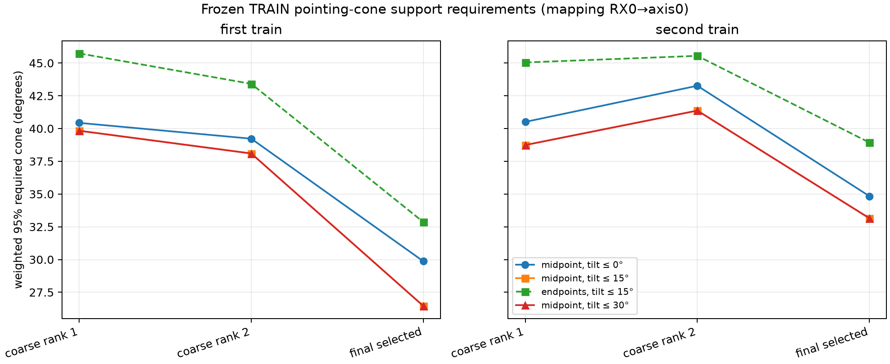
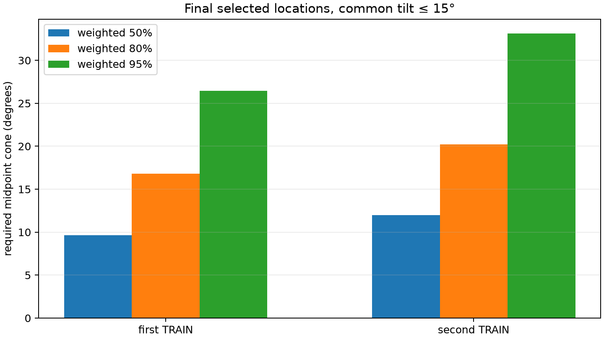

# Frozen TRAIN pointing-cone pilot results

The bounded vectorized run completed in 23.33 seconds over 155,592 common
orientations per location and mapping. It used only the frozen first six TRAIN
scans in each group, retained the Doppler-minimum candidate independently at
each frozen location, and accessed neither held rows nor truth. The largest
sealed center-time alignment residual was 128 ns.

With a common tilt allowance of 15 degrees, the final selected locations need
weighted midpoint cones of 26.45 degrees (first TRAIN) and 33.15 degrees
(second TRAIN) to cover 95 percent of duration weight. Re-evaluation at the
same selected orientations and track endpoints raises these to 32.86 and 38.93
degrees. The corresponding midpoint 50/80/95 percent requirements are
9.62/16.79/26.45 degrees and 11.98/20.21/33.15 degrees.

The conservative endpoint sensitivity takes the worse of each track's start
and end angle before applying its duration weight; its corrected 95 percent
values are 32.86 and 38.93 degrees at the final points. The superseded output
that pooled endpoint samples is retained under an explicit filename and attempt
record, but is not used here.

The coarse locations require wider 95 percent midpoint cones: 38.10--39.83
degrees for first TRAIN and 38.74--41.37 degrees for second TRAIN with the same
15-degree bound. Allowing 30 degrees produces exactly the same optima and cone
values at every location; all selected 95 percent tilts are 3--10 degrees.
The two provisional receiver mappings are geometrically symmetric here: they
produce the same cone values with yaw shifted by 180 degrees. This result
therefore does not identify the physical mapping.

The favorable signal is that both final Doppler-minimum locations require
narrower 80 and 95 percent cones than either coarse survivor. The null result
is equally material: in first TRAIN the near-tied coarse Doppler pair has 80
percent cones of 21.779 and 21.650 degrees, only 0.130 degrees apart, so this
pilot does not clearly break that coarse association tie or yet demonstrate
independent dual-receiver geometric information.

The two coarse cells are 49.99 km apart. The final point lies 32.33/36.30 km
from the two first-TRAIN cells and 24.54/30.24 km from the two second-TRAIN
cells. At a representative 1,000 km slant range, 50 km subtends about 2.86
degrees, while 300 m subtends about 0.017 degrees. The orientation grid itself
uses 5-degree yaw and tilt-azimuth steps, RF boresight is unmeasured, and the
required cones span tens of degrees. These geometric support requirements can
help test coarse association consistency between distant basins, but they do
not establish or imply 300 m position precision.

`results.json` binds the frozen locations, protocol, scorer and loader, exact
candidate identities, receiver IDs, duration weights, metadata checkpoints,
cache receipts, and causal state caches. `PREEXECUTION_AMENDMENT.json` records
all failed/interrupted pre-seal attempts and binds the vectorized executed
source and its tests.
