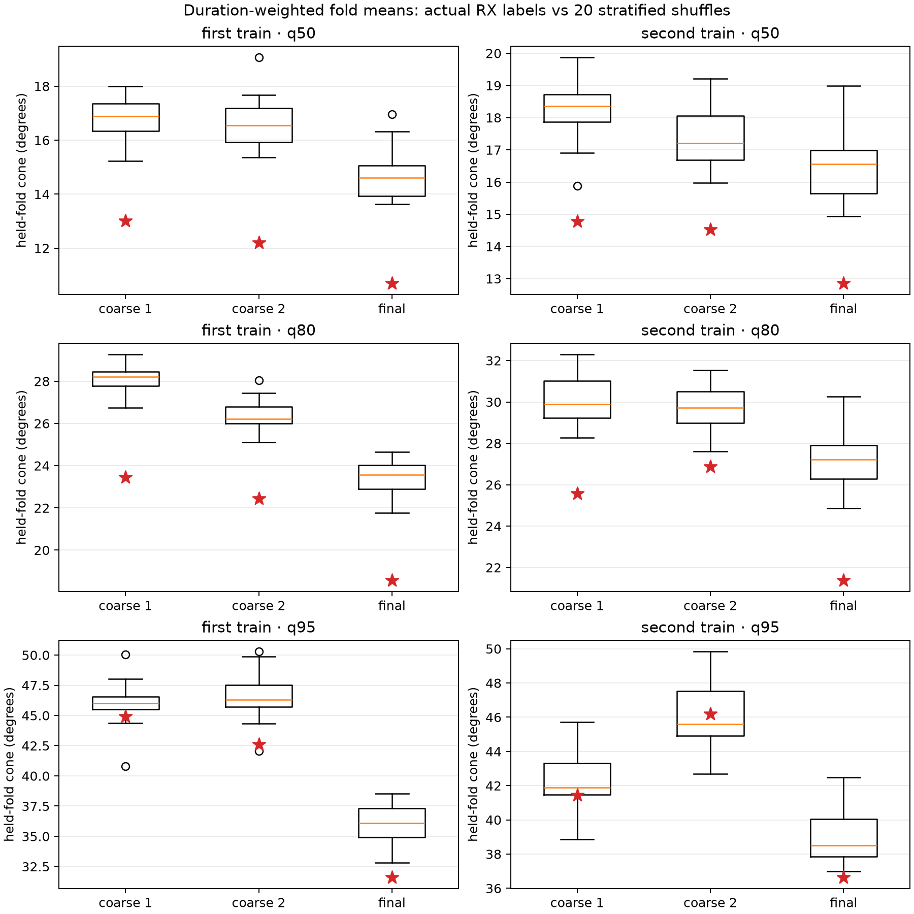

# TRAIN pointing generalization

The frozen experiment completed all 1,260 planned location, mapping, fold, and
label-control rows in 633.7 seconds with zero failures. Five whole-NORAD folds
were assigned deterministically with seed 20260923. Each orientation was fitted
on four folds and evaluated without refitting on the fifth. All 20 controls
permuted whole-track receiver labels within scan/RF-lane strata while preserving
each stratum's RX counts. Depending on group, 128--230 labels moved per
permutation; no stratum was silently omitted.

For RX0-to-axis0 (the other provisional mapping is geometrically symmetric),
the duration-weighted means of the five held-fold quantiles were as follows.
Each control entry is the median and full range across 20 permutations. These
are summaries of five separately computed held-fold quantiles, not a pooled
quantile over held tracks.

| TRAIN view | Location | q50 actual / control | q80 actual / control | q95 actual / control |
|---|---|---:|---:|---:|
| first | coarse rank 1 | 13.02° / 16.89° [15.23,18.00] | 23.45° / 28.22° [26.74,29.27] | 44.92° / 46.02° [40.79,50.02] |
| first | coarse rank 2 | 12.19° / 16.55° [15.36,19.07] | 22.45° / 26.22° [25.10,28.05] | 42.62° / 46.30° [42.05,50.30] |
| first | final selected | 10.70° / 14.61° [13.64,16.96] | 18.57° / 23.56° [21.76,24.64] | 31.61° / 36.08° [32.81,38.54] |
| second | coarse rank 1 | 14.78° / 18.37° [15.89,19.87] | 25.56° / 29.89° [28.27,32.30] | 41.45° / 41.90° [38.87,45.73] |
| second | coarse rank 2 | 14.53° / 17.21° [15.97,19.21] | 26.87° / 29.73° [27.60,31.53] | 46.19° / 45.59° [42.69,49.85] |
| second | final selected | 12.86° / 16.56° [14.93,19.00] | 21.38° / 27.22° [24.87,30.25] | 36.64° / 38.52° [36.98,42.47] |

Actual labels beat all 20 controls at q50 and q80 at all six locations. This is
evidence that receiver labels carry angular structure that generalizes across
NORAD groups. It is not location discrimination: the improvement also occurs
at the wrong coarse cells. At q95 the evidence is mixed, including substantial
control overlap and a worse-than-control median at second-TRAIN coarse rank 2.
The 20 deterministic controls define a finite comparison range, not a
calibrated p-value or population-level significance test.

These are angular concentration diagnostics, not RF beam likelihoods,
detection probabilities, or evidence that tracks outside a cone are invisible.
The experiment used no truth, VAL/TEST, geographic optimization, candidate
reselection, position fit, or new RF.

`prepared_inputs.json` preserves and binds the exact six-location identities,
durations, metadata/cache/TLE inputs produced through the sealed cone source.
`results.json` binds that artifact, the frozen locations, protocol, executed
source, and cone source. Three independent tests cover whole-NORAD fold
stability, within-stratum shuffle invariants, and isolation of fitted
orientations from held-angle perturbations.

See [the primary-agent review](REVIEW.md) for aggregation definitions, the
additional 80% summary, and the distinction between the copied historical
amendment, prepared-input placeholders, and this experiment's actual results.
