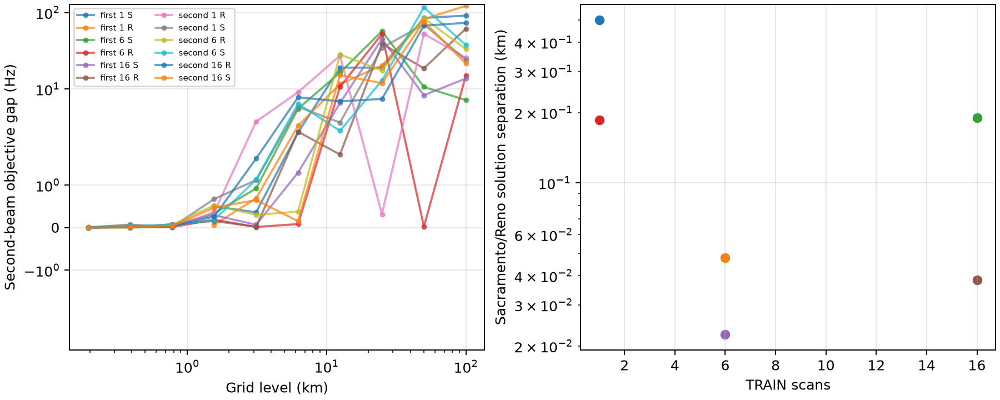

# TRAIN saved-search ambiguity audit

The saved blind searches show one clear coarse multimodal warning and otherwise
strong convergence between the two broad priors. They do not provide a reliable
rejection statistic for acquisition failure.

The strongest warning is the first TRAIN group's six-scan Reno search. At the
50 km refinement level, two retained basins were 50 km apart but differed by
only **0.025 Hz** in the capped objective. At the next 25 km level the alternate
branch no longer remained competitive. Because the beam retains only three
cells and explores children only around those cells, the saved trace cannot
tell whether that branch was truly ruled out or lost through pruning.

All other saved searches had much larger objective gaps to their second coarse
beam cell at 50 km (8.3–116.9 Hz). Sacramento and Reno searches converged to
coordinates within 0.02–0.50 km for every matching group/duration view. Their
selected candidate identities agreed on 99.47–100% of common tracks. This makes
a persistent, widely separated TRAIN basin uncommon in these outputs, while
also showing why prior-start agreement alone cannot certify correctness.

At the final 0.195 km level, second/third beam gaps are generally tiny
(0.0005–0.016 Hz for 6/16 and second-group one-scan searches). Those retained
cells are only 0.195–0.276 km apart, so they describe a locally flat sampled
minimum rather than independently retained geographic modes. The first group's
one-scan final alternatives remained 1.56 km away with 0.069–0.746 Hz gaps.

The original first-group one-scan run was a deliberately coarse control: its
saved source stops at 1.5625 km and has no 0.781/0.391/0.195 km evaluations.
All later 6/16 and second-group searches did evaluate about 18 new unique cells
at each fine level. A retained point can carry forward unchanged, so its trace
`level_km` is the level where that coordinate was first evaluated. Effective
resolution is bounded by the selected point's origin level: first-group
one-scan selections originate at 1.5625 km; later selected points originate
between 0.781 and 0.195 km.

The proposed cheap diagnostic is **multi-resolution separated-mode
persistence**: retain and report, at every grid level, the objective gap and
distance from the best cell for all three beam survivors, alongside independent
prior-start coordinate and identity agreement. Keep these as continuous
diagnostics; this audit chooses no rejection threshold and uses no truth. A
future search should persist branch lineage explicitly, since the current trace
cannot distinguish a dead branch from one removed by the next beam pruning.

## Pointing-aware acquisition diagnostic

The first bounded geometry experiment should measure required field of view,
rather than invent an antenna-gain likelihood. For every retained spatial basin,
take Doppler-compatible candidate directions with their receiver labels and
profile one mount orientation shared across all scans in the TRAIN view. Using
the nominal 20° relative LT3D-001A axes, both receiver-to-slot mappings, and a
small predeclared set of upward-tilt bounds, report the minimum common cone
half-angle needed to cover 50%, 80%, and 95% of duration-weighted track support.
Orientation may not vary per track or per scan. Split only at documented
hardware/rotation validity boundaries.

Run two conditional versions: fixed winning identities from each saved basin,
and, using the existing candidate-state cache, the least-cone identity among
candidates whose Doppler loss is within a fixed TRAIN-only objective allowance.
The second version exposes whether association alternatives can rescue an
otherwise implausible cone. Later nulls can shuffle receiver labels or response
weights while preserving scan/track structure. This diagnostic is cheap: it is
a yaw/tilt grid and weighted angle quantiles, not another geographic fit.

Only after this cone audit shows basin discrimination should a soft capped
pointing term be tested in acquisition. RF boresights and phase centers are null
in the geometry manifest, cable mapping is provisional, and the reported 79°
east axis lacks a settled convention and validity interval. The array was later
rotated 180°, so a common orientation cannot span that boundary. No
site/reference coordinate may calibrate orientation. Finite sidelobes remain
necessary in any later scoring model. The previous receiver-leader diagnostic
favored the leader for 94/106 tracks but changed localization only from about
1.059 to 1.054 km versus shuffled control, so orientation evidence has not yet
demonstrated useful geographic discrimination.

## Limits

- Only evaluated cells exist in saved traces; pruned or never visited modes are
  unknowable.
- Beam width three is itself the measurement bottleneck.
- Objective gaps are not probabilities or calibrated uncertainty.
- Candidate identity is minimized independently at each cell, so a smooth
  objective branch can hide association switches.
- Both prior searches share the same measurements, catalogue, and scorer; their
  agreement is correlated evidence.
- This is TRAIN-only and runs no new model fit.

