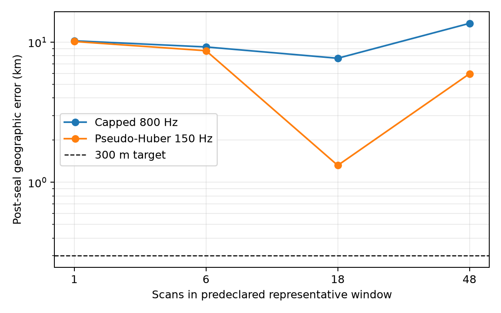

# Training-only continuous position search

This bounded diagnostic fits a new receiver coordinate independently in each
predeclared validation window. Candidate identity, integer timing offset, CFO,
and position are selected using only saved training rows. The complementary
rows and locked reference coordinate are read only after `inference.json` is
sealed. The search uses the intersection of the Sacramento 250 km and Reno
500 km priors, three in-window prior-derived seeds when valid, and at most 150
Nelder-Mead evaluations per seed.

The candidate universe is conditional: each scan cache contains the union of
identities published by the earlier Sacramento/Reno analyses, whose identity
selection used evaluation rows. These results therefore measure continuous
spatial fitting inside that conditional pool, not a full-catalogue blind test.
The four validation windows are the first frozen 1, 6, 18, and 48 scan windows;
they were chosen by the dataset manifest before these outcomes were computed.

| scans | capped error km | robust error km | capped reserved RMS Hz | robust reserved RMS Hz |
|---:|---:|---:|---:|---:|
| 1 | 10.235 | 10.121 | 204.39 | 204.43 |
| 6 | 9.252 | 8.700 | 141.45 | 145.16 |
| 18 | 7.684 | 1.322 | 146.08 | 147.25 |
| 48 | 13.635 | 5.955 | 168.31 | 167.54 |

The robust arm uses a pseudo-Huber track loss with a 150 Hz scale frozen from
development diagnostics. It improves geographic error in these four windows,
most strongly for 18 scans, but neither arm approaches the 300 m target on any
validation window. Reserved-frequency RMS does not reliably rank geographic
error: for example, the robust 18-scan coordinate is much closer while its
common reserved RMS is slightly worse.

On the original 16-scan development set, the training-only capped and robust
fits have post-seal errors of 0.412 km and 0.592 km respectively. This is a
development diagnostic, not generalization evidence.

The inference pass took 328.2 s, including 253.9 s for the four
validation-window optimizations. Recomputing all post-seal metrics took 7.6 s,
for 335.9 s total. `results.json` contains coordinates, native objectives, common
reserved capped and uncapped metrics, seeds, convergence flags, source digests,
and per-fit evaluation counts. `inference.json` and `inference.sha256` are the
truth-free sealed inference and receipt.

