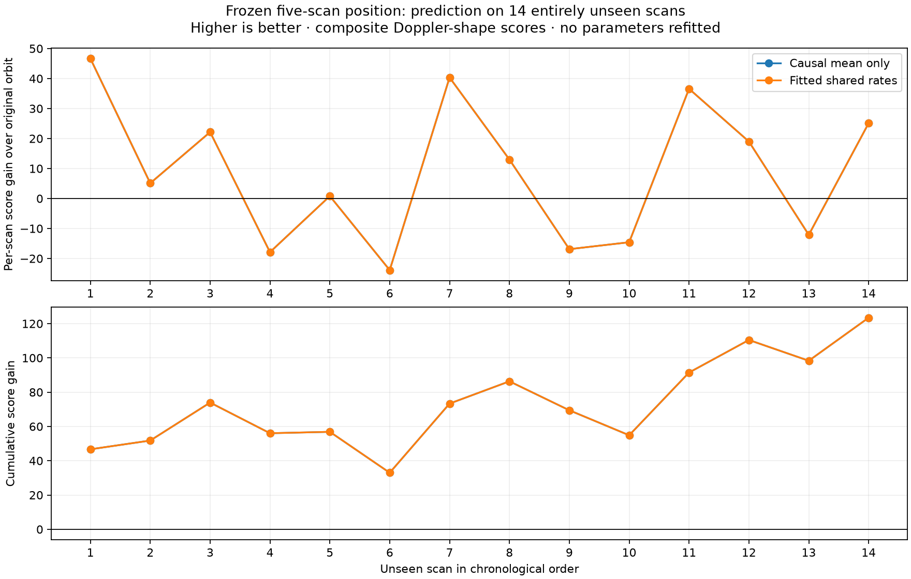

# Frozen five-scan orbit prediction on unseen scans

This is a comparative whole-scan predictive-shape result for a frozen five-scan Reno
model. All three runs score the same 14 entirely unseen scans, 350 episodes, and
10,184 observations. The receiver position and model parameters were fixed; no
holdout observation was used to refit them.

The fitted-rate run scored **-18,189.345927416787**, compared with
**-18,312.790960433384** for the original orbit and **-18,189.351962909517** for
the causal-mean orbit. Higher is better on this composite score. The fitted model
therefore gains **123.445033016596** over the original orbit, but only
**0.006035492730** over the causal mean.

That distinction controls the interpretation. The evidence supports a predictive
Doppler-shape improvement from moving the original orbit to the causal-mean orbit at
the fixed five-scan position. It does not provide a meaningful test of learned rate
corrections: all 319 episodes whose leading candidate weight exceeds 0.5 are led by
saved-rate candidates with `abs(rate) < 1e-6 s/h`; the maximum is only
`3.6861351016944154e-10 s/h`. The result must not be described as orbital-rate
generalization or as confirmation that the leading satellite identities are correct.

## Bound inputs and equality checks

- Frozen fit SHA-256: `609cb2aa8c97bb26ac0a19a0a6f4792a6cc91fbf5b0e2c861c3b73bea11b0175`
- Qualified exact-fit receipt SHA-256: `61f87f8764518d4441a563ab507048ebb71bf7afafbb75c6816d89ebd46b6166`
- Holdout inventory SHA-256: `f9fe254906d73bb2bfb2042be9016ddcea086c28692cc21b434aed83cb2b71a2`
- Each run is complete, truth-free, and records `parameters_refitted: false`.
- Every result binds the same fit, exact receipt, inventory, score configuration, and
  five training sessions.
- The copied per-scan files reproduce every digest recorded by their run result.
- Session IDs, episode IDs, and per-episode observation counts are identical across
  all three modes.
- The holdout inventory contains exactly the same 14 included sessions.

## Chronological scan comparison

The table reports composite-score gains. Positive values favor the row’s first orbit
mode.

| # | Session | Observations | Episodes | Fitted − original | Causal mean − original | Fitted − causal mean |
|---:|---|---:|---:|---:|---:|---:|
| 1 | `scan-fw-6b6851e02c77f490` | 565 | 17 | 46.676360 | 46.676360 | 0.000000 |
| 2 | `scan-fw-2e2ef6644780516c` | 634 | 19 | 5.103469 | 5.103469 | 0.000000 |
| 3 | `scan-fw-d7a50cb9fcb9c2e6` | 588 | 24 | 22.151404 | 22.151404 | 0.000000 |
| 4 | `scan-fw-19ab87cc12c4b883` | 818 | 28 | -17.877167 | -17.880129 | 0.002962 |
| 5 | `scan-fw-6fdbf14afd5bb8cc` | 931 | 24 | 0.814446 | 0.814446 | 0.000000 |
| 6 | `scan-fw-525ec2bdd6d72e72` | 786 | 24 | -23.873836 | -23.873836 | 0.000000 |
| 7 | `scan-fw-53a405ae9a5de3ce` | 792 | 34 | 40.350816 | 40.350816 | 0.000000 |
| 8 | `scan-fw-254dad923cc961aa` | 952 | 34 | 12.986059 | 12.986059 | 0.000000 |
| 9 | `scan-fw-af2edb2370e94774` | 872 | 29 | -16.886155 | -16.886155 | 0.000000 |
| 10 | `scan-fw-ae07971460361cf7` | 893 | 35 | -14.578472 | -14.578472 | 0.000000 |
| 11 | `scan-fw-e11a14696f0f86f9` | 351 | 14 | 36.582989 | 36.582989 | 0.000000 |
| 12 | `scan-fw-ceafe9666d1dda0d` | 510 | 19 | 18.999954 | 18.999954 | 0.000000 |
| 13 | `scan-fw-180f6e8236bfab17` | 657 | 19 | -12.109509 | -12.112583 | 0.003074 |
| 14 | `scan-fw-7b25b1ffa0e62950` | 835 | 30 | 25.104676 | 25.104676 | 0.000000 |

Fitted rates beat the original orbit on 9 of 14 scans. The causal mean also beats the
original on the same 9 scans. Fitted rates are arithmetically higher than the causal
mean on 3 scans, but one difference is about `8e-12`; only two exceed `1e-6`.



## Method and limitations

The scorer uses the fixed five-scan Reno receiver position and the same frozen
parameter set over the full causal catalogue. It removes one constant frequency
offset per source segment with contrasts and evaluates Doppler shape. A NORAD absent
from the saved fit receives an explicit zero residual rate at its causal mean.

The score is an effective-count-tempered composite score, not a calibrated joint
predictive probability. Candidate weights are composite association diagnostics, not
identity probabilities. Orbit-rate or position covariance is not integrated, so the
comparison omits parameter uncertainty and correlation. Visibility and propagation
support remain deterministic under each frozen orbit mode.

These scans lie within the same eight-hour collection window, but this is not the
final eight-hour training result. It does not measure a geometry gain, establish
receiver-position accuracy, or compare positions trained on 8, 15, and 30 scans.
It isolates orbit-mode prediction at one position learned from the earlier five-scan
Reno cohort.

## Reproduction

`build_report.py` rechecks all authority and per-scan digests, exact episode/row
identity, totals, chronology, and dominant-rate coverage before writing
`summary.json`. `render.py` renders the plot from that verified summary.

```bash
.venv/bin/python reports/2026_09_23_unseen_scan_orbit_validation/build_report.py
.venv/bin/python reports/2026_09_23_unseen_scan_orbit_validation/render.py
```

The copied run outputs and authority/source snapshots under `inputs/` make the
comparison independent of mutable cache paths. `artifact-manifest.json` hashes the
completed bundle.
