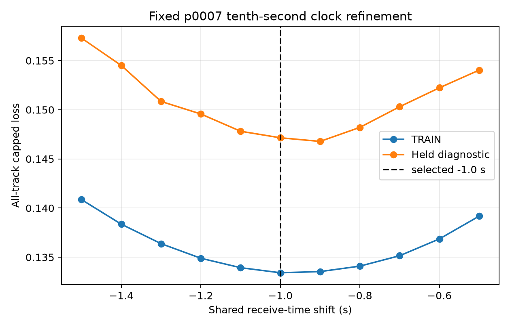

# Tenth-second shared-clock refinement

At the fixed sealed location `p0007`, the TRAIN-selected shared receive-time
shift remains **-1.0 seconds** on the 0.1-second grid from -1.5 through -0.5
seconds. The all-track capped TRAIN loss is 0.133417 and the held diagnostic is
0.147147, exactly reproducing the parent experiment at -1.0 seconds.

The nearest alternatives are -0.9 seconds (TRAIN 0.133537, held 0.146779) and
-1.1 seconds (TRAIN 0.133932, held 0.147812). The TRAIN curve has an interior
minimum on this discrete grid, but 0.1 seconds is a numerical step and not a
confidence interval or calibrated clock uncertainty. Orbit mismatch can still
drive the fitted sensitivity shift.

Runtime was 14.94 seconds. Geography was fixed throughout, so the prior
post-seal reference error remains 3.015 km by construction. No truth entered
selection, and no geographic rescan, cone fit, VAL/TEST, new RF, QNAP write, or
deployment was used.

