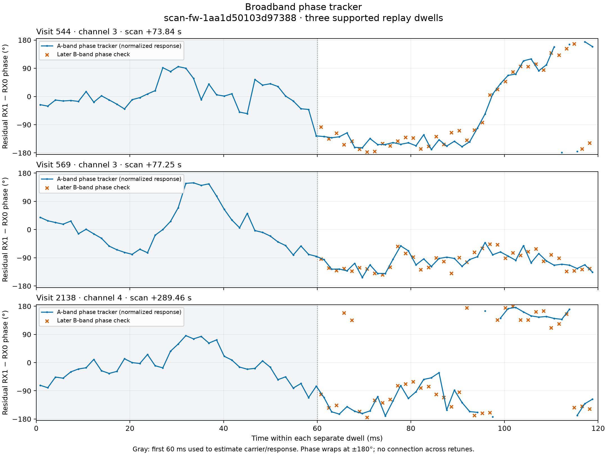
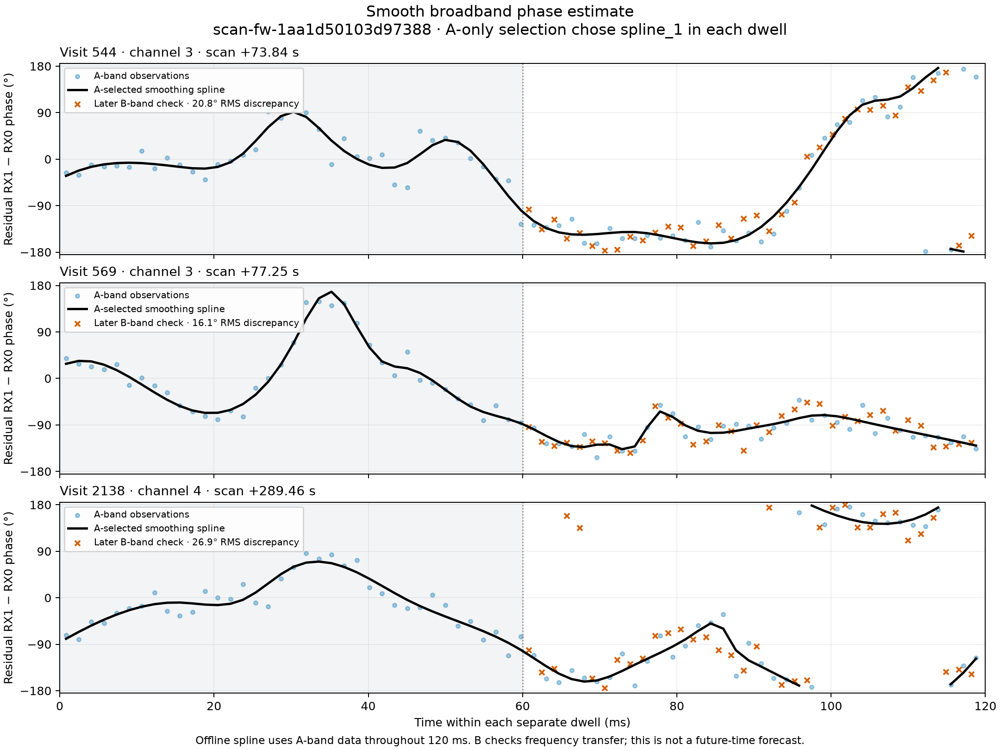
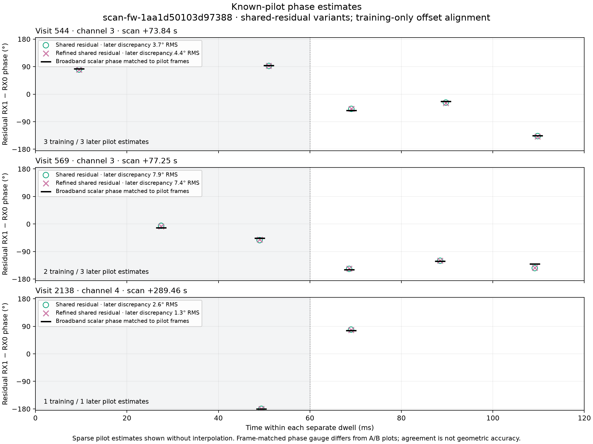
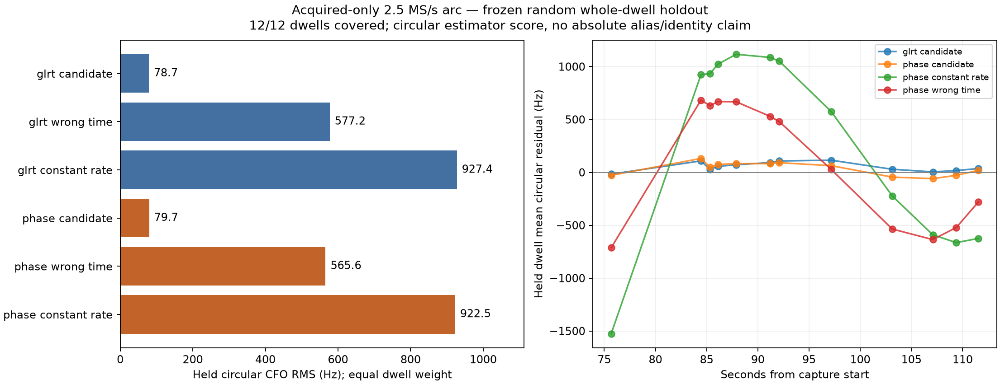
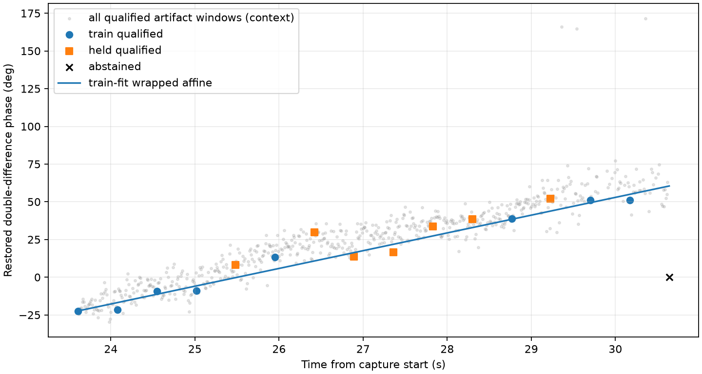
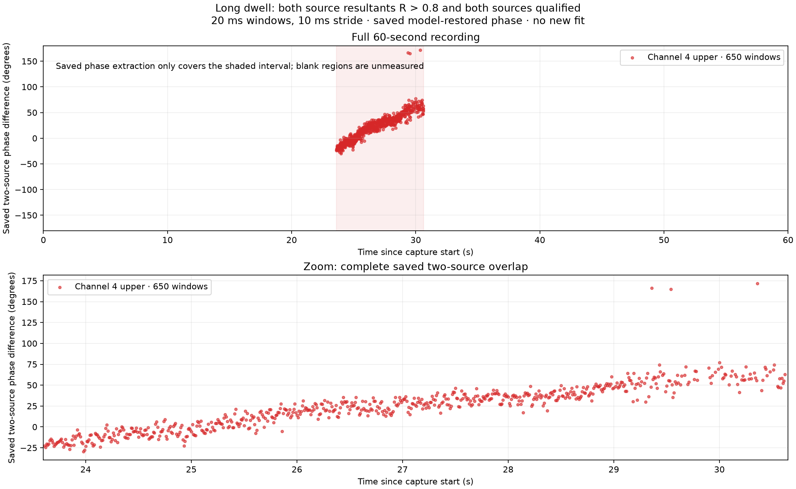
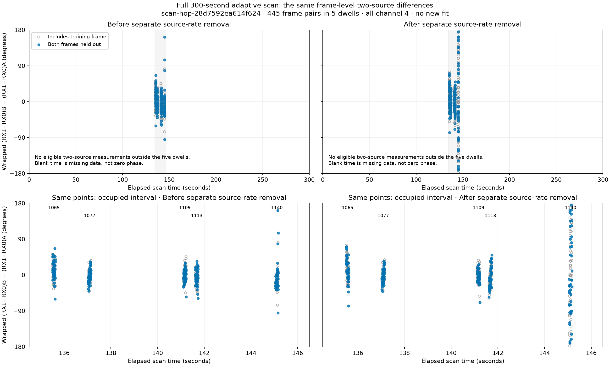
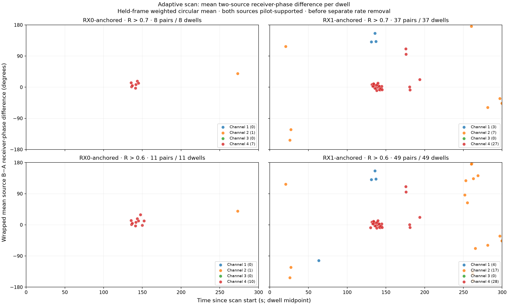

# Consolidated phase-methods evidence

This is an index and technical reading guide for the saved-IQ phase work through
24 September 2026. It preserves negative, superseded, and conditional results
beside the strongest extraction results. None of the work establishes a named
satellite, a receiver position, antenna direction, or satellite velocity.

## What is measured

The useful local observable is a phase associated with a selected waveform
component, normally the receiver cross-product

```text
phi_10,s(t) = arg(RX1_s(t) conj(RX0_s(t))).
```

It is conditional on source epoch, carrier branch, template, timing, and the
receiver response rotations used by the extractor. For two contemporaneous
isolated components, the more promising cancellation observable is

```text
D_AB(t) = phi_10,B(t) - phi_10,A(t)  (modulo 2 pi).
```

This can remove a receiver term common to both components at that epoch. It
does not remove frequency-dependent receiver delay, source/template ambiguity,
or a source-dependent channel response. For separated phase centers with a
calibrated electrical baseline `b`, the geometric part would be
`(2 pi f/c) b dot u`; its time derivative is one projected transverse-motion
measurement. The current corpus has no phase-center/world-pose or electrical
calibration authority that permits that interpretation.

The common safeguards are: freeze timing/CFO/template branches before held
response scoring; use physical, seeded random whole groups; fit offsets and
rates only on training data; retain all abstentions; and score exact, rolled,
wrong-time, wrong-source, or wrong-geometry controls on the same held support.
Several early first/later-half and across-retune-unwrapped plots remain useful
diagnostics, but are historical development evidence and not random-holdout
validation.

## Evidence map

| Area | Current reading | Status |
| --- | --- | --- |
| Local single-source RX phase | [scan-1aa methods](2026_09_23_scan_1aa_phase_methods.md), [random group replay](2026_09_23_random_phase_association.md) | Useful conditional waveform/coherence evidence; no geometry. |
| Rate and bandwidth | [phase association and motion](2026_09_23_phase_association_and_motion.md), [matched bandwidth](2026_09_23_matched_bandwidth_phase_results.md) | 10/15 MS/s can yield local tracks; no causal rate advantage established. |
| Long one-source arc | [longarc phase](2026_09_23_longarc_phase.md), [independent v2](2026_09_23_independent_phase_v2_results.md) | Phase does not improve held candidate/site association. |
| Two-source waveform separation | [joint isolation](2026_09_23_joint_pilot_isolation_results.md), [stream-0 replication](2026_09_23_stream0_pilot_replication_results.md) | Conditional opportunities, not robust source identity. |
| Continuous dual-RX phase | [long-dwell multiscale](2026_09_23_long_dwell_multiscale_phase.md), [long-dwell change](2026_09_23_long_dwell_phase_change.md) | Strongest evidence that the 120 ms scale is technically recoverable. |
| Adaptive dwells and retunes | [refined adaptive replay](2026_09_23_adaptive_multiscale_phase_refined.md), [300 s view](2026_09_23_adaptive_phase_300s.md), [gate ladder](2026_09_23_adaptive_relaxed_phase_gate_ladder.md) | Within-dwell DD coherence is conditional and localized; no cross-retune phase connection. |
| Geometry/association readiness | [observability audit](2026_09_23_phase_geometry_observability_audit.md), [sensitivity](2026_09_23_phase_geometry_sensitivity.md), [real-data readiness](2026_09_23_phase_real_data_readiness.md) | Calibration/authority blocks a physical direction, speed, or position claim. |
| Synthetic scorer qualification | [synthetic phase association](2026_09_23_synthetic_phase_association_results.md) | Shows the proposed scorer can help when explicit truth/calibration assumptions hold and abstains under declared mismatch. It is not hardware evidence. |

## Local phase extraction: retained and superseded methods

The 2.5 MS/s `scan-fw-1aa1d50103d97388` replay is the starting local
measurement. It selected eight dwells phase-blind by paired detection strength;
three passed support, four failed, and one abstained. The original 60 ms
calibration / later-B comparisons have independent A/B frequency bands, but
their first/later temporal division is historical, not the current validation
standard.







For the three supported examples, later B RMS for the A-selected spline was
20.8°, 16.1°, and 26.9°, versus 123.7°, 43.4°, and 50.9° for a linear curve.
That shows a local residual curve can be tracked; it does not preserve an
absolute interferometric phase because every dwell has fitted carrier/response
parameters and its own reference.

The replacement random-group replay froze the same 24 selected 120 ms dwells
at 2.5/10/15 MS/s, seed `20260923`. Whole 20 ms groups, both receivers, and
their FFT/filter support stay together; 0.2 ms boundary guards prevent crossing
groups. Inner selection also uses random training groups. A is conditioning
input and B is held frequency response, so it is held-B prediction conditional
on A, not a completely unseen block prediction.

| Rate | Supported / 8 selected | Abstained | Median tracked / wrong-pair coherence |
| --- | ---: | ---: | ---: |
| 2.5 MS/s | 2 | 2 | 0.10599 / 0.01727 |
| 10 MS/s | 7 | 0 | 0.12359 / 0.002615 |
| 15 MS/s | 6 | 0 | 0.12166 / 0.001719 |


The support gate is tracked B coherence above 0.05 and three times wrong-pair,
plus residual resultant above 0.8. Near-pi increments, sparse support, and
unsupported blocks abstain. This supports conditional common-waveform tracking;
the GLRT source pair can still be a mixture or a changing candidate.

## Sampling rate, duration, and matched bandwidth

The multirate comparison used 24 preselected dwells from distinct 300 s
captures. It therefore tests available local tracks, not an equal-sky causal
sample-rate experiment. The nearby 10/15 MS/s scans without accepted RX pairs
are unavailable rather than failures. On the phase-selected high-rate captures,
native supported dwell counts were 3/8, 8/8, and 7/8 at 2.5, 10, and 15 MS/s.
Median spline B RMS was 20.8°, 12.8°, and 12.9°; comparable refined-pilot RMS
was 4.4°, 2.7°, and 3.3°. Those are internal estimator discrepancies, not
angle/position/speed errors.


At an equal 1.6384 ms physical block duration, same-support median spline RMS
changed 20.8° to 20.8° at 2.5 MS/s, 12.6° to 9.5° at 10 MS/s, and 12.4° to 7.5°
at 15 MS/s. The longer FFT also changes frequency resolution, masks, and
smoothing; lost support at 10 MS/s visit 54 and 15 MS/s visit 272 prevents a
claim of uniform improvement.

The later same-IQ high-rate/full-versus-filtered-2.5 experiment is explicitly
retrospective development. Its original seeded split happened to be
chronological and was viewed; v2 uses a later nonchronological split with only
three held groups. The scorer was corrected from an incorrect modulo-pi to the
ordinary modulo-2pi vector phase without rereading IQ. Corrected held RMS /
resultants (degrees) are:

| Visit | Full | Filtered 2.5 MS/s |
| --- | ---: | ---: |
| 10 MS/s visit 760, v1 | 85.8 / 0.828 | 79.3 / 0.753 |
| 10 MS/s visit 760, v2 | 73.0 / 0.848 | 71.0 / 0.766 |
| 15 MS/s visit 475, v1 | 101.4 / 0.203 | 110.2 / 0.077 |
| 15 MS/s visit 475, v2 | 123.1 / 0.271 | 109.6 / 0.327 |


The order reverses between RMS and resultant or between visits. Different
frequency weighting and NCO/filter phase gauges mean offsets are not physical.
This does not rank 2.5, 10, and 15 MS/s. Wider bandwidth can supply more
samples and potentially more non-pilot content, but the fixed eight-tone pilot
does not gain pilot tones merely by increasing sample rate.

## Long arcs: phase-derived frequency did not improve association

The 49.963 s 15 MS/s `scan-fw-f0af018448538a4c` arc has 78 source-bound
dwells, 42/36 seeded random whole-dwell train/held split, and 24 fixed frame
opportunities per dwell. Local even symbols choose among predeclared source
CFO seeds; odd symbols are response-only. Candidate and receiver-rate choices
are outer-training only.


Archived GLRT selected candidate 67330 with 144.254 Hz held odd-CFO RMS;
even-pilot CFO selected the same candidate with 145.166 Hz. GLRT won 29/36
dwell comparisons. The phase-increment arm had held RMS 0.261200 rad for its
correct-time candidate, 0.262125 for the constant-rate control, and 0.260967
for wrong-time geometry. Correct-time gain over constant was 0.000483 (whole-
dwell bootstrap 95% [-0.003561, 0.004369]); wrong-time was competitive.


The independent 2.5 MS/s v2 candidate/site test reaches the same conclusion:
phase held circular RMS was 79.666 Hz versus 78.719 Hz for GLRT, with phase
minus GLRT negative-log-score gain -0.001199 (95% [-0.015731, 0.016309]). The
phase-selected site was farther from the evaluation-only reference (342.2 km
versus 235.1 km). It is a useful frozen negative: phase waveform precision did
not add candidate discrimination beyond the inherited GLRT trajectory.



## Source isolation and local differential phase

Six 20 ms August-25 snippets received a fixed two-source, eight-tone joint
fit, with 100 microsecond random physical groups and equal train/held masks.
Only 19.025 s and 28.200 s improve held prediction beyond both single-source
models and all controls on both receivers. RX1 is positive on all six but RX0
is not. The two favorable rows are discovery opportunities, not independent
population validation.


The follow-up 100 microsecond coefficient-phase test on 28.2 s fails its
prespecified stability gate: exact held affine RMS 1.300 rad, held resultant
0.462 (required 0.8), despite full rank and condition number at most 1.72.
Nine training increments exceed 2.5 rad, so the affine slope is unwrap-
ambiguous and must not be called velocity. This does not rule out a 20 ms
integrated static phase; optimistic independent averaging would only reduce
1.300 rad to about 0.092 rad, still far above short-dwell geometric curvature
after a free phase/rate nuisance.

The independent stream-0 replication is likewise mixed: 2/4 held eligible
probes meet the descriptive two-receiver exact-pair condition. Together these
results show waveform separation can be present locally, but it has not yet
produced a stable phase motion observable.


## Long continuous dwell and adaptive-scale recovery

The strongest mechanism result is the 105915 continuous two-source interval.
Five independent centers were replayed at 600, 300, 150, 120, 60, and 20 ms.
At 120 ms, frozen historical timing gives 5.54° median error against the
retained corrected 20 ms reference; train-only local timing gives 7.04°.
At 60/20 ms frozen timing gives 3.83°/2.72°. Exact/rolled held-power ratios are
16.2, 19.8, and 18.9 at 120/60/20 ms. One constant residual model becomes poor
at 300--600 ms; this is compatible with residual curvature, mixture, timing,
or other mismatch and is not an identified cause.


The separate seven-second phase-change diagnostic uses 16 predeclared windows,
8/8 seeded random train/held. Seven held windows qualify: affine median
circular error is 6.191°, versus 18.648° for constant phase and 8.059° for the
frozen wrong-time control. The modest 1.87° wrong-time advantage is not a
candidate-specific success criterion.





The last figure is a retained threshold visualization; it is not a new fit or
a population validation endpoint.

## Adaptive dwells, retunes, and the high-R regions

The first five-visit adaptive replay is **superseded as an interpretation**:
it summed pilot symbols before residual-CFO correction and therefore showed
weak exact/control ratios near one. It remains archived as a frontend failure,
not evidence phase was physically lost.


The corrected replay applies train-only within-frame residual CFO before the
64-symbol coherent sum. All five 120 ms development visits show weighted,
near-simultaneous held DD resultants 0.922--0.963 before separate source-rate
removal. Exact/rolled and exact/wrong-timing power ratios at 120 ms have
medians 16.77 and 22.70. The values are conditional on frozen source branches,
low-to-high ordering, source timing, a raw RX offset prior, and a selected
five-visit development cohort.


Do not separately subtract per-source fitted rates before evaluating DD
coherence. On visit 1140, a 17.74 Hz difference between those fitted rates
creates an apparent DD sweep: weighted R changes from 0.935 before removal to
0.157 after. The raw/conditional DD is concentrated; the detrended display is
not a physical-incoherence result.

The full 300 s scan contains 445 cached paired-frame points (225 held-by-both),
but all lie from 135.504 to 145.172 s because only five strict two-source
channel-4 bindings exist. They are plotted on the full scan clock without
interpolation or fitting.



Relaxed metadata criteria deliberately distinguish broader single-source
coherence from independent two-source support. Of 301 visits with one passed
candidate on both RX, 258 have the archived timing/offset-consistent one-source
match and only five have the strict two-source match. In all already computed
relaxed results, thresholded two-source dwell means retain separate anchor
arms: at R>0.9, RX0 has 7 and RX1 22 rows; at R>0.8, RX0 has 7 and RX1 27.
All R>0.9 rows are channel 4. At R>0.8, RX1 includes one channel-1, three
channel-2, and 23 channel-4 rows. Counts across arms overlap and cannot be
added as unique dwells; no arm has multiple passing pairs in a dwell.




R is an amplitude-weighted circular concentration within a 120 ms dwell, not
Pearson correlation, a confidence interval, association probability, or a
cross-retune phase gauge. The near-zero cluster only shows where this
conditional extractor is coherent. Candidate pairs derive from the start-20-ms
GLRT probe of each dwell, so phase held frames test the replay conditional on
same-dwell discovery information rather than independent acquisition.

Across retunes, preserve wrapped points and score a candidate-specific circular
model. Never use an unwrap to choose hidden turns across 1.7--5.1 s retune
gaps. A retune can leave a same-epoch DD usable if common receiver phase
cancels, but retune-specific channel response, timing/branch transport, and
source identity are unresolved.


## Geometry, position, and the valid next gate

The nominal mechanical 8 cm fixture separation is not an electrical
phase-center baseline, has no verified world orientation, and has provisional
RX mapping. A forward calculation at 11.2096875 GHz over 24 actual frame times
finds maximum geometric RMS over any 8 cm orientation of 0.009464 rad after a
per-dwell phase intercept and only 2.045 microradians after fitting intercept
plus differential frequency. After a quadratic nuisance, nanoradian numerical
remainders are projector residues, not a physical precision prediction. Current
conditional phase discrepancies are roughly 0.05--0.36 rad, so no measured
short-dwell curvature remains for geometry after those free nuisances.

The synthetic scorer qualification gives the appropriate conditional target:
in an explicitly calibrated artificial scenario, phase improves held true-
candidate log loss 0.0888 to 0.0520 at full coverage; in declared
frequency/source mismatch and independent-phase scenarios, training authority
disables phase and held scoring equals Doppler. Real saved-IQ results have not
met that calibrated observation model.

The next real association test should freeze a phase-blind population of
continuity-qualified, source-isolated two-source intervals before IQ access.
Assign seeded random whole intervals to outer train/held. Fit an effective
baseline vector of declared norm range and a low-order common differential-LO
term on training intervals only, retaining per-tone static response terms and
all aliases. Score held wrapped DD increments against the identical Doppler
candidate bank, wrong-time geometry, source-pair/epoch swaps, and rolled
templates. This can establish conditional candidate compatibility without a
surveyed orientation. Direction, speed, position, and identity still require
separate phase-center, receiver/channel, branch, timing, and source authority.

## Supersession ledger

| Item | Current treatment |
| --- | --- |
| First/later-half multirate fits | Historical development only; superseded for validation by seeded random groups. |
| Direct across-retune `unwrap()` and chronological extrapolation | Deprecated as continuity evidence; use wrapped visit values and random whole visits. |
| Initial adaptive multiscale negative replay | Superseded as a physical conclusion by within-frame-CFO-corrected replay. |
| Matched-bandwidth modulo-pi scoring | Corrected to modulo 2pi from preserved rows; v1/v2 remain audit artifacts and are retrospective. |
| 28.2 s local affine DD slope | Abstained: random gaps and near-pi increments make unwrap/rate non-identifiable. |
| Longarc phase-rate and independent-v2 candidate score | Retained negative controls: no phase increment over GLRT/Doppler association. |
| High-R adaptive means | Conditional within-dwell concentration only; not a connected phase or orbit trace. |

Every linked JSON/PNG is retained beside its source report. This consolidation
does not alter a phase extractor, candidate scorer, capture configuration, or
production association path.
