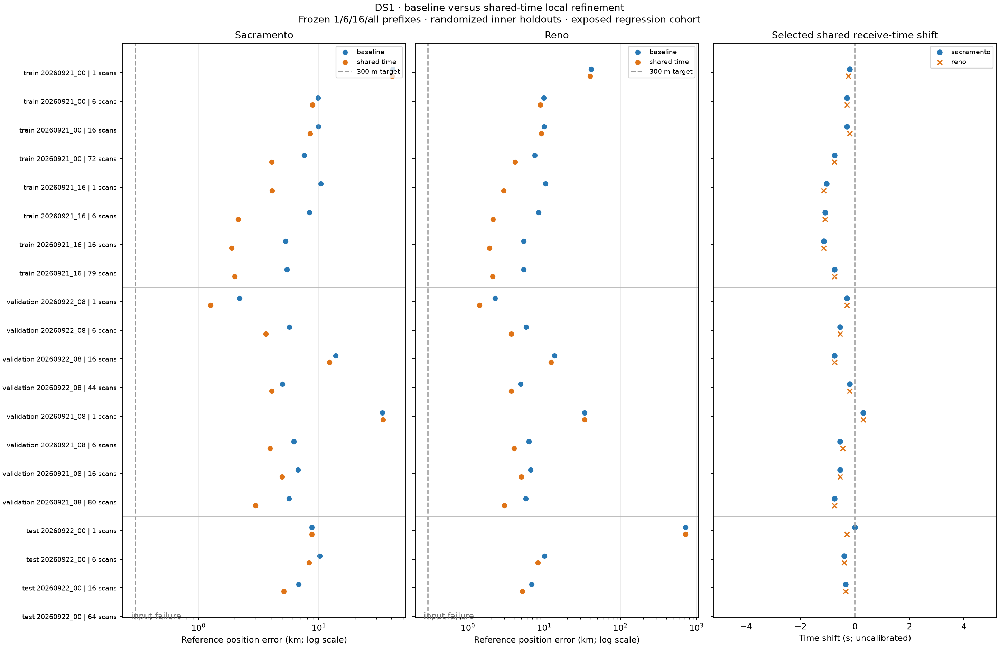
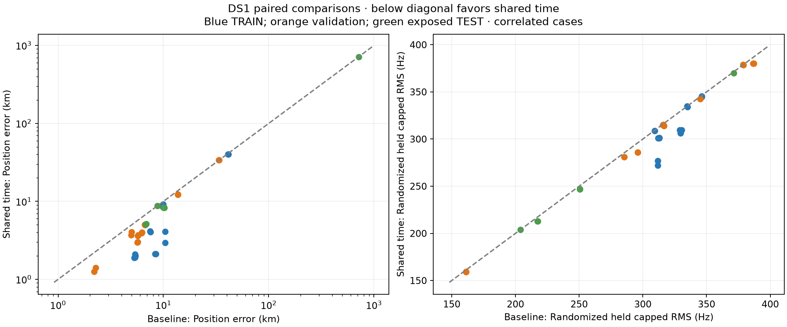

# DS1 baseline versus shared receive-time evaluation

DS1 is now the frozen multi-duration positioning regression benchmark. It has
339 recordings in five non-overlapping eight-hour calendar groups: 151 TRAIN,
124 validation and 64 exposed TEST recordings. Each group contributes fixed,
nested 1/6/16/all-scan prefixes and Sacramento 250 km/Reno 500 km starts. The
eight-hour groups contain capture gaps and are not continuous IQ. Validation
and partial TEST outcomes were previously inspected, so these results measure
regression behavior rather than untouched final generalization.

The comparison completed 76 model rows from 38 paired case/prior fits. Four
rows are the required explicit failures for baseline/shared-time and both starts
on the full 64-scan TEST case: frozen session 48 lacks counter-continuity
authority. It was not removed or replaced.

## Main result

| Partition | Completed paired fits | Position improved | Held RMS improved | Baseline median error | Shared-time median error |
|---|---:|---:|---:|---:|---:|
| TRAIN | 16 | 16/16 | 16/16 | 9.138 km | **4.075 km** |
| Validation | 16 | 14/16 | 15/16 | 5.982 km | **3.972 km** |
| Exposed TEST | 6 | 5/6 | 5/6 | 9.419 km | **8.265 km** |
| **All completed** | **38** | **35/38** | **36/38** | — | — |

The two validation position regressions are the two starts for the same weak
single-scan case, Sep 21 08Z: 33.641→34.085 km and 33.777→33.963 km. The one
TEST non-improvement is an exact position tie at the Sacramento one-scan case,
where TRAIN selected tau=0. The Reno one-scan TEST initialization remains the
historical blind-search failure near 714 km and was not corrected using truth.

Across the eight completed full-block/start pairs, shared time improves both
position and randomized held RMS in **8/8**. Median position error falls from
5.534 to **3.364 km** and median held capped RMS from 312.47 to **301.06 Hz**.
The individual full-block results are:

| Group | Scans | Baseline → shared time, Sacramento | Baseline → shared time, Reno | Selected tau |
|---|---:|---:|---:|---:|
| TRAIN Sep 21 00Z | 72 | 7.548→**4.055 km** | 7.495→**4.134 km** | -0.75 s |
| TRAIN Sep 21 16Z | 79 | 5.414→**1.996 km** | 5.367→**2.097 km** | -0.75 s |
| Validation Sep 22 08Z | 44 | 4.993→**4.063 km** | 4.927→**3.715 km** | -0.20 s |
| Validation Sep 21 08Z | 80 | 5.655→**2.969 km** | 5.722→**3.014 km** | -0.75 s |

No completed case reaches 300 m. The best observed result is 1.257 km on one
validation scan; the best full-block result is 1.996 km. The time correction is
therefore a useful nuisance model, but it does not solve the positioning target.





The complete per-case results are in [RESULTS_TABLE.md](RESULTS_TABLE.md), and
machine-readable evaluated rows are in `evaluation.json` and `comparison.csv`.

## What was compared

Both models start from each case/prior's previously sealed blind tau-zero
coordinate. They share the exact same accumulated geographic points in a
predeclared six-level local refinement down to 0.15625 km spacing. Baseline
always uses tau=0. Shared time fits one receive-time shift across all recordings,
tracks, receivers and satellites in that case, searches [-5,+5] seconds, and
reselects each track's satellite and constant CFO from randomized TRAIN rows at
every evaluated point/time pair. No cone constraint, per-scan time, satellite
orbit correction or frequency drift is fitted.

Both methods retain all eligible >=3-second tracks and occupied-second weights
in the 800-Hz-capped squared-RMS objective. Held rows and the reference position
never select a point, shift, candidate, expansion or stopping condition. After
all 40 case/prior inference files and their index were sealed, the evaluator
replayed the selected TRAIN scores, calculated randomized held metrics, and only
then introduced the reference coordinate.

The search evaluated roughly 160–235 location/time pairs in most completed
arms. It is a bounded, co-designed local-basin comparison, not two exhaustive
global searches. Shared time includes every tau-zero baseline point, so its
TRAIN objective cannot be worse by construction; randomized held improvement
is the more useful predictive check. Geographic and tau coverage remain adaptive
and partial, and 0.15625 km/0.1 s are numerical spacings rather than uncertainty
intervals.

## Interpretation

The improvement is broadly repeatable, including independent recording groups,
but the fitted shift is not globally constant. Full groups select -0.75 s except
Sep 22 08Z, which selects -0.20 s. Short cases range from +0.30 to -1.15 s. No
completed arm hits ±5 s. This behavior argues against interpreting one fitted
number as a calibrated receiver-clock error. The parameter can absorb catalogue
orbit phase, position/time coupling and candidate reassignment, while short
cases have weaker identifiability.

Satellite assignments do change: median shared-time assignment changes are
27.5 tracks per TRAIN pair, 14 per validation pair and 1 per TEST pair. Thus the
result is the combined effect of shifted Doppler prediction and candidate
reselection, exactly as specified for the current model; it is not a fixed-ID
time correction.

The full numerical run used 16 one-thread workers and took 2,761.79 seconds
(46.0 minutes). Post-seal evaluation took about 32 seconds with eight workers.
All 16 pre/post-execution tests pass, including exact membership/cache authority,
historical tau-zero parity, common geographic-union retention, held isolation,
deterministic TRAIN winner validation and exact 76-complete/4-failure accounting.
The runner, protocol, dataset, dependencies, per-arm inferences and cache/receipt
hashes are retained for reproduction. No RF was collected and no production
configuration changed.

## Reproduction

The numerical inference is intentionally fresh-output-only. Preserve the
published `inference/` directory before rerunning:

```bash
OPENBLAS_NUM_THREADS=1 OMP_NUM_THREADS=1 \
  .venv/bin/python reports/2026_09_24_ds1/run.py

OPENBLAS_NUM_THREADS=1 OMP_NUM_THREADS=1 \
  .venv/bin/python reports/2026_09_24_ds1/evaluate.py --workers 8

.venv/bin/python reports/2026_09_24_ds1/render.py
```

The dataset contract, exposure status, algorithm and scientific limits are in
[README.md](README.md), [PROTOCOL.md](PROTOCOL.md), and
[DS1_AUDIT.md](DS1_AUDIT.md). Baseline seed sources and seals are documented in
[BASELINE_PROVENANCE.md](BASELINE_PROVENANCE.md).
