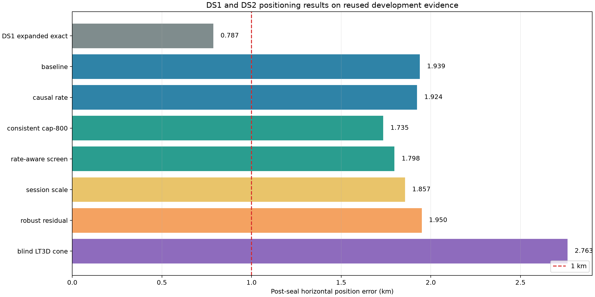

# DS1 and DS2 positioning evaluation

## Result

DS1 is complete. Its best reused-development result remains **0.787 km** from
the expanded exact search. DS2 contains cleaner individual tracks, but does
not reproduce the sub-kilometre DS1 location: the best DS2 result is **1.735
km** from the consistent cap-800 objective. That DS2 result is a bounded local
refinement of the independently sealed 250 km-prior search, whose best portable
result is **1.924 km** from the causal per-NORAD rate model.



The DS2 dataset contains every eligible September 24 capture available before
the frozen cutoff: **20 complete 300 s sessions, 441 tracklets, and 12,694
tracklet observations**. The authoritative V14 reviews contain 319 tracks; 315
of 319 rank-one candidates have randomized-evaluation RMS at or below 800 Hz,
and the median is 123.84 Hz. This confirms that the RF evidence is clean. The
roughly 1.7--1.9 km position plateau is therefore dominated by association and
geographic-objective ambiguity rather than detection quality or final grid
spacing.

## Position results

| Method | Post-seal error | Scope | Finding |
|---|---:|---|---|
| DS1 expanded exact | **0.787 km** | Reused DS1 development groups | Best overall result; selected an edge cell in the expanded exact search. |
| DS2 baseline Doppler | 1.939 km | Fresh 250 km-prior search, all 20 sessions | Baseline all-observation hard association. |
| DS2 causal per-NORAD rate | **1.924 km** | Fresh 250 km-prior search, all 20 sessions | Best portable DS2 result; exact SGP4 replay passed. |
| DS2 consistent cap-800 | **1.735 km** | Bounded 3x3 local refinement | Best DS2 coordinate; improves the sealed parent by 189 m and passes both exact gates. |
| DS2 rate-aware screen | 1.798 km | Bounded 3x3 local refinement | Every fitted rate was rejected by its published objective; tied the nominal control. |
| DS2 common plus session scale | 1.857 km | Bounded local, unqualified | Same coordinate as rate-only; hit a scale guard and iteration limit. |
| DS2 AR(1) plus Student-t residual | 1.950 km | Six sealed finalists, diagnostic | Avoids the Gaussian rank reversal but does not improve position. |
| DS2 blind LT3D fitted cone, 50 degree FOV | 2.763 km | Three geometry-valid captures | Blind full-catalogue association with receiver geometry; same joint coordinate as its unconstrained baseline. |

The 97.7 m fine lattice moved the portable baseline by only 26 m relative to
the preceding 390.6 m lattice. Finer geographic sampling alone will not close
the remaining error. Global receive time also converged to zero, and extra
per-track, per-session, or residual nuisance freedom did not improve the
accepted result.

## Complete model accounting

All 17 models in the frozen pre-DS2 registry are accounted for.

| Registry model | DS2 disposition | Result or conclusion |
|---|---|---|
| Baseline Doppler | Complete | 1.939 km joint. |
| Shared global receive time | Complete | 1.939 km; learned global time is 0 s. |
| Regularized per-scan time | Complete | 1.939 km; no gain over shared time. |
| Independent per-track time | Diagnostic complete | 3.958 km joint; flexibility hurts portability. |
| Causal per-NORAD orbit rate | Complete | 1.924 km; best fresh wide-prior model. |
| Rate-aware joint geographic screen | Bounded local complete | 1.798 km; rates rejected at all nine cells. |
| Soft identity mixture | Diagnostic complete | 2.068 km; probabilities remain uncalibrated. |
| Equal-weight joint multiscan position | Complete | Used for all-session inference so dense scans cannot dominate by count. |
| Consistent cap-800 joint objective | Bounded local complete | 1.735 km; best DS2 result. |
| Shared-NORAD rate joint | Complete, zero overlap | No selected NORAD repeats across whole sessions, so it reduces to independent blocks. |
| Regularized common plus session scale | Complete, unqualified | 1.857 km; guard and convergence failures prevent promotion. |
| Learned pointing-cone quantiles | Geometry diagnostic complete | Support behavior reported for the LT3D-001A subset. |
| Fixed hard cone orientation | Geometry diagnostic complete | Half-angle sweep at 10, 15, 20, and 30 degrees. |
| Staged full-FOV cone sweep | Geometry diagnostic complete | Full-FOV sweep from 10 through 90 degrees. |
| Local fitted full-FOV cone position | Geometry diagnostic complete | Blind 50 degree joint result 2.763 km; cone does not move its joint optimum. |
| Robust residual likelihood rerank | Diagnostic complete | AR(1)+Student-t selects 1.950 km; Gaussian selects a harmful 4.420 km finalist. |
| Legacy joint session-scale L-BFGS-B | Rejected, not rerun | Superseded by the repaired block-coordinate session-scale model. |

The LT3D-001A analysis includes both possible RX-to-LNB mappings because the
cable mapping remains provisional. It enforces an upward-facing mount and fits
the best cone orientation at each tested geographic point. Only three DS2
captures have valid explicit geometry, which is too little support for the
geometry arm to dominate the all-20 Doppler solution. The cone is useful as an
association plausibility filter, but it has not yet supplied additional
geographic resolution.

## Interpretation and next experiment

DS2 improves evidence quality without improving location accuracy. The main
bottleneck is that several nearby coordinates can reacquire plausible
satellite identities and obtain nearly equal capped Doppler losses. Flexible
timing, rate, scale, and residual models mostly explain error without adding a
new geographic discriminator. The next useful experiment is a joint
association objective that preserves uncertainty across several candidate
satellites while enforcing cross-session catalogue consistency and receiver
visibility. It should be tested first on the existing 20-session corpus with a
fixed candidate budget and exact replay, then on an untouched later-day
dataset.

These are development evaluations on a known site. The reference coordinate
was excluded from inference and introduced only after artifacts were sealed,
but repeated method development on DS1 and DS2 means the reported distances
are not independent test-set performance.

## Reproducibility

The frozen DS2 manifest SHA-256 is
`6f93ed1b87cbd4149b038cadec197c1be8017a398912052f251b1cd9c13bba8a`.
The machine-readable comparison and source digests are in `summary.json`; the
model-level artifacts, commands, exact gates, and limitations are documented
in the linked report directories:

- `../2026_09_24_ds2_portable_evaluation/`
- `../2026_09_24_ds2_consistent_rate_screen/`
- `../2026_09_24_ds2_missing_models/`
- `../2026_09_24_ds2_geometry_cone_evaluation/`
- `../2026_09_24_ds2_quality/`

Regenerate this comparison from the repository root with:

```bash
.venv/bin/python reports/2026_09_24_ds1_ds2_final_comparison/build_summary.py
.venv/bin/python -m pytest -q \
  reports/2026_09_24_ds1_ds2_final_comparison/test_build_summary.py
```
