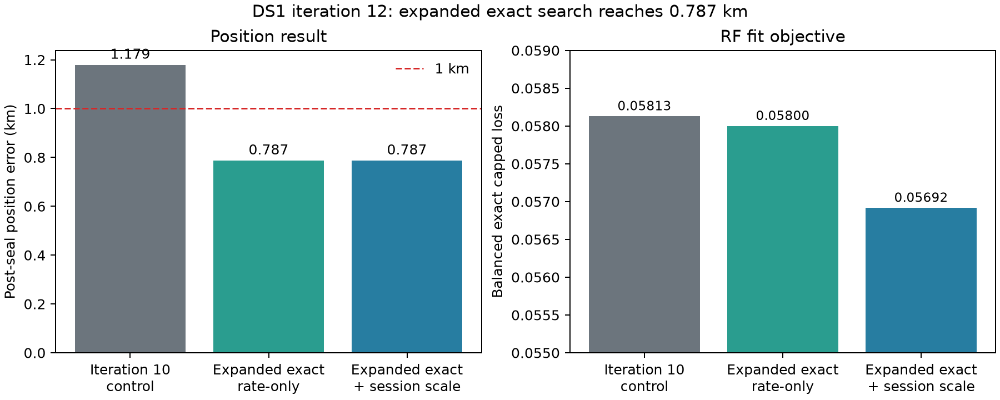

# DS1 iteration 12 comparison

## Outcome

This round achieved the first shared-coordinate DS1 result below one
kilometre: **0.787188 km** post-seal error.  The selected coordinate is
`(37.85559656, -122.48229576)`.

The result needs a precise interpretation.  The regularized session-scale
model and its matched rate-only baseline selected the same coordinate at both
search levels.  Expanding the exact local search produced the positional
improvement from 1.179286 km to 0.787188 km.  Session-scale fitting improved
the RF residual objective in both groups, but did not change the selected
location.

| Arm | Reference-free disposition | Post-seal error | Finding |
| --- | --- | ---: | --- |
| Iteration-10 control | retained shared-coordinate baseline | 1.179286 km | Starting point for this round |
| Expanded exact search, rate-only | selected; level-2 winner remains on southwest edge | **0.787188 km** | Positional improvement comes from searching beyond the previous local footprint |
| Expanded exact search plus regularized session scale | accepted; same coordinate as rate-only | **0.787188 km** | Lowered exact losses in both groups, but did not change position |
| Shared per-NORAD correction across groups | exact equivalence control | 1.179286 km | Zero NORAD overlap between groups; the joint rate map is block diagonal |
| Consistent cap-800 proposal/exact objective | compute-infeasible within one hour | unavailable | No partial winner published; projected runtime 82–100 minutes |

## What worked

The bounded 195.3125 m lattice followed by a 97.65625 m symmetric refinement
moved southwest under the RF-only objective.  The post-seal error fell first
to 0.915761 km and then to 0.787188 km.  Selected session-scale fits converged
in 14 and 15 block iterations, no scale reached the 2,000 ppm guard, and no
per-NORAD rate reached its bound.

At the final coordinate, the hierarchy reduced group `20260921_00` exact
loss from `0.038813477` to `0.037323570`, and group `20260921_16` from
`0.077184687` to `0.076508158`.  The fitted session terms are materially
active, so independent bundles are needed before treating them as calibrated
receiver corrections.

## What did not work

The two DS1 groups contain 109 and 128 selected NORADs with no intersection.
Sharing per-NORAD rate parameters therefore cannot couple these groups.  The
ablation exactly reproduced the iteration-10 loss and coordinate.

Matching the cap-800 proposal and exact objectives was computationally too
expensive in the current implementation.  Its authoritative attempt passed
level one in about 14.5 minutes, but level two remained incomplete after an
additional 25.5 minutes under host loads of 85–131.  The projected complete
runtime was 82–100 minutes.  The process was stopped without selecting or
post-seal scoring a partial result.

## Limits and next experiment

The 0.787 km winner is still on the southwest edge of the refinement lattice.
It demonstrates sub-kilometre error on the reused DS1 TRAIN groups, but it
does not close the local basin or provide calibrated uncertainty.  DS1 has
also been inspected repeatedly during method development, so this remains a
development result rather than independent validation.

The next dataset should freeze whole-session inputs before evaluation, include
repeated NORADs when possible, and retain a bounded expansion rule based only
on reference-free edge status.  The consistent-objective implementation needs
checkpointed levels, persisted hard supports, and warm starts before rerun.

## Reproducibility

Machine-readable comparison values and source paths are in
`summary.json`.  Each inference arm excludes the reference coordinate; only
its separate evaluator computes the displayed geographic error.  Arm-specific
code, tests, inference records, evaluation JSON/CSV, and PNGs are retained in:

- `reports/2026_09_24_ds1_iteration12_session_scale/`
- `reports/2026_09_24_ds1_iteration12_shared_norad/`
- `reports/2026_09_24_ds1_iteration12_consistent_objective/`
