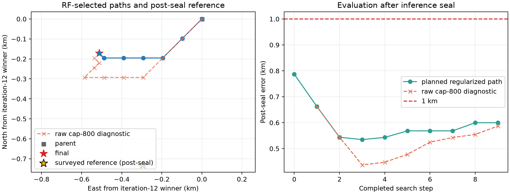

# DS1 iteration 13: exact basin closure

## Result

The predeclared reference-free search reduced the accepted DS1 development
error from **0.787188 km to 0.599900 km**. The selected coordinate is
`(37.85406136, -122.48812889)`. It is an interior winner on the final 24.414 m
lattice, both group fits converged, no fitted rate reached its bound, and both
direct exact-SGP4 replay gates passed.



| Quantity | Result |
|---|---:|
| Iteration-12 parent error | 0.787188 km |
| Iteration-13 selected error | **0.599900 km** |
| Improvement | **0.187288 km** |
| Search steps | 9 |
| Unique group-coordinate fits | 92 |
| Runtime, four workers | 463.4 s |
| Group 00 exact-gate maximum error | 0.0000566 Hz |
| Group 16 exact-gate maximum error | 0.0000484 Hz |

The inference artifact was sealed before the surveyed coordinate was read.
Its inputs are the sealed iteration-12 winner, iteration-10 hard associations,
group timing offsets of -0.75 s and -0.50 s, and the exact causal per-NORAD
rate model with profiled per-track CFO.

## What worked

Iteration 12 had stopped on the southwest corner of two successive lattices.
Iteration 13 treated that as a clipped spatial basin: it retained the 97.656 m
spacing while translating the symmetric 3 by 3 lattice, then reduced spacing
only after the regularized RF winner became interior. This cut another 187 m
from post-seal error and closed the planned regularized basin at 24.414 m.

Overlapping cells were cached, so nine search steps required 92 group-coordinate
fits instead of 162. The result comfortably met the one-hour compute bound.
The exact replay discrepancies are tens of microhertz against a 0.2 Hz gate,
showing that the quartic causal-rate representation remains faithful to direct
SGP4 over the selected support.

## What did not work

The regularized rate objective and raw cap-800 loss cease selecting the same
cell after the first two translations. The planned regularized path eventually
moves mainly west, while raw cap-800 continues southwest. The final accepted
position is therefore an objective-specific basin rather than a common minimum
of both scores.

For diagnosis only, every already-computed lattice was also reranked by raw
cap-800 after inference was sealed. One visited raw-loss cell is 0.437241 km
from the surveyed position, but it did not steer the planned path and is not
the iteration-13 estimate. Selecting that cell by its post-seal error would be
leakage. It is evidence for a new prospectively declared raw-loss search.

The arm also fixes iteration-10 identities. Earlier reports established strong
local association stability, making this useful for isolating the geographic
surface. A subsequent reference-free full-catalogue replay at the selected
coordinate retained 468/476 group-00 identities (98.32%) and 294/298 group-16
identities (98.66%). Both refitted groups converged, both exact gates passed,
and neither hit a rate bound. Dynamic reassociation raises balanced exact loss
from 0.0578943 to 0.0583302, so identities are highly stable but not perfectly
exchangeable. A small dynamic-association lattice remains necessary before
calling the coordinate fully portable.

## What we learned

The previous 0.787 km result was partly limited by its search boundary. Closing
the basin produces a real further gain. The next limiting choice is the
geographic objective: adding the Gaussian rate prior changes position even
when both methods fit the same per-NORAD rates and use the same observations.
The rate prior is useful for nuisance identifiability, but the evidence now
suggests it should not decide geographic ranking.

Receiver geometry is not added to this iteration. The September 21 DS1
receipts lack an authoritative capture-time LT3D-001A binding and RX-to-LNB
mapping. Applying the DS2 cone model here would manufacture geometry that is
not present in the frozen DS1 contract.

## Next iteration

Iteration 14 should prospectively rank geography by balanced exact cap-800
data loss while continuing to use the rate prior inside each nuisance fit. It
should begin again at the sealed iteration-12 parent, use the same edge-
translation and interior-closure rule, preserve both DS1 groups with equal
weight, and exact-gate the final point. The complete regularized path must stay
as a matched control. The completed dynamic replay changed only 12 of 774
track identities, so a future dynamic-association experiment can use a small
lattice around the qualified winner instead of repeating the wide search.

A separate later arm can test a bounded same-NORAD cross-RX mixture as a
tiebreaker. That requires an immutable observation-ID join to recover RX
labels and shuffled-label/time-shift null controls; it should not be conflated
with unavailable LT3D geometry.

## Reproduction

```bash
OPENBLAS_NUM_THREADS=1 OMP_NUM_THREADS=1 MKL_NUM_THREADS=1 \
  .venv/bin/python reports/2026_09_24_ds1_iteration13_basin_closure/run.py \
  --output reports/2026_09_24_ds1_iteration13_basin_closure/inference.json \
  --checkpoint-dir reports/2026_09_24_ds1_iteration13_basin_closure/checkpoints \
  --workers 4
.venv/bin/python reports/2026_09_24_ds1_iteration13_basin_closure/qualify.py \
  --inference reports/2026_09_24_ds1_iteration13_basin_closure/inference.json \
  --output reports/2026_09_24_ds1_iteration13_basin_closure/qualification.json
.venv/bin/python reports/2026_09_24_ds1_iteration13_basin_closure/evaluate_postseal.py \
  --inference reports/2026_09_24_ds1_iteration13_basin_closure/inference.json \
  --output-dir reports/2026_09_24_ds1_iteration13_basin_closure/evaluation
OPENBLAS_NUM_THREADS=1 OMP_NUM_THREADS=1 MKL_NUM_THREADS=1 \
  .venv/bin/python reports/2026_09_24_ds1_iteration14_cap800_basin/dynamic_replay.py \
  --inference reports/2026_09_24_ds1_iteration13_basin_closure/inference.json \
  --output reports/2026_09_24_ds1_iteration13_basin_closure/dynamic-replay.json
```

`plan.json`, `inference.json`, `qualification.json`, and
`dynamic-replay.json` are reference-free.
The surveyed coordinate appears only in `evaluation/postseal-evaluation.json`.
