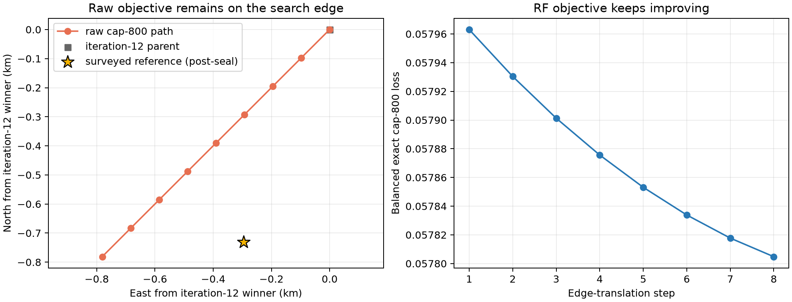

# DS1 iteration 14: raw cap-800 basin

## Result

This prospectively declared arm is **not qualified**. Its equal-group raw
cap-800 objective selected the southwest edge on all eight allowed 97.656 m
lattices and exhausted the frozen translation budget before closing a basin.
The last visited coordinate is `(37.84857851, -122.49118396)` with post-seal
error 0.488151 km, but it is a boundary point and is not a valid position
estimate.



| Quantity | Result |
|---|---:|
| Full-spacing lattices | 8 |
| Spacing | 97.656 m |
| Final raw cap-800 loss | 0.057804783 |
| Final cell | Southwest boundary |
| Runtime, four workers | 562.6 s |
| Qualified position | **No** |
| Boundary-point post-seal error | 0.488151 km, diagnostic only |

## What worked

The arm cleanly isolates the objective change discovered in iteration 13.
It fits the same causal per-NORAD rates with the same Gaussian prior, fixed
timing, associations, observations, and profiled CFOs, while excluding the
rate prior from geographic ranking. It reuses the sealed iteration-12 3 by 3
surface and computes only seven new coordinates per translated lattice.

Both group nuisance fits at the final point converged, neither hit a rate
bound, and the direct exact-SGP4 gates passed. The run stayed within the
one-hour limit and its inference never read the surveyed coordinate.

## What did not work

Raw cap-800 has no local minimum within the predeclared 0.78 km continuation.
Its loss falls monotonically along a southwest diagonal. Post-seal evaluation
shows that this path passes near the surveyed location and then keeps moving
away. The final boundary point happens to remain below 0.5 km, but extending,
stopping, or selecting an earlier path point based on those errors would tune
the method to the answer.

This rejects the hypothesis that nuisance-prior removal alone yields a closed,
portable high-resolution position objective. The nuisance prior in iteration
13 prevents this open direction, although it introduces its own geographic
bias.

## What we learned

DS1 now has two complementary surfaces:

- the regularized surface closes and yields a qualified 0.600 km estimate;
- the raw cap-800 surface passes closer to truth but remains open and therefore
  cannot support a location or uncertainty claim.

The disagreement is evidence of a frequency-model degeneracy: geographic
motion and per-satellite orbit-rate corrections can trade against each other.
The next iteration should constrain that degeneracy using internal evidence,
not by choosing a point along this post-seal path.

## Next iteration

Use whole-session stability to set the strength of the rate hierarchy. A
reference-free leave-one-session-out arm can compare a small frozen set of
prior weights, rank them by omitted-session predictive cap-800 loss and spatial
stability, then perform one final exact basin search at the selected weight.
This tests the continuum between the open raw surface and the over-constrained
regularized surface without using geographic error to tune the weight.

A dynamic full-catalogue replay of the qualified iteration-13 winner is also
required. If identities change materially, association uncertainty should be
added before further spatial refinement; if they remain stable, effort should
focus on the rate/geography hierarchy.

## Reproduction

```bash
OPENBLAS_NUM_THREADS=1 OMP_NUM_THREADS=1 MKL_NUM_THREADS=1 \
  .venv/bin/python reports/2026_09_24_ds1_iteration14_cap800_basin/run.py \
  --output reports/2026_09_24_ds1_iteration14_cap800_basin/inference.json \
  --workers 4
.venv/bin/python reports/2026_09_24_ds1_iteration14_cap800_basin/evaluate_postseal.py \
  --inference reports/2026_09_24_ds1_iteration14_cap800_basin/inference.json \
  --output reports/2026_09_24_ds1_iteration14_cap800_basin/postseal-evaluation.json
.venv/bin/python reports/2026_09_24_ds1_iteration14_cap800_basin/plot.py
```

`plan.json` and `inference.json` are reference-free and sealed. The surveyed
coordinate appears only in `postseal-evaluation.json` and the rendered plot.
