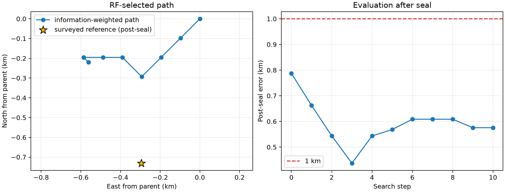

# DS1 iteration 15: information-weighted exact basin

## Result

The frozen information-weighted objective produces a new qualified DS1 best
of **0.575577 km** at `(37.85362274, -122.48868442)`. This improves the
iteration-13 equal-group result by 24.323 m and the iteration-12 result by
211.611 m.



| Quantity | Result |
|---|---:|
| Iteration-12 parent | 0.787188 km |
| Iteration-13 equal-group regularized basin | 0.599900 km |
| Iteration-15 information-weighted basin | **0.575577 km** |
| Group 00 / 16 weights | 0.2742 / 0.7258 |
| Search steps | 10 |
| Unique group-coordinate fits | 104 |
| Runtime, four workers | 486.8 s |
| Group 00 / 16 exact-gate maxima | 0.0000567 / 0.0000484 Hz |

The final 24.414 m lattice winner is interior. Both group fits converge, no
rate reaches its bound, and both direct exact-SGP4 gates pass at the 0.2 Hz
tolerance. The inference is therefore qualified under its frozen contract.

## What worked

Iteration 13 weighted the two independent six-session groups equally even
though their sealed local surfaces contain different information. The prior
DS1 weighting audit derived weights of 0.2742 and 0.7258 from source-tempered
coverage, local curvature, and objective scale without reading the reference
position. Iteration 15 froze those values before its search and used them for
the complete basin closure.

The information-weighted path initially agrees with the other objectives,
then closes near the equal-group regularized basin while moving 48.8 m farther
west and 48.8 m farther south before its final refinement. The modest 24 m
post-seal gain is directionally consistent with giving more authority to the
group whose local surface has higher normalized curvature.

## What did not work

Weighting does not remove the larger north/south bias. The selected coordinate
remains about half a kilometre north of the surveyed site. Its path also passes
through a 0.437 km intermediate point before the RF objective continues west;
that point is visible only in post-seal evaluation and cannot be substituted
for the final inference.

The result still uses fixed iteration-10 identities. The separate dynamic
replay at the iteration-13 winner retained 98.3% and 98.7% of track identities,
which supports the local approximation, but this exact weighted coordinate
has not yet been selected on a dynamically reacquired lattice.

## What we learned

Three consecutive experiments separate the effects cleanly:

| Objective | Basin status | Qualified error | Interpretation |
|---|---|---:|---|
| Equal-group regularized rate | Closed | 0.599900 km | Stable sub-kilometre baseline. |
| Equal-group raw cap-800 | Open after eight translations | — | Nuisance/geography degeneracy; 0.488 km boundary point is not publishable. |
| Information-weighted regularized rate | Closed | **0.575577 km** | Small, valid improvement from reference-free group weighting. |

The dominant limitation is no longer grid resolution. It is the trade between
geographic Doppler, per-NORAD rate corrections, and the relative authority of
independent session groups. Information weighting helps, but a calibrated
hierarchical constraint or fresh dynamic association is needed for a larger
gain.

## Next iteration

Run a small dynamic full-catalogue lattice around the qualified iteration-15
winner with the same frozen group weights and timing. Reacquire identities at
every geographic cell, exact-fit per-NORAD rates independently by group, and
compare the selected point to a fixed-identity matched control. The existing
98% association agreement permits a bounded local test.

In parallel, develop a leave-one-session-out stability score for a small
frozen set of rate-prior strengths. The held-session score must select the
prior before any post-seal position comparison. This is the principled route
between iteration 13's closed but biased basin and iteration 14's open raw
surface.

## Reproduction

```bash
OPENBLAS_NUM_THREADS=1 OMP_NUM_THREADS=1 MKL_NUM_THREADS=1 \
  .venv/bin/python reports/2026_09_24_ds1_iteration15_information_weighted/run.py \
  --output reports/2026_09_24_ds1_iteration15_information_weighted/inference.json \
  --checkpoint-dir reports/2026_09_24_ds1_iteration15_information_weighted/checkpoints \
  --workers 4
.venv/bin/python reports/2026_09_24_ds1_iteration15_information_weighted/qualify.py \
  --inference reports/2026_09_24_ds1_iteration15_information_weighted/inference.json \
  --output reports/2026_09_24_ds1_iteration15_information_weighted/qualification.json
.venv/bin/python reports/2026_09_24_ds1_iteration15_information_weighted/evaluate_postseal.py \
  --inference reports/2026_09_24_ds1_iteration15_information_weighted/inference.json \
  --output-dir reports/2026_09_24_ds1_iteration15_information_weighted/evaluation
```

`plan.json`, `inference.json`, and `qualification.json` are reference-free.
Only `evaluation/postseal-evaluation.json` and its PNG read the surveyed
coordinate.
