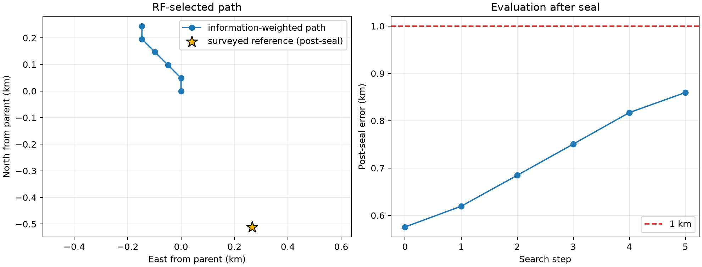

# DS1 iteration 16: dynamic hard-association basin

## Result

Reassigning every track from the full catalogue at every geographic cell did
**not** close a local basin. The winner stayed on an edge for all five allowed
48.828 m translations, so this arm is unqualified and does not replace the
iteration-15 result.



| Quantity | Result |
|---|---:|
| Qualified iteration-15 parent | **0.575577 km** |
| Iteration-16 final boundary point, post-seal diagnostic only | 0.859630 km |
| Search steps | 5 |
| Unique group-coordinate fits | 54 |
| Runtime, four workers | 297.2 s |
| Final offset from parent | 0.146 km west, 0.244 km north |
| Group 00 / 16 exact-gate maxima | 0.0000572 / 0.0000484 Hz |

Both exact SGP4 gates pass at the 0.2 Hz tolerance, every nuisance fit
converges, and no per-NORAD rate reaches its bound. Those checks establish
numerical correctness of each cell evaluation. They do not establish a
geographic optimum when the winner remains on the search boundary.

## What worked

The experiment exercised full-catalogue reassociation inside the geographic
search rather than testing it only at one sealed point. It used the same
information weights, fixed group timing, causal rate model, and exact Doppler
gate as iteration 15. This isolates association policy as the changed factor.

The computation was also practical: multiprocessing and coordinate caching
evaluated 54 distinct group-coordinate fits in under five minutes.

## What did not work

The hard identity map changes discretely as the geographic point changes.
Consequently, the regularized objective is only piecewise smooth. The selected
cell moved northwest on every translation and never reached the planned
24.414 m or 12.207 m refinement stages. Its post-seal error grew from 0.576 km
at the parent to 0.860 km at the final boundary point.

This does not contradict the earlier dynamic replay, where approximately 98%
of identities agreed with the frozen map at a single coordinate. A small set
of switching tracks can still change the local ranking when adjacent cells
have very similar aggregate losses. Repeating hard reassociation independently
at every cell lets those switches create steps in the geographic surface.

The raw exact loss and the regularized selection objective also rank nearby
cells differently. The final selected cell has a weighted raw loss of
0.066953 and a weighted regularized objective of 0.096130. Optimizing either
one after observing the surveyed coordinate would be post-selection and is not
permitted.

## What we learned

Dynamic association must carry uncertainty or continuity across neighboring
cells. A winner-takes-all catalogue lookup at every point is too unstable for
fine localization, even when almost all individual identities are stable and
all exact numerical checks pass.

The best qualified DS1 estimate therefore remains iteration 15 at
`(37.85362274, -122.48868442)`, with 0.575577 km post-seal error. The bottleneck
is model/association stability rather than lattice spacing.

## Next iteration

Use a two-stage association update. Reacquire identities once at the sealed
iteration-15 coordinate, freeze that map, and then close a new exact local
basin. This tests whether the updated identities help without allowing
cell-to-cell switching. A later soft-association model should marginalize a
small ambiguous subset over its top candidates while keeping the stable core
fixed; its temperature and switching penalty must be selected without the
surveyed position.

For DS2, preserve both fixed and dynamic arms. The comparison will show
whether September 24's cleaner signal makes hard reassociation stable. Receiver
geometry and fitted-cone models must remain separate candidate arms with
explicit geometry-binding receipts.

## Reproduction

```bash
OPENBLAS_NUM_THREADS=1 OMP_NUM_THREADS=1 MKL_NUM_THREADS=1 \
  .venv/bin/python reports/2026_09_24_ds1_iteration16_dynamic_association/run.py \
  --output reports/2026_09_24_ds1_iteration16_dynamic_association/inference.json \
  --checkpoint-dir reports/2026_09_24_ds1_iteration16_dynamic_association/checkpoints \
  --workers 4
.venv/bin/python reports/2026_09_24_ds1_iteration16_dynamic_association/qualify.py \
  --inference reports/2026_09_24_ds1_iteration16_dynamic_association/inference.json \
  --output reports/2026_09_24_ds1_iteration16_dynamic_association/qualification.json
.venv/bin/python reports/2026_09_24_ds1_iteration16_dynamic_association/evaluate_postseal.py \
  --inference reports/2026_09_24_ds1_iteration16_dynamic_association/inference.json \
  --output-dir reports/2026_09_24_ds1_iteration16_dynamic_association/evaluation
```

`plan.json`, `inference.json`, and `qualification.json` do not contain or read
the surveyed coordinate. Only the post-seal evaluation and plot use it.
