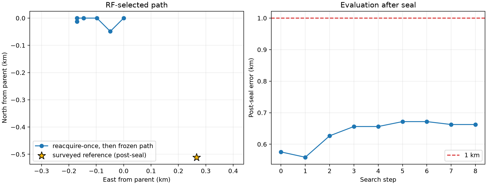

# DS1 iteration 17: reacquire once, then freeze

## Result

One full-catalogue reassociation at the sealed iteration-15 coordinate,
followed by a frozen-identity geographic search, produces a qualified basin at
`(37.85351308, -122.49062874)`. Its post-seal error is **0.662549 km**, so it
does not replace the **0.575577 km** iteration-15 result.



| Quantity | Result |
|---|---:|
| Iteration-15 parent | **0.575577 km** |
| Iteration-17 qualified result | 0.662549 km |
| Change in error | +0.086972 km |
| Group 00 identities changed | 9 / 476 |
| Group 16 identities changed | 4 / 298 |
| Search steps | 8 |
| Unique group-coordinate fits | 82 |
| Runtime, four workers | 397.2 s |
| Group 00 / 16 exact-gate maxima | 0.0000598 / 0.0000484 Hz |

The 12.207 m final lattice closes on an interior cell. Both group fits
converge, no per-NORAD rate reaches its bound, and both direct exact-SGP4 gates
pass at the 0.2 Hz tolerance. This is a valid negative result rather than an
unfinished boundary search.

## What worked

Freezing the updated association map restores continuity. Unlike iteration
16, which reassigned at every cell and ran northwest without closing its first
stage, this arm closes all three planned stages. It also isolates the effect of
the 13 identity changes: timing, group weights, exact causal rate model,
regularization, and geographic transition rules match the qualified parent.

## What did not work

The updated identities move the RF optimum about 171 m west and 12 m south of
the parent. That direction increases post-seal error by 87 m. The association
update therefore changes the local optimum coherently, but the change is not a
positioning improvement on DS1.

The experiment also shows why a high identity-agreement percentage is not
sufficient. Only 1.9% of group-00 tracks and 1.3% of group-16 tracks changed,
yet those changes were enough to shift the selected coordinate by several
fine-grid cells.

## What we learned

Association policy has two distinct effects:

| Policy | Basin status | Post-seal error | Conclusion |
|---|---|---:|---|
| Frozen iteration-10 identities, information weighted | Qualified | **0.575577 km** | Best DS1 result. |
| Fresh hard identities at every cell | Unqualified | — | Discontinuous and unstable. |
| Reacquire once at parent, then freeze | Qualified | 0.662549 km | Stable, but worse location. |

The DS1 error floor is not caused by a 12–25 m lattice. It is controlled by
small association changes and nuisance/geography tradeoffs. Further DS1 tuning
against the known position would be increasingly post-selective, so this is a
good point to seal DS1 and transfer the full candidate set to DS2.

## DS2 implication

DS2 should retain all three association policies as explicit comparators:
dynamic per-cell association for the ordinary baseline, frozen identities for
smooth local refinement, and one-time reacquisition before refinement. Cone
and receiver-geometry arms must use only captures with an explicit
capture-time geometry binding and must marginalize the provisional RX mapping.

## Reproduction

```bash
OPENBLAS_NUM_THREADS=1 OMP_NUM_THREADS=1 MKL_NUM_THREADS=1 \
  .venv/bin/python reports/2026_09_24_ds1_iteration17_reacquire_then_freeze/run.py \
  --output reports/2026_09_24_ds1_iteration17_reacquire_then_freeze/inference.json \
  --checkpoint-dir reports/2026_09_24_ds1_iteration17_reacquire_then_freeze/checkpoints \
  --workers 4
.venv/bin/python reports/2026_09_24_ds1_iteration17_reacquire_then_freeze/qualify.py \
  --inference reports/2026_09_24_ds1_iteration17_reacquire_then_freeze/inference.json \
  --output reports/2026_09_24_ds1_iteration17_reacquire_then_freeze/qualification.json
.venv/bin/python reports/2026_09_24_ds1_iteration17_reacquire_then_freeze/evaluate_postseal.py \
  --inference reports/2026_09_24_ds1_iteration17_reacquire_then_freeze/inference.json \
  --output-dir reports/2026_09_24_ds1_iteration17_reacquire_then_freeze/evaluation
```

The association update, plan, inference, and qualification are reference-free.
Only the post-seal evaluation and plot read the surveyed coordinate.
