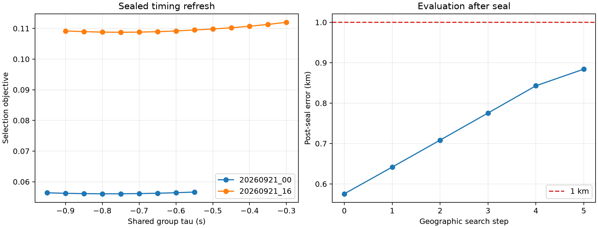

# DS1 iteration 18: timing refresh before basin closure

## Status

Iteration 18 is complete as a **qualified timing result and an unqualified
positioning result**. Both timing searches closed on interior nodes, but the
geographic winner stayed on the northwest edge for all five permitted 48.828 m
translations. It therefore does not replace the qualified iteration-15 result.



| Quantity | Result |
| --- | ---: |
| Iteration-15 qualified parent | **0.575577 km** |
| Group `20260921_00` tau | -0.75 s → **-0.80 s** |
| Group `20260921_16` tau | -0.50 s → **-0.75 s** |
| Timing fits | 22 unique exact fits |
| Geographic group-coordinate fits | 58 |
| Geographic translations | 5 at 48.828 m |
| Final boundary offset | 0.195 km west, 0.244 km north |
| Final boundary-point error | 0.884064 km, diagnostic only |
| Runtime, four workers | 414.7 s |
| Qualified position | **No** |

The final boundary point remains below one kilometre, but it is not a position
estimate because the RF objective was still decreasing when the frozen search
budget ended.

## What worked

The timing experiment answered its question cleanly. Group `20260921_00`
selected -0.80 s inside its first window. Group `20260921_16` selected an edge
at first, continued without reading the reference, and then closed at -0.75 s
inside its second window. Every selected timing fit converged and no rate hit
its bound.

The implementation also kept the experiment auditable: the timing result was
sealed separately, geographic checkpoints bind its digest and selected taus,
and the inference path contains no surveyed coordinate. The complete negative
run took under seven minutes and can resume only matching checkpoints.

## What did not work

Freezing the refreshed timing offsets did not close a geographic basin. The
winner moved northwest at every step:

| Step | East from parent | North from parent | Selection objective | Post-seal error |
| ---: | ---: | ---: | ---: | ---: |
| 0 | -0.049 km | +0.049 km | 0.094294486 | 0.641706 km |
| 1 | -0.098 km | +0.098 km | 0.094286063 | 0.708379 km |
| 2 | -0.146 km | +0.146 km | 0.094280091 | 0.775454 km |
| 3 | -0.195 km | +0.195 km | 0.094276580 | 0.842836 km |
| 4 | -0.195 km | +0.244 km | 0.094275050 | 0.884064 km |

The timing choices also illustrate the nuisance trade. Their regularized
selection objectives improved, but their raw cap-800 data losses increased:

| Group | Initial → selected objective | Initial → selected raw loss |
| --- | ---: | ---: |
| `20260921_00` | 0.056068570 → 0.056064784 | 0.038527373 → 0.038678845 |
| `20260921_16` | 0.109808406 → 0.108752271 | 0.077236866 → 0.077441307 |

The regularizer preferred offsets that reduced nuisance cost despite a small
loss of direct data fit. Once frozen, those offsets opened another geographic
direction instead of removing the existing bias.

## What we learned

The remaining DS1 error is not explained by stale shared timing alone. Timing,
per-NORAD rates, and position can trade against each other in the same way that
iteration 14 exposed for the raw-versus-regularized rate objective. A denser
timing grid can find a numerically better nuisance solution while making the
spatial surface less identifiable.

The qualified DS1 best remains iteration 15 at **0.575577 km**. Its fixed
timing offsets are now best understood as part of a stabilizing model contract,
not independently calibrated clock corrections.

## Next iteration

Further tuning of timing or prior strength on these same 12 sessions risks
following the known-position development result. The next useful experiment
should add independent spatial information instead:

1. extend the shared-coordinate fit from the 12 prefix-six sessions to several
   non-overlapping whole-session bundles from the 151 available TRAIN sessions;
2. derive bundle weights from reference-free local curvature and source
   diversity, using the existing source-tempered formula;
3. require each bundle and the aggregate objective to close an interior basin;
4. keep the current iteration-10 identities fixed for the primary arm, with a
   separate soft top-K arm only for the 13 identities known to be unstable.

This directly tests whether more independent satellite passes reduce the
location/nuisance degeneracy. Geometry remains unavailable for DS1 because its
September 21 receipts do not contain an authoritative capture-time LT3D-001A
binding.

## Frozen protocol

The qualified iteration-15 coordinate is the only spatial origin. Track to
satellite identities remain the sealed iteration-10 hard associations, and the
two group weights remain 0.2742 and 0.7258.

Before any geographic move, each group independently profiles an exact causal
per-NORAD rate and per-track CFO on a nine-node shared-tau grid. The initial
centres are -0.75 s and -0.50 s, the spacing is 0.05 s, and each window spans
plus or minus 0.20 s. If the reference-free regularized objective selects an
edge, the window recentres by 0.20 s and reuses its five overlapping nodes.
Each group may translate at most four times. Both timing winners must be
interior and converged; otherwise the timing seal is an unqualified negative
result and no geographic search starts.

After timing is sealed, the selected group taus are frozen. The geographic
search uses symmetric 3 by 3 lattices at 48.828 m, 24.414 m, and 12.207 m,
with at most four translations per stage. Geographic ranking uses the frozen
information-weighted regularized exact objective. Complete timing and spatial
steps are written atomically and can be resumed only when their plan, parent,
identity-source, timing-seal, and selected-tau bindings match.

The surveyed coordinate is absent from `plan.json`, `run.py`, `qualify.py`,
timing inference, and geographic inference. It appears only in
`evaluate_postseal.py`, which runs after inference and qualification are sealed.

## Reproduction

```bash
.venv/bin/python -m pytest -q \
  reports/2026_09_24_ds1_iteration18_timing_refresh/test_run.py

OPENBLAS_NUM_THREADS=1 OMP_NUM_THREADS=1 MKL_NUM_THREADS=1 \
  .venv/bin/python reports/2026_09_24_ds1_iteration18_timing_refresh/run.py \
  --timing-output reports/2026_09_24_ds1_iteration18_timing_refresh/timing-refresh.json \
  --output reports/2026_09_24_ds1_iteration18_timing_refresh/inference.json \
  --checkpoint-dir reports/2026_09_24_ds1_iteration18_timing_refresh/checkpoints \
  --workers 4

.venv/bin/python reports/2026_09_24_ds1_iteration18_timing_refresh/qualify.py \
  --inference reports/2026_09_24_ds1_iteration18_timing_refresh/inference.json \
  --output reports/2026_09_24_ds1_iteration18_timing_refresh/qualification.json

.venv/bin/python reports/2026_09_24_ds1_iteration18_timing_refresh/evaluate_postseal.py \
  --inference reports/2026_09_24_ds1_iteration18_timing_refresh/inference.json \
  --qualification reports/2026_09_24_ds1_iteration18_timing_refresh/qualification.json \
  --output-dir reports/2026_09_24_ds1_iteration18_timing_refresh/evaluation
```

Rerunning the inference command with the same inputs resumes complete timing
and geographic steps. The final `inference.json` remains write-once; remove or
rename only an explicitly rejected output before resuming to completion.
