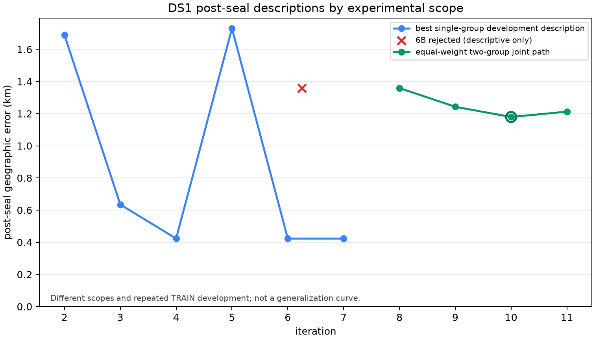

# DS1 iterative sub-kilometre synthesis

This is a read-only synthesis of the sealed DS1 iteration-2 through
iteration-11 artifacts, rejected iteration 6B, and the joint-weighting
diagnostic.  It reports development and post-seal descriptions only.  No
inference, association, rate fit, or evaluation was rerun for this report.

## Retained outcomes

Two results answer different questions and must remain distinct:

| Outcome | Scope | Post-seal geographic error | Meaning |
|---|---|---:|---|
| Best single-group result | Iteration 4, `20260921_16` TRAIN group | **0.423 km** | Best observed one-group development result. It does not show that one coordinate works across groups. |
| Best robust joint result | Iteration 10, equal weighting of `20260921_00` and `20260921_16` with separate tau, association, rate, and CFO fits | **1.179 km** | Retained shared-coordinate two-group in-sample solution; balanced exact loss `0.0581276592`. |

The shared coordinate retained at iteration 10 is `(37.858228335,
-122.478962459)` degrees.  Iteration 11's finer symmetric confirmation was
worse on exact loss (`0.0581393921`) and post-seal error (`1.213 km`), so it
establishes a grid-refinement floor rather than a new retained solution.

The plot separates single-group development rows from the later two-group
path.  These series differ in objective and evidence scope; visual proximity
does not make their errors comparable for model selection.

## Iteration record

| Iteration | Method | Runtime | Result / post-seal error | Worked / did not work | Next lesson |
|---|---|---:|---|---|---|
| 2 | Local geographic refinement; global versus regularized per-scan time | 73–520 s per task, 16 tasks | Best 1.689 km; global-time six-scan median 3.912 km | Geographic finalists were interior; timing often hit stencil edges and per-scan priors did not converge | Use a bounded common timing grid and keep the result as development evidence |
| 3 | Prefix-6 joint global tau plus causal per-NORAD rate screen | 793.0 s | Best 0.635 km; 3 of 4 paired views improved | Causal-rate screen qualified all exact replays; one seed/view worsened | Remove seed-specific selection and exact-audit a union |
| 4 | Seed-union exact selection | 394.7 s | **0.423 km** for group `20260921_16`; group `00` 4.204 km | Exact ranking moved both surrogate leaders | The best row is single-group development evidence, so evaluate wider exact coverage |
| 5 | Frozen-spatial, common-grid timing refinement | 531.9 s | 3.720 km (`00`), 1.730 km (`16`) | All 153 rate profiles converged and selected interior taus | Cap-300 timing screening did not transfer consistently to exact/post-seal ranking |
| 6 | Matched cap-300 proposal / cap-800 exact-rank ablation | 1,139.7 s | 3.157 km (`00`), 0.423 km (`16`) | Larger exact shortlists found better exact rows in both groups | Measure objective rank mismatch before widening geographic or timing search |
| 6B (rejected) | Hierarchical session-scale, rate, CFO, and scale fit | 41.6–50.9 s per candidate, 17 candidates | No accepted coordinate; descriptive values only | No scale guard hit | All 17 optimizers hit their evaluation limit; use analytic gradients or block-coordinate fitting, not a larger budget |
| 7 | Fixed exact-residual Gaussian and AR(1)+Student-t reranks | 235.6 s | Gaussian retained iteration 6; robust `00` worsened to 4.204 km | Refitting-free residual likelihood was fast | Do not replace the exact objective with this robust rank on the fixed candidate set |
| 8 | Equal-weight shared coordinate across both groups | 855.95 s | 1.359 km; balanced exact loss 0.0582506868 | Joint support kept group nuisance fits independent | Refine a symmetric shared-coordinate lattice and validate by whole session |
| 9 | Symmetric shared-coordinate refinement | 1,089.7 s | 1.243 km; loss 0.0581348587 | Exact-qualified joint move improved the joint result | Winner lay on a fine-grid edge; make one symmetric confirmation lattice |
| 10 | Three-level symmetric shared refinement | 1,093.73 s | **1.179 km**; loss **0.0581276592** | Exact loss and post-seal description improved; all 32 gates passed | Retain this two-group solution and test whole-session predictive stability before more refinement |
| 11 | Fine symmetric confirmation | 1,120.34 s | 1.213 km; loss 0.0581393921 | Confirmed the relevant local scale | Exact loss regressed and finalists nearly tied; stop grid halving |
| Joint weighting | Read-only source-tempered curvature/scale rerank of iteration-10 finalists | no coordinate search | Weights 0.2742 (`00`) / 0.7258 (`16`); retained the iteration-10 winner | A reference-free normalized rerank is feasible | Freeze the formula and weights prospectively, then validate by whole session |

## Truth exclusion and evidence boundary

Each inference record used for a reported selection declares or is documented
as reference-free.  Geographic reference data was excluded from the TRAIN
search, candidate association, timing/rate/CFO profiling, finalist selection,
and exact replay gates.  After the inference artifact was sealed and its
contract/gates checked, a separate `evaluation/` or `postseal/` program
introduced the reference solely to calculate the displayed geographic error.
Iteration 6B is stronger still: its post-seal values are expressly
descriptive because portability was rejected.

This protocol prevents direct truth leakage into a given selection, but it
does not make the reported values independent validation.  Iterations reuse
the two TRAIN groups (`20260921_00`, `20260921_16`), many overlapping scans,
and earlier development observations.  The repeated post-seal comparisons
have also been inspected while choosing subsequent work.  Thus neither 0.423
km nor 1.179 km is a calibrated accuracy guarantee; 0.423 km is not a
robust-joint result, and 1.179 km is the best retained two-group in-sample
result.

## Prioritized next work

1. Create a predeclared evaluation from **more independent scans**, grouped by
   whole recording session, and keep every correlated track from a session in
   the same split.  Include a fresh held-out group not used in this iteration
   sequence if the corpus permits.
2. Freeze the iteration-10 coordinate, equal-group objective, tau grid, and
   nuisance policy before that evaluation.  Do not tune from its geographic
   errors or return to finer spatial grids without independent evidence.
3. If joint weighting is tested, freeze its curvature neighborhood,
   scale floor, source-coverage tempering, and fallback before generating a
   new lattice; compare it with equal weights on the same independent scans.
4. Only revisit session-scale fitting after an analytic-gradient or
   block-coordinate implementation can converge reproducibly.  Preserve 6B
   as a rejected ablation instead of promoting its provisional losses.

## Sources and validation

`summary.json` records every source path used here, the four joint evaluation
artifacts, and SHA-256 values for the iteration-8, iteration-9, and
iteration-10 sealed inference records.  The final outcomes were checked
against the separate post-seal JSON artifacts, not transcribed from inference
outputs.  The trend plot is derived only from those post-seal JSON values.

The machine-readable companion is [summary.json](summary.json).  The source
records are the iteration-2 evaluation, iteration-3 through iteration-7
reports/evaluations, iteration-6B result/evaluation, iteration-8 through
iteration-11 inference/evaluation records, and `joint-weighting.json`, each
named in that companion.
