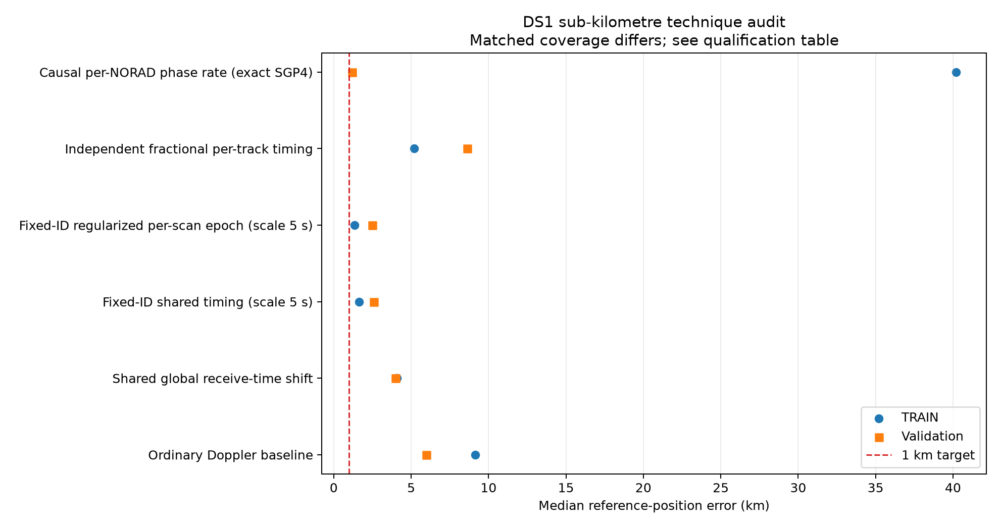

# DS1 sub-kilometre technique audit

`technique_matrix.json` is the machine-readable source for this audit. It traces
every historical positioning result reported below one kilometre to the model,
the actual source code or frozen source archive, the relevant qualification
limit, and a matched DS1 treatment.

## Result

**No qualified method reaches sub-kilometre error on DS1 validation.** The
shared global receive-time model is still a clear improvement: against the
ordinary current baseline it improves position in 35/38 completed case/prior
comparisons and held RMS in 36/38. On the eight full-block/start comparisons
it improves both metrics in 8/8, reducing median position error from 5.534 to
3.364 km. It is therefore a broad win, but not literally a win on every short
case and not yet the positioning target.

The table below uses medians only where the method has matched coverage. Rows
with different coverage are diagnostics and should not be ranked directly.

| Technique | Qualification and coverage | TRAIN error | Validation error | Exposed TEST error | Full-block error |
|---|---|---:|---:|---:|---:|
| Ordinary Doppler baseline | Primary DS1, 38 completed case/prior fits | 9.138 km | 5.982 km | 9.419 km | 5.534 km |
| Shared global receive time | Primary DS1, same 38 fits | **4.075 km** | **3.972 km** | **8.265 km** | **3.364 km** |
| Fixed-ID shared timing, 5 s scale | Conditional; two full TRAIN and two full validation blocks | 1.629 km | 2.569 km | — | 1.826 km |
| Fixed-ID regularized per-scan epoch, 5 s scale | Conditional; same four full blocks | **1.337 km** | **2.471 km** | — | 1.889 km |
| Independent fractional per-track timing | Diagnostic at inherited terminal points; four 16-scan groups | 5.197 km | 8.621 km | — | — |
| Exact causal per-NORAD phase rate | Bounded top-1/top-4 singleton feasibility | 40.203 km | 1.186 km | — | — |
| Formal causal orbit fixed-ID transfer control | First six scans of both TRAIN groups | 8.395 km | — | — | — |

The regularized per-scan model did produce **0.886 km** on one 79-scan TRAIN
block at the 1 s scale. That setting did not transfer: the two full validation
blocks are 2.486 and 2.934 km (medians across the two starts). TRAIN-only
selection by the declared frequency objective instead chooses the 5 s scale,
whose validation median is 2.471 km. This is the clearest explanation for the
apparent earlier win: it was a real conditional fit in one development block,
not a stable held-group positioning result.

`evaluation_summary.json` and `evaluation_summary.csv` contain this compact
comparison with source paths and qualification labels. The figure plots only
methods with both TRAIN and validation values:

## What is actually transferable

The only historical component with a clear matched ablation supporting it is
the **causal, regularized per-NORAD phase-rate correction**. In the formal
archive, removing it changed error from 328.4 m to 3,137.1 m; the two closest
likelihood variants with it were 328.4 m (AR(1), Student-t) and 335.7 m
(independent Gaussian with learned scale). Those results used fixed historical
identities, so DS1 must report both a frozen-ID control and a current
TRAIN-only-reselection arm before calling the result transferable.

The reusable numeric core is
`src/leo/analysis/research/formal_orbit.py::fit_formal_orbit`. Its frozen
phase-rate prior is 0.09176615913014215 s/h with a +/-0.25 s/h bound. The
historical mean comes from causal TLE history; the DS1 input adapter must use
only TLE states available before each capture and must not import the old list
of 446 selected NORADs.

DS1 already implements the lower-complexity shared-time comparator: one global
tau in [-5,+5] seconds. Its full-block median error was 3.364 km after fitting
that nuisance. This has repeatable predictive benefit, but does not reproduce
the older sub-kilometre results. The gap is consistent with satellite-specific
TLE phase errors that a single tau cannot represent.

## Matched DS1 sequence

The matrix deliberately orders work by identifiability rather than by historical
best point error.

| Priority | DS1 arm | Why it is informative |
|---|---|---|
| 1 | Global tau (complete) | Establishes the common-mode timing/orbit baseline. |
| 2 | Causal per-NORAD rate, fixed IDs | Separates rate capability from candidate switching. |
| 3 | Causal per-NORAD rate, DS1 TRAIN-only reselection | Tests the transferable model under the current association procedure. |
| 4 | Rate plus global tau | Measures time/rate confounding explicitly. |
| 5 | Gaussian-independent learned-scale and AR(1)+Student-t ablations | Determines whether the historical likelihood complexity transfers after the rate model is present. |
| 6 | Regularized per-scan epoch | A simpler competing nuisance model; scales are selected only on TRAIN. |
| Diagnostic only | Bracket-constrained fractional timing | Tests timestamp resolution without importing the historical independent +/-5 s per-track freedom. |

Every arm must preserve the same DS1 tracks, randomized masks, weighting and
geographic trace where a paired comparison is claimed. It must publish
candidate changes, per-NORAD rates, bound hits, exact-SGP4 error and held
metrics alongside position error. A lower RF residual does not by itself select
the better location: this failed repeatedly in the historical record.

## Current machine-readable comparison

`comparison_skeleton.json` and `comparison_skeleton.csv` now provide a
merge-safe row for every DS1 case/prior/method combination. They contain the
80 sealed DS1 control rows, including all four explicit full-TEST64 failures;
190 completed and two failed exact historical timing rows; and explicit
`pending` or `not_applicable` rows for every remaining technique. The two
control plots are `ds1_control_comparison.png` and
`historical_exact_timing_held_error.png`.

The exact timing rows in `historical_exact_timing_rows.json` are the preserved
nonlinear 0.2/1/5-second global or scan-epoch fits. They have fixed identities
and their own local optimizer, so their four sub-kilometre rows are evidence
about the conditional historical configuration, not blind DS1 wins. The best
indexed example is the second TRAIN 79-scan fixed-ID scan-epoch arm at 886 m.

The new cached-state scan/rate prototypes remain intentionally pending. Their
first-order state derivative does not reproduce the historical quartic/exact
SGP4 phase-state gate, and the robust prototype would require selection by its
own likelihood before becoming a valid ablation. They are retained as precise
implementation targets rather than reported as performance results.

The exact orbit feasibility implementation is now in
`../2026_09_24_ds1_orbit_arm`. It advances SGP4 orbital phase while holding
Earth rotation at receive time, converges, and passes a 0.2 Hz direct-SGP4 gate
by more than four orders of magnitude. It reduces local TRAIN frequency loss,
but the bounded runs do not move the selected geographic point. The one
0.961 km validation singleton begins at that already-selected point and is not
a new location solution. A full candidate-pair evaluation would be materially
more expensive and is not needed to reject a current sub-kilometre claim.

## Techniques intentionally excluded from the DS1 accuracy contest

The old 292 m result was calibrated at the configured site and is 1.579 km from
the confirmed antenna. The 314 m sixteen-scan point used evaluation-exposed
candidate/seed discovery. The 631 m fractional-timing result reversed on the
other randomized group. The 348 m beam-proxy fold was beaten by shuffled
controls, and the 898 m receiver-reference point failed its numerical and
uncertainty checks. These remain useful negative controls and diagnostics, not
valid DS1 accuracy arms.

## Source citations

The complete source list and exact parameter values are stored per row in
`technique_matrix.json`. Core evidence is:

- `reports/2026_09_20_matched_positioning.md:42-63`
- `reports/2026_09_21_causal_orbit_error_model.md:7-84`
- `reports/2026_09_21_position_ablation_report.md:8-77`
- `reports/2026_09_23_sixteen_scan_comparison/README.md:94-178`
- `reports/2026_09_23_fractional_timing_position/README.md:1-63`
- `reports/2026_09_23_second_train_epoch_replication/README.md:1-50`
- `reports/2026_09_21_dual_lnb_geometry.md:180-272`
- `reports/2026_09_22_paired_receiver_position_comparison.md:23-52`
