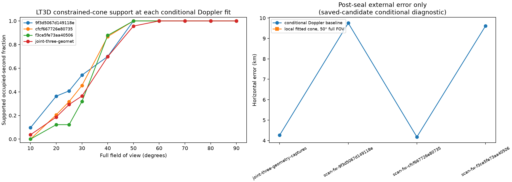
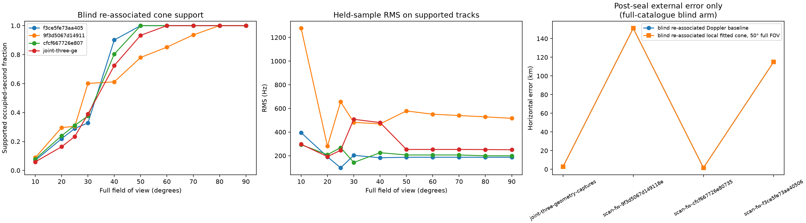

# DS2 LT3D-001A geometry and cone diagnostic

This completed DS2 development evaluation uses all three September 24 captures
with an explicit capture-time `LT3D-001A` binding: `scan-fw-f3ce5fe73aa40506`,
`scan-fw-9f3d5067d149118e`, and `scan-fw-cfcf667726e80735`.  It is a useful
geometry check, but it is **not a blind position result**: the causal candidate
universe is the saved site-assisted review shortlist.  The reference coordinate
was excluded from [inference.json](inference.json) and entered only in the
separate [postseal-evaluation.json](postseal-evaluation.json).

The sealed fixture says the two nominal mount axes are 20° apart, with RX0
mapped to `negative-x` and RX1 to `positive-x`.  That cable mapping is
provisional, so every fit evaluates both mapping symmetries.  The fixture
orientation in ENU is learned on randomized training rows only, with a shared
upward tilt no greater than 45°.  The 5,208-point orientation grid uses 15°
yaw/tilt-azimuth increments and 5° tilt increments.  It is intentionally a
coarse support model, not a measured boresight calibration.

## Conditional saved-candidate diagnostic

The joint conditional Doppler fit for the three captures is 4.265 km from the
reference after sealing.  The cone restriction did not improve its selected
local 3×3 position: 10–50° full-FOV variants retain the same 4.265 km point.
This matches the prior DS1 finding that fitted cones are a consistency and
association-stress diagnostic rather than a primary geographic estimator.

| Input | Conditional baseline error (km) | 50° local-cone error (km) | Baseline capped loss |
| --- | ---: | ---: | ---: |
| `f3ce5fe73aa40506` | 9.614 | 9.614 | .0197 |
| `9f3d5067d149118e` | 9.752 | 9.752 | .0623 |
| `cfcf667726e80735` | 4.176 | 4.176 | .0413 |
| Joint three-capture fit | **4.265** | **4.265** | .0800 |

The joint fit requires a 13.08° half-angle to cover 80% of midpoint-weighted
saved associations and 24.84° to cover 95%.  Its actual whole-track hard-cone
support rises sharply with width:

| Full FOV | 10° | 20° | 25° | 30° | 40° | 50° | 60° | 70° | 80° | 90° |
| --- | ---: | ---: | ---: | ---: | ---: | ---: | ---: | ---: | ---: | ---: |
| Joint support | 3.7% | 18.6% | 29.3% | 36.5% | 69.7% | 95.7% | 100% | 100% | 100% | 100% |
| Joint training capped loss | .9643 | .8377 | .7410 | .6870 | .3659 | .1227 | .0826 | .0826 | .0826 | .0800 |

The historical hard-cone half-angle family is represented directly by the
matching full-FOV rows: 10° → 20° FOV, 15° → 30°, 20° → 40°, and 30° → 60°.
Thus its joint supported fractions are 18.6%, 36.5%, 69.7%, and 100%.



## What was run

| Family | Settings | Result / limitation |
| --- | --- | --- |
| Learned pointing-cone quantiles | 50%, 80%, 95% weighted midpoint angles; both mappings | Completed for every individual capture and the joint input. Both mappings tie to numerical precision because fixture yaw makes the provisional exchange symmetric. |
| Staged full-FOV sweep | 10, 20, 25, 30, 40, 50, 60, 70, 80, 90° | Completed at each conditional Doppler position with all-track unmatched penalties. |
| Fixed hard cones | Half angles 10, 15, 20, 30° | Completed as the corresponding 20, 30, 40, 60° FOV scenarios. |
| Local fitted cone position | Full FOV 10, 20, 25, 30, 40, 50° | Completed on a 3×3, 50-km local grid around each reference-free conditional Doppler result. It did not improve the joint selected location. |
| Geometry-aware mapping | RX0↔negative-x / RX1↔positive-x and exchanged mapping | Both retained, then training-selected; no unverified mapping was claimed. |

The local-grid spacing means this is a bounded sensitivity check, not a
sub-kilometre cone optimizer.  More importantly, no hard-cone result should be
read as an antenna gain measurement: a 300 s adaptive recording may see a
satellite only over a portion of its path, and the fixture holds mount reference
axes rather than calibrated RF phase centers or boresights.

## Blind, receipt-bound re-associated cone arm

The separate [blind-inference.json](blind-inference.json) uses the completed
receipt-bound cache, not the saved review identity.  At every candidate
location it profiles each track's constant CFO on its randomized training
samples and chooses the best available causal, non-debris Starlink trajectory
from the cache.  The cache itself was conservatively pre-filtered only by
whether a candidate could be visible from the declared Sacramento-250 km or
Reno-500 km regions.  It contains no reference coordinate or site association.
RX labels are joined through immutable observation IDs, not through any
candidate label.  The cone grid then refits both provisional RX-to-fixture
mappings and an upward-facing LT3D orientation.  Held samples only score the
selected solution.

| Input | Blind baseline error (km) | 50° local-cone error (km) | Blind baseline loss | Held RMS at 50° (Hz) |
| --- | ---: | ---: | ---: | ---: |
| `f3ce5fe73aa40506` | 115.020 | 115.020 | .0323 | 186.8 |
| `9f3d5067d149118e` | 151.058 | 151.058 | .1599 | 578.5 |
| `cfcf667726e80735` | 1.589 | 1.589 | .0373 | 206.1 |
| Joint three-capture fit | **2.763** | **2.763** | .0666 | 252.8 |

The blind joint result supports 93.3% of occupied seconds at a 50° full FOV
and all tracks at 60°.  Its narrow-cone constraint changes five of the 40
point-local reassociations at 50°; it is therefore exercising a real
association restriction, rather than merely drawing a cone over frozen IDs.
It does not improve the selected local grid coordinate in this run.  The 50°
constraint is a useful geometric plausibility check because it preserves
reasonable held RMS, while the 9f3 capture remains a weak independent blind
position result (579 Hz held RMS and a 150 km post-seal error).  The joint
result should be preferred over that single capture.

| Joint blind full FOV | 10° | 20° | 25° | 30° | 40° | 50° | 60° | 70° | 80° | 90° |
| --- | ---: | ---: | ---: | ---: | ---: | ---: | ---: | ---: | ---: | ---: |
| Supported occupied seconds | 5.9% | 16.4% | 23.4% | 38.9% | 72.4% | 93.3% | 100% | 100% | 100% | 100% |
| Held RMS on supported tracks (Hz) | 296.8 | 192.6 | 245.3 | 507.9 | 480.0 | 252.8 | 252.8 | 252.8 | 251.9 | 250.3 |

The small 3×3 blind cone grid uses 25 km spacing and is deliberately a local
sensitivity test.  It does not establish a sub-kilometre cone fit.  Its full
machine-readable per-width assignments, mappings, coverage, train loss, and
held diagnostics are in [blind-inference.json](blind-inference.json).  The
known coordinate is only added in the linked
[blind-postseal-evaluation.json](blind-postseal-evaluation.json).

Both post-seal tables use the established surveyed evaluation coordinate
`(37.84903264307456, -122.4856541910174)`.  The V14 product's nominal
`observer_site` coordinate is a site-assisted tracking input and is not used as
ground truth.



## Runtime and failures

| Step | Runtime / status | Notes |
| --- | --- | --- |
| Read-only causal input export | 36 s | Reconstructed target-session-only saved review candidates and TLE states from immutable tracking products. No QNAP access or write. |
| Conditional Doppler + all cone families | 6.47 s | Four evaluations: three sessions and the joint set; all five bounded optimizer starts converged per evaluation. |
| Post-seal evaluation and PNG | completed | Reference only enters this step. |
| Receiver binding for portable cache | 10.6 s | All 40 cache tracks joined to RX0/RX1 by immutable observation IDs. |
| Blind full-catalogue Doppler + cone families | 181.16 s | All three sessions plus the joint input. The full 10–90° sweep, fixed half-cones, mappings, and local 10–50° cone grid completed. |
| Blind post-seal evaluation and PNG | completed | Reference only enters after the blind inference artifact was sealed. |

## Reproduction

The export command needs only read access as the `leo` service account:

```bash
sudo -n -u leo /opt/leo-tracker/releases/51701a6ba364bd20170cbc167c1ee0db8c640483/.venv/bin/python \
  reports/2026_09_24_ds2_geometry_cone_evaluation/extract_inputs.py \
  > reports/2026_09_24_ds2_geometry_cone_evaluation/causal-inputs.json

OPENBLAS_NUM_THREADS=1 OMP_NUM_THREADS=1 MKL_NUM_THREADS=1 \
  .venv/bin/python reports/2026_09_24_ds2_geometry_cone_evaluation/run.py

.venv/bin/python reports/2026_09_24_ds2_geometry_cone_evaluation/evaluate.py \
  --reference-latitude-deg 37.84903264307456 --reference-longitude-deg -122.4856541910174
.venv/bin/python reports/2026_09_24_ds2_geometry_cone_evaluation/plot.py
.venv/bin/python reports/2026_09_24_ds2_geometry_cone_evaluation/extract_blind_labels.py \
  --cache-root /var/tmp/leo-ds2-portable-cache \
  > reports/2026_09_24_ds2_geometry_cone_evaluation/blind-receiver-labels.json

OPENBLAS_NUM_THREADS=1 OMP_NUM_THREADS=1 MKL_NUM_THREADS=1 \
  .venv/bin/python reports/2026_09_24_ds2_geometry_cone_evaluation/run_blind_reassociated.py \
  --cache-root /var/tmp/leo-ds2-portable-cache

.venv/bin/python reports/2026_09_24_ds2_geometry_cone_evaluation/evaluate.py \
  --inference reports/2026_09_24_ds2_geometry_cone_evaluation/blind-inference.json \
  --reference-latitude-deg 37.84903264307456 --reference-longitude-deg -122.4856541910174 \
  --method-prefix 'blind re-associated' \
  --method-prefix "blind re-associated" \
  --output reports/2026_09_24_ds2_geometry_cone_evaluation/blind-postseal-evaluation.json
.venv/bin/python reports/2026_09_24_ds2_geometry_cone_evaluation/plot_blind.py
.venv/bin/pytest -q reports/2026_09_24_ds2_geometry_cone_evaluation/test_run.py
```

The sealed machine-readable artifacts are [causal-inputs.json](causal-inputs.json),
[inference.json](inference.json), [postseal-evaluation.json](postseal-evaluation.json),
[blind-receiver-labels.json](blind-receiver-labels.json),
[blind-inference.json](blind-inference.json), and
[blind-postseal-evaluation.json](blind-postseal-evaluation.json).
