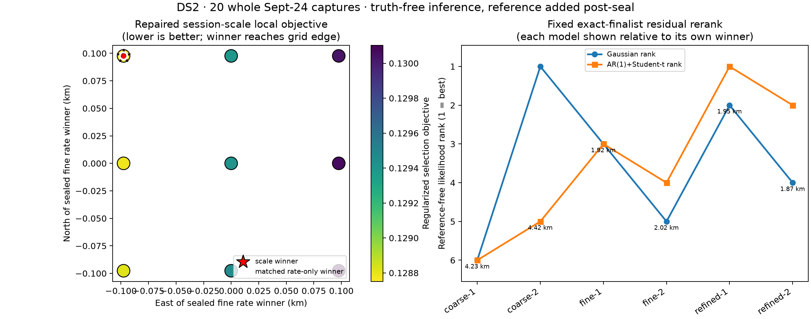

# DS2 remaining portable-model evaluation

## Result

Two previously unexecuted DS2 registry arms now have sealed, reproducible
results on all 20 whole Sept-24 captures: the repaired common-plus-session
fractional Doppler scale and the fixed-finalist robust residual likelihood.
The run used 503 qualified tracks and 13,111 observations.  The Sacramento
250 km prior and the six finalist coordinates were frozen before execution;
the reference coordinate appears only in `evaluation.json` after
`inference.json` was sealed.

Neither arm improves the accepted DS2 position result.  The scale hierarchy
and its matched rate-only control select the same 97.656 m lattice cell at
**1.857 km** post-seal error.  The scale hierarchy reduces unpenalized capped
loss, but fails its predeclared qualification rules.  The AR(1)+Student-t
residual diagnostic selects the earlier refined rate finalist at **1.950 km**;
the independent Gaussian instead selects a coarse finalist at **4.420 km**.



## Frozen inference design

The session-scale arm is a matched local ablation around the sealed portable
fine rate winner.  It evaluates a symmetric 3 by 3 exact lattice with 97.656 m
spacing.  The fine winner's 503 hard identities and global time offset are
fixed.  At every cell, the reviewed repaired block-coordinate model fits one
bounded causal phase rate per NORAD, one common fractional Doppler scale, one
shrinkage-regularized scale deviation per session, and one profiled constant
CFO per track.  A rate-only fit on precisely the same support is the control.
Every complete session is normalized to one objective vote.

The residual arm uses exactly the two pre-existing exact-rate finalists from
each portable coarse, refined, and fine stage.  It adds no geographic point.
At each frozen coordinate and time, the original all-observation hard
association is reconstructed once and then fixed.  The repaired exact rate
fit is also frozen before scoring either likelihood:

- independent Gaussian residuals with a learned global scale;
- fixed AR(1) correlation `rho=0.65`, one-second correlation time, Student-t
  `df=4`, 12-step bounded IRLS track offsets, and the predeclared scale prior.

All six candidates pass the 0.2 Hz exact-SGP4 surrogate gate.  No held mask or
reference coordinate participates in association, nuisance fitting, ranking,
or selection.

## Repaired session-scale findings

| Quantity | Matched rate-only | Common + session scale |
|---|---:|---:|
| Selected local offset | -97.656 m east, +97.656 m north | -97.656 m east, +97.656 m north |
| Exact capped loss | 0.051762 | 0.048644 |
| Regularized selection objective | 0.096497 | 0.128751 |
| Block convergence | yes, 2 iterations | no, 16-iteration limit |
| Rate boundary count | 0 | 0 |
| Scale guard reached | n/a | yes |
| Maximum exact-gate error | — | 0.0000233 Hz |
| Post-seal position error | 1.857 km | 1.857 km |

The hierarchy learns a common scale of **+265.0 ppm**.  One session deviation
reaches the fixed **+2,000 ppm** guard, while another reaches about -1,787 ppm.
The winner also lies on the northwest corner of the local lattice.  Opposite
plus/minus 400 ppm initializations agree on the selection objective to
`9.83e-9`, so the numerical basin is repeatable, but both still hit the strict
16-block limit and the scale guard.  The arm is therefore **not qualified**.

The lower raw capped loss does not justify promotion.  The hierarchy spends
35.83 units of scale-prior cost before the fixed `0.001` selection multiplier,
and its added nuisance freedom does not change the chosen coordinate relative
to the matched rate-only control.  The boundary winner also means this small
local surface does not close a new basin.

## Fixed-finalist residual findings

| Finalist | Gaussian NLL | Gaussian rank | AR(1)+t NLL | AR(1)+t rank | Post-seal error |
|---|---:|---:|---:|---:|---:|
| coarse-1 | 6.694853 | 6 | 5.928709 | 6 | 4.23 km |
| coarse-2 | 6.642738 | **1** | 5.928362 | 5 | **4.42 km** |
| refined-1 | 6.671438 | 2 | 5.928119 | **1** | **1.95 km** |
| refined-2 | 6.671731 | 4 | 5.928147 | 2 | 1.87 km |
| fine-1 | 6.671618 | 3 | 5.928185 | 3 | 1.92 km |
| fine-2 | 6.671974 | 5 | 5.928265 | 4 | 2.02 km |

The robust likelihood is mechanically qualified: all fits converge and all
six exact gates pass.  Its NLL separations are very small, and it chooses the
refined stage rather than the best post-seal error among these fixed points.
It remains a residual diagnostic, as predeclared by the registry.  The
Gaussian ranking is actively harmful on DS2 because its learned-scale score
prefers a much coarser location.

## Interpretation

The two arms close their DS2 execution gaps without changing the accepted
portable conclusion.  Session-specific frequency scaling explains residual
structure but is weakly identified and too flexible under the frozen priors.
Correlation-aware residual scoring avoids the Gaussian arm's worst rank
reversal, but does not improve the location selected by the original exact
rate objective.  The strongest remaining direction is therefore a better
geographic/association objective rather than more residual nuisance freedom.

This is reused DS2 development evidence, not independent validation.  The
post-seal distances describe this known site only.

## Reproduction

```bash
.venv/bin/python reports/2026_09_24_ds2_missing_models/build_plan.py
OPENBLAS_NUM_THREADS=1 OMP_NUM_THREADS=1 MKL_NUM_THREADS=1 \
  .venv/bin/python reports/2026_09_24_ds2_missing_models/run.py --workers 4
.venv/bin/python reports/2026_09_24_ds2_missing_models/evaluate_postseal.py
.venv/bin/python reports/2026_09_24_ds2_missing_models/plot.py
.venv/bin/python -m pytest -q reports/2026_09_24_ds2_missing_models/test_run.py
.venv/bin/python -m ruff check reports/2026_09_24_ds2_missing_models
```

The complete four-worker inference run took 78.1 seconds.  `plan.json`,
`inference.json`, and `evaluation.json` each have adjacent SHA-256 seals.
