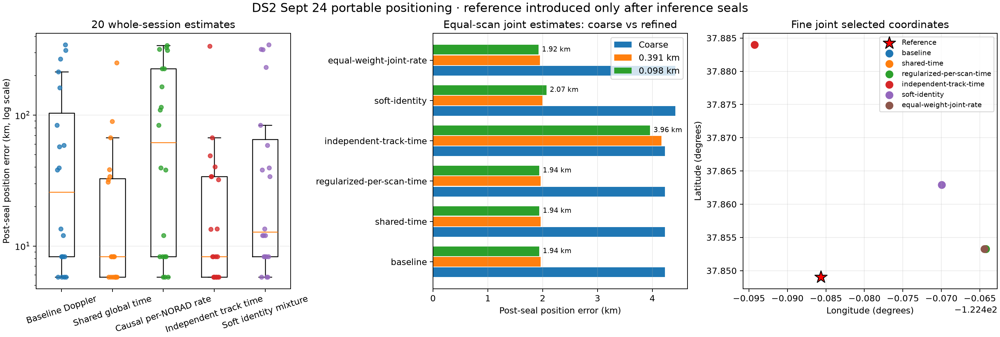

# DS2 Sept 24 portable positioning evaluation

## Result

This development evaluation uses all 20 sealed Sept 24 captures (503 qualified tracks and 13,111 observations). Each capture is kept whole. The reference coordinate was absent from inference and introduced only after every position artifact was sealed.

The best portable fine-grid result is `equal-weight-joint-rate` at 1.924 km. Baseline, shared-time, and regularized per-scan timing all converge to 1.939 km and choose zero global timing shift. Moving from the 0.391 km stage to the 0.098 km stage changes baseline error by only 0.026 km. The remaining roughly 1.9 km error is therefore a model/evidence plateau, rather than a coarse-lattice artifact; DS2 does not demonstrate sub-kilometre portable accuracy. The causal-rate winner passes its exact SGP4 gate with a 2.18e-05 Hz maximum cached-versus-exact discrepancy.

### Single-scan estimates

| Method | Captures | Median error (km) | P25–P75 (km) | Best (km) | Worst (km) | <10 km | <1 km |
|---|---:|---:|---:|---:|---:|---:|---:|
| `independent-track-time` | 20 | 8.329 | 5.791–33.993 | 5.791 | 337.238 | 11 | 0 |
| `shared-time` | 20 | 8.329 | 5.791–32.704 | 5.791 | 251.118 | 13 | 0 |
| `soft-identity` | 20 | 12.789 | 8.329–65.170 | 5.791 | 344.320 | 7 | 0 |
| `baseline` | 20 | 25.869 | 8.329–103.513 | 5.791 | 344.320 | 8 | 0 |
| `causal-rate` | 20 | 61.752 | 8.329–226.369 | 5.791 | 340.048 | 7 | 0 |

### Joint all-session estimates

Each joint objective gives every whole session equal total weight, so dense scans cannot dominate merely because they contain more tracks or observations.

| Method | Coarse error (km) | 0.391-km error | 0.098-km error | Latitude | Longitude | RF objective | Global time (s) | Runtime (s) |
|---|---:|---:|---:|---:|---:|---:|---:|---:|
| `equal-weight-joint-rate` | 4.420 | 1.950 | 1.924 | 37.853244 | -122.464404 | 0.051843 | 0.000 | 542.5 |
| `baseline` | 4.231 | 1.965 | 1.939 | 37.853245 | -122.464223 | 0.095668 | 0.000 | 50.6 |
| `shared-time` | 4.231 | 1.965 | 1.939 | 37.853245 | -122.464223 | 0.095668 | 0.000 | 370.2 |
| `regularized-per-scan-time` | 4.231 | 1.965 | 1.939 | 37.853245 | -122.464223 | 0.095668 | 0.000 | 372.0 |
| `soft-identity` | 4.420 | 1.997 | 2.068 | 37.862903 | -122.469969 | 6.136815 | 0.000 | 415.4 |
| `independent-track-time` | 4.231 | 4.169 | 3.958 | 37.883972 | -122.494280 | 0.048063 | — | 368.7 |



## Methods and interpretation

- **Baseline Doppler** reacquires a satellite identity for every track at every geographic trial and fits a nuisance CFO per track.
- **Shared global time** adds one receive-time displacement shared by every scan, receiver, track, and candidate.
- **Regularized per-scan timing** adds bounded scan corrections around the shared time and penalizes those corrections.
- **Independent track time** is a deliberately flexible diagnostic. It can expose timing-model mismatch, but its many nuisance parameters make it a weak portable positioning model.
- **Causal per-NORAD rate** fits a shared rate correction for each associated NORAD on exact causal SGP4 predictions after geographic screening.
- **Soft identity mixture** marginalizes nearby candidate identities rather than treating the top hard match as certain.

All frequency losses use the declared 800 Hz cap and every qualified observation; there is no chronological or within-track holdout. These are development comparisons against a post-seal reference, not untouched validation/test results.

## Frozen registry accounting

| Model | Registry role | DS2 execution state | Reason |
|---|---|---|---|
| `baseline_doppler` | `primary_portable` | `complete` | sealed portable artifact |
| `shared_global_receive_time` | `primary_portable` | `complete` | sealed portable artifact |
| `regularized_per_scan_time` | `conditional_portable` | `complete` | sealed portable artifact |
| `independent_per_track_time` | `diagnostic_only` | `complete` | sealed portable artifact |
| `causal_per_norad_orbit_rate` | `primary_portable` | `complete` | sealed portable artifact |
| `rate_aware_joint_geographic_screen` | `conditional_portable` | `complete_bounded_local` | the follow-up matched 3×3 local screen is reported in `../2026_09_24_ds2_consistent_rate_screen/`; all rate fits were rejected by the published objective, so it tied its nominal control at 1.798 km |
| `soft_identity_mixture` | `diagnostic_only` | `complete` | sealed portable artifact |
| `equal_weight_joint_multiscan_position` | `primary_portable` | `complete` | sealed portable artifact |
| `consistent_cap800_joint_objective` | `conditional_portable` | `complete_bounded_local` | the follow-up cached 3×3 local run is reported in `../2026_09_24_ds2_consistent_rate_screen/`; both exact gates passed and the result reached 1.735 km |
| `shared_norad_rate_joint` | `conditional_portable` | `complete_zero_overlap` | joint support contains no NORAD repeated across whole sessions |
| `regularized_common_plus_session_scale` | `conditional_portable` | `complete_unqualified` | the follow-up receipt-bound exact-support run is reported in `../2026_09_24_ds2_missing_models/`; it tied rate-only at 1.857 km but hit a scale guard, the iteration limit, and a lattice corner |
| `learned_pointing_cone_quantiles` | `diagnostic_only` | `delegated_geometry_evaluation` | reported by the separate LT3D-001A geometry/cone DS2 package |
| `fixed_hard_cone_orientation` | `diagnostic_only` | `delegated_geometry_evaluation` | reported by the separate LT3D-001A geometry/cone DS2 package |
| `staged_full_fov_cone_sweep` | `diagnostic_only` | `delegated_geometry_evaluation` | reported by the separate LT3D-001A geometry/cone DS2 package |
| `local_fitted_full_fov_cone_position` | `diagnostic_only` | `delegated_geometry_evaluation` | reported by the separate LT3D-001A geometry/cone DS2 package |
| `robust_residual_likelihood_rerank` | `rejected_or_diagnostic` | `complete_diagnostic` | the follow-up six-finalist rerank is reported in `../2026_09_24_ds2_missing_models/`; AR(1)+Student-t selected 1.950 km and Gaussian was harmful at 4.420 km |
| `legacy_joint_session_scale_lbfgsb` | `rejected` | `rejected_not_rerun` | registry rejects this nonconvergent formulation in favor of the repaired arm |

The registry table accounts for all 17 frozen candidates.  Follow-up bounded
local adapters close the four gaps that remained after the wide-prior portable
run; their scope is explicitly narrower and they are not presented as fresh
250 km searches.  The four LT3D-001A cone/geometry arms are evaluated in the
separate geometry package.

## Reproducibility and bounds

- Final manifest: `sha256:6f93ed1b87cbd4149b038cadec197c1be8017a398912052f251b1cd9c13bba8a`.
- Runtime caches are receipt-bound exports of causal TLE snapshots. Cache bytes are intentionally outside git; their digests and receipts are frozen in `dataset.json`.
- Single scans use 100, 25, and 6.25 km geographic levels. Joint coarse fits add a 1.5625 km level. Every sealed joint winner then receives a symmetric reference-free local search at 1.5625, 0.78125, and 0.390625 km, with bounded expansion when the winner lies within one first-level cell of the search edge.
- Each sealed 0.390625-km winner receives a second truth-free local search at 0.1953125 and 0.09765625 km with the same symmetric edge-expansion rule.
- A small reported reference error does not by itself establish equivalent statistical resolution. The fine 0.09765625 km lattice and variation across methods bound what this experiment can claim.
- The radio corpus is read only. This evaluation collected no new RF data.

From the repository root, after restoring the receipt-bound runtime caches:

```bash
.venv/bin/python reports/2026_09_24_ds2_portable_evaluation/build.py \
  --cache-root /var/tmp/leo-ds2-portable-cache
.venv/bin/python reports/2026_09_24_ds2_portable_evaluation/execute.py \
  --cache-root /var/tmp/leo-ds2-portable-cache --workers 4
.venv/bin/python reports/2026_09_24_ds2_portable_evaluation/refine_joint.py \
  --cache-root /var/tmp/leo-ds2-portable-cache --workers 3
.venv/bin/python reports/2026_09_24_ds2_portable_evaluation/refine_joint_fine.py \
  --cache-root /var/tmp/leo-ds2-portable-cache --workers 3
.venv/bin/python reports/2026_09_24_ds2_portable_evaluation/evaluate_postseal.py
.venv/bin/python reports/2026_09_24_ds2_portable_evaluation/account_registry.py
.venv/bin/python reports/2026_09_24_ds2_portable_evaluation/render.py
.venv/bin/python reports/2026_09_24_ds2_portable_evaluation/write_report.py
```
