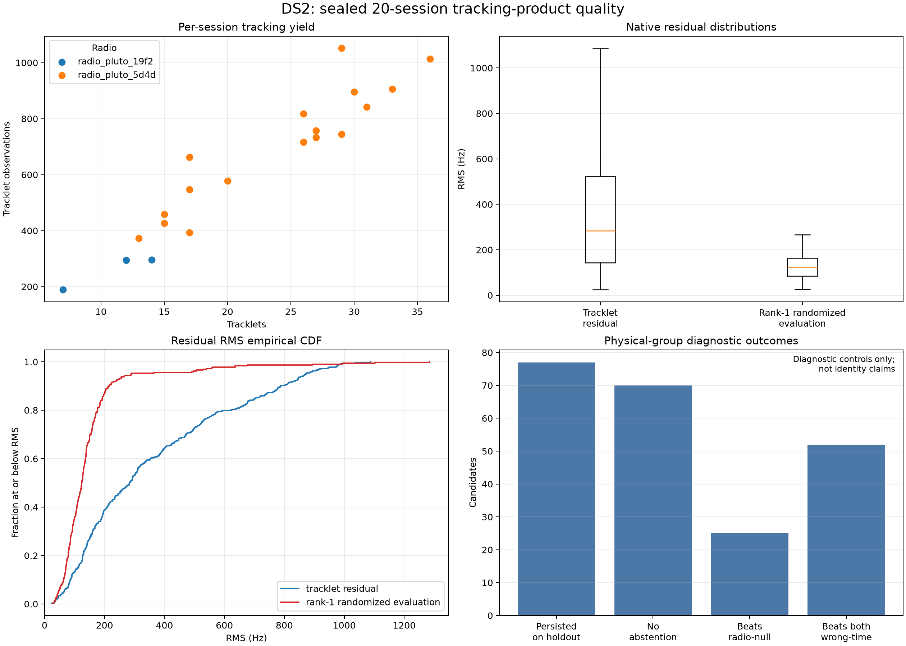

# DS2 corpus and tracking-product quality

DS2 is a frozen set of the 20 raw-capture-eligible adaptive sessions recorded
on 24 September 2026 before the published cutoff. Every one now has a complete
`scanner-shared-tracking-v14` product with the same tracking configuration
digest. This report is descriptive only: it does not run a geographic search,
read a reference position, or use the product's site/position-diagnostic data.

The report uses the existing V14 randomized observation split. It does not
create a chronological holdout.

## What is in the corpus

| Measure | DS2 result |
|---|---:|
| Sealed sessions | 20 |
| Capture span per session | 300 s |
| Retained visits per session, median (range) | 2,216 (1,624–2,221) |
| Tracklets | 441 |
| Tracklet observations | 12,694 |
| Reviewed tracklets | 319 |
| Reviewed observations | 11,449 |
| Physical-group candidate rows | 79 |

The two radio/sample-rate cohorts are materially unbalanced, so their summary
statistics should not be read as a controlled hardware comparison.

| Radio | Sessions | Sample rates | Tracklets | Tracklet observations | Rank-1 reviews |
|---|---:|---|---:|---:|---:|
| `radio_pluto_5d4d` | 17 | 2.5 MS/s | 408 | 11,914 | 297 |
| `radio_pluto_19f2` | 3 | 2.5 and 15 MS/s | 33 | 780 | 22 |

## Signal and review quality

Tracklet residual is the native straight-track residual before catalogue review;
rank-1 randomized evaluation RMS is the more useful per-review predictive
quantity. They answer different questions and are plotted separately.

| Quantity | Count | p25 | Median | p75 | p90 |
|---|---:|---:|---:|---:|---:|
| Tracklet span (s) | 441 | 11.42 | 17.76 | 27.64 | 35.22 |
| Tracklet residual RMS (Hz) | 441 | 142.74 | 283.65 | 523.49 | 786.98 |
| Rank-1 review span (s) | 319 | 15.90 | 22.99 | 31.00 | 38.71 |
| Rank-1 fit RMS (Hz) | 319 | 75.31 | 108.08 | 143.17 | 172.31 |
| Rank-1 randomized evaluation RMS (Hz) | 319 | 85.20 | 123.84 | 163.12 | 213.98 |

Of the 319 rank-1 reviewed tracks, 115 are at or below 100 Hz randomized RMS,
278 are at or below 200 Hz, and 315 are at or below 800 Hz. The four reviews
above 800 Hz remain visible in the machine-readable table; no quality filter
was applied here.



The visual shows a broad long-tailed raw-track residual distribution, while the
reviewed rank-1 randomized checks are substantially tighter. This is expected:
the review set is a selected subset of candidate-bearing tracklets. It does not
prove satellite identity or position accuracy.

## Randomized-holdout and control diagnostics

The 79 physical-group candidate rows retain their pipeline-provided diagnostic
outcomes:

| Diagnostic | Count |
|---|---:|
| Leading candidate persisted on randomized holdout | 77 / 79 |
| Pipeline recommended no abstention | 70 / 79 |
| Nominal score beat radio-null diagnostic | 25 / 79 |
| Nominal score beat both ±500 s wrong-time diagnostics | 52 / 79 |
| Tau-boundary abstention reason | 9 |
| Heldout-rank instability reason | 2 |
| Leader did not persist reason | 2 |

Lower negative-log score is better, so a positive control delta favors the
nominal candidate. These controls are explicitly diagnostic-only in V14 and
must not be promoted into a satellite-identity claim. In particular, passing a
review control is neither a position fix nor an independently calibrated
signal-quality label.

## Relation to the available DS1 summary

The closest published DS1 number is its full-block aggregate, 800-Hz-capped
randomized-held RMS: 312.47 Hz for baseline and 301.06 Hz for shared time.
Those are multi-scan geographic-fit objectives after candidate reselection.
The DS2 values above are uncapped, native, per-track site-assisted catalogue
review RMS. The definitions and selection stages differ, so dividing or ranking
them as a DS2-versus-DS1 cleanliness improvement would be misleading. The
useful conclusion is narrower: DS2 contains many individually well-predicted
reviewed tracks, with a median randomized RMS of 123.84 Hz, and it is suitable
for the planned DS2 candidate-model evaluation under its own sealed protocol.

## Reproduction and outputs

The source binding and all quantiles are in [summary.json](summary.json). The
sanitized source snapshot deliberately excludes observer-site and
position-diagnostic fields: [tracking-products-sanitized.json](tracking-products-sanitized.json).
Per-session, per-tracklet, per-review, and per-candidate tables are available
as [session-quality.csv](session-quality.csv), [tracklet-quality.csv](tracklet-quality.csv),
[review-quality.csv](review-quality.csv), and [candidate-quality.csv](candidate-quality.csv).

Rebuild from the local authoritative tracking endpoint:

```bash
.venv/bin/python reports/2026_09_24_ds2_quality/build_quality_report.py \
  --output reports/2026_09_24_ds2_quality
```

Or reproduce strictly from the committed sanitized snapshot, with no endpoint
access:

```bash
.venv/bin/python reports/2026_09_24_ds2_quality/build_quality_report.py \
  --products reports/2026_09_24_ds2_quality/tracking-products-sanitized.json \
  --output reports/2026_09_24_ds2_quality_rebuilt
```
