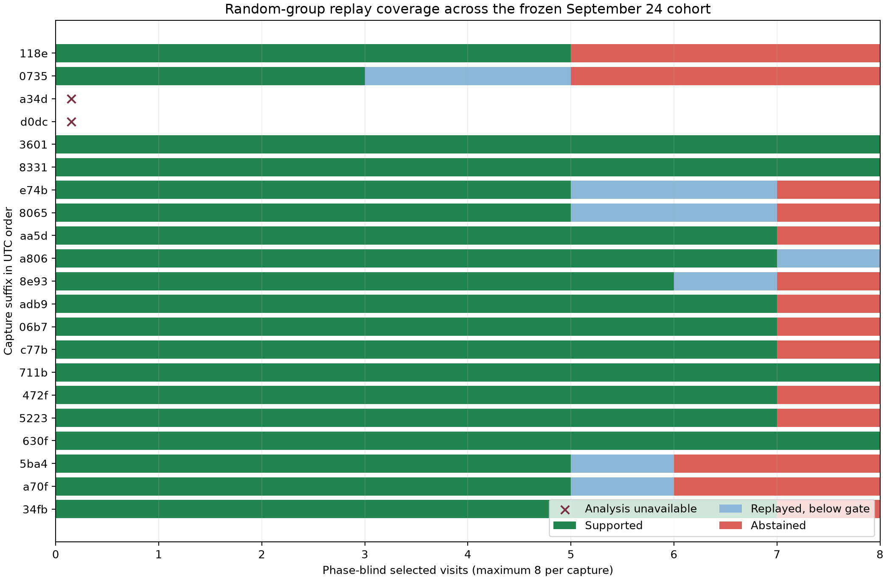
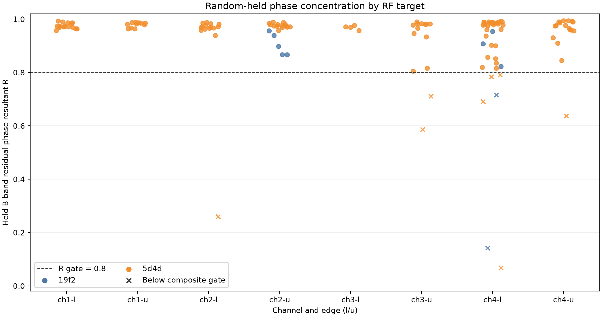
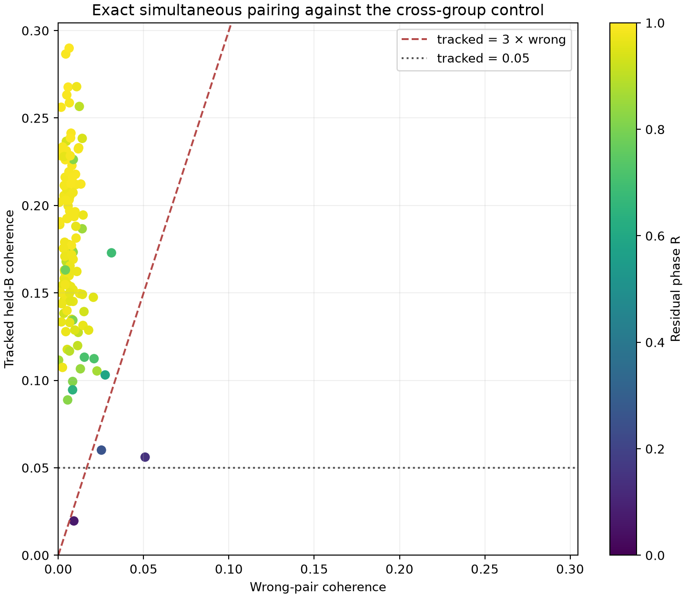
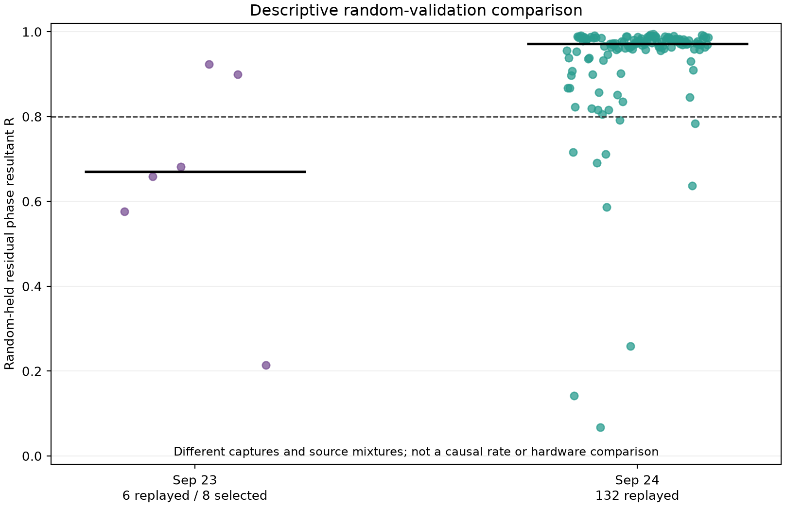

# September 24 dual-capture phase with random holdouts

The September 24 saved-IQ cohort has substantially stronger shared-waveform
phase evidence than the earlier 2.5 MS/s random-group sample. Across the 19
captures that the current analysis contracts can read, 122 of 152 phase-blind
selected dwells pass the held-waveform gate. Among the 132 successful
extractions, median residual phase concentration is **R = 0.9721**, median
tracked coherence is **0.1733**, and median wrong-pair coherence is **0.00654**.
This is useful capture-level signal, with the strongest coverage on radio
`5d4d`. It does not establish satellite identity, geometric phase, or improved
position accuracy.

## Cohort and coverage

The cohort freezes every finalized 2.5 MS/s simultaneous dual-RX adaptive
capture available at `2026-09-24T15:39:44Z`: 21 captures and 46,542 complete
stored visits. The incomplete 15 MS/s session
`scan-fw-f3ce5fe73aa40506` is excluded by the frozen cohort rule. No capture was
started for this study, and every read of saved IQ and production analysis was
read-only.

Nineteen captures have sealed, complete GLRT inventories readable by the
current `main` contracts. The remaining two, both from radio `19f2`, use receipt
schema 6. The current binding dispatches that receipt to a schema-2 analysis
model and rejects it. They remain in the cohort as explicit analysis-level
abstentions; no receipt conversion or substitute capture was introduced.

For each readable capture, selection takes the eight visits with the strongest
phase-blind paired-GLRT fractional-margin floor. Phase outcomes never affect
selection, and failed extractions are never replaced. This yields 152 selected
dwells, 132 completed phase extractions, and 20 dwell-level abstentions:

| Abstention reason | Count |
| --- | ---: |
| Local phase increment near pi | 6 |
| Fewer than eight coherent physical-overlap bins | 6 |
| No A-band response-normalization support | 4 |
| No paired training-group carrier seed | 2 |
| No qualified shared response | 1 |
| Insufficient disjoint frequency support | 1 |

All 21 captures have valid-duty fractions between 0.8848 and 0.8884. That
narrow range is below 0.90, so this replay should not be used to infer behavior
at a 90% duty threshold.

## Random-holdout protocol

There are **no time holdouts** in this study. Seed `20260924`, combined with the
session ID and visit index, assigns complete 20 ms groups within each 120 ms
dwell to a deterministic 50/50 random split. The split is stratified over the
dwell, preserves device-relative sample timing, and keeps every receiver and
spectral window in a group on the same side.

Carrier seeding uses only paired phase-blind GLRT probes wholly inside training
groups. Carrier fitting, response normalization, frequency-bin selection, and
inner model selection also use training data. Within each random-held block,
frequency band A supplies the instantaneous relative phase used to predict a
disjoint band B. A one-to-one cross-group pairing supplies the wrong-pair
control with the same flexibility.

The requested phase-correlation statistic is the same circular resultant
metric used in the prior random validation. For each held group it averages
unit phasors of the B-band residual phases; the reported value is the magnitude
of the equal-group complex mean:

\[
R = \left|\frac{1}{G}\sum_{g=1}^{G}
    \left(\frac{1}{N_g}\sum_{k=1}^{N_g}e^{j\epsilon_{gk}}\right)\right|.
\]

Thus `R = 1` indicates concentrated residual phase and `R` near zero indicates
dispersed residual phase. This circular phase concentration is distinct from a
Pearson correlation coefficient. The fixed gate requires tracked held-B
coherence above `max(0.05, 3 × wrong-pair coherence)` and `R > 0.8`.

## Evidence

| Radio | Supported / selected | Replayed | Median R | Median tracked / wrong coherence |
| --- | ---: | ---: | ---: | ---: |
| `19f2` | 8 / 16 | 10 | 0.8824 | 0.1146 / 0.00979 |
| `5d4d` | 114 / 136 | 122 | 0.9743 | 0.1764 / 0.00647 |
| **Combined** | **122 / 152** | **132** | **0.9721** | **0.1733 / 0.00654** |

The combined pass fraction is 80.3% of phase-blind selections and 92.4% of
successful extractions. The radio split matters: two of four `19f2` captures
are contract-incompatible, and six of the 16 selections in the readable pair
abstain. The broad conclusion is therefore driven mainly by `5d4d`.

Exact simultaneous pairs separate cleanly from the cross-group control for
most replayed dwells. A few points retain high coherence but fail the `R` gate,
which is why the composite decision retains both conditions.

The September 23 2.5 MS/s random-group reference passed 2 of 8 selected dwells,
with six successful extractions, median `R = 0.6706`, median tracked coherence
0.1060, and median wrong-pair coherence 0.01727. The new cohort shifts all
three descriptive metrics in the favorable direction.

That comparison is descriptive rather than a causal hardware or method
estimate. Capture time, radio, RF target, source mixture, and selection pool all
differ. The result supports a better signal in today's captures under the same
random-held waveform test; it does not identify which changed condition caused
the improvement.

## Relationship to the recent phase work

This replay carries forward the strongest safeguards from the recent reports:

- The corrected dual-RX analysis applies relative CFO once; the September 16
  diagnosis showed that double-counting it can manufacture phase drift.
- The September 23 random-group method supplies the present leakage boundary,
  disjoint held-B response, wrong-pair control, abstention rules, and fixed
  composite gate.
- The source-seeded pilot study showed that training-only known-pilot evidence
  can choose a useful local CFO branch. Its phase-rate feedback did not improve
  held results consistently, so no phase-slope feedback is added here.
- The September 24 index audit found no off-by-one rescue for the older
  capture. This replay consequently uses exact persisted visit indices and does
  not shift or borrow them.

The next useful step is source-bound validation: freeze a candidate/source
hypothesis before looking at phase, compare Doppler-only and phase-augmented
scores on the same random groups, and retain different-source controls. The
present broadband result is strong enough to justify that experiment, but it
must remain separate from claims about named satellites or geometry.

## Reproduction and artifacts

The [artifact README](figures/2026_09_24_dual_capture_phase_random/README.md)
contains the replay commands. The
[summary](figures/2026_09_24_dual_capture_phase_random/summary.json),
[per-dwell table](figures/2026_09_24_dual_capture_phase_random/per-dwell.csv),
[frozen cohort](figures/2026_09_24_dual_capture_phase_random/cohort.json), and
[compressed evidence](figures/2026_09_24_dual_capture_phase_random/comparison.json.gz)
retain the capture-manifest digests, IQ digests, deterministic splits,
training-only carrier probes, source hashes, outcomes, and abstentions.

The focused random-phase, broadband-alignment, and September 24 replay tests
pass 18 tests. Ruff checks pass for the replay, summarizer, and component-owned
tests. The four generated PNGs were inspected after the final late-session
analysis products sealed. This change adds research tooling and evidence only;
it changes no production analyzer or persisted contract.
