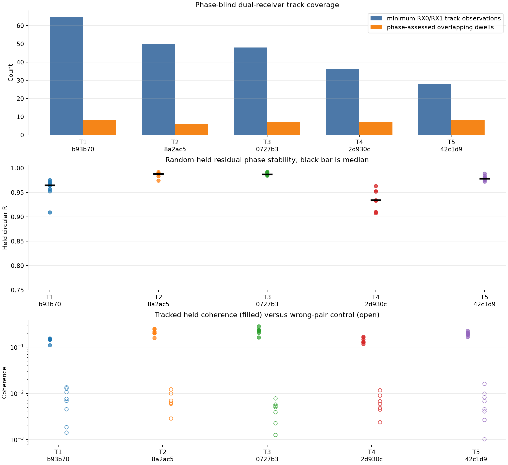
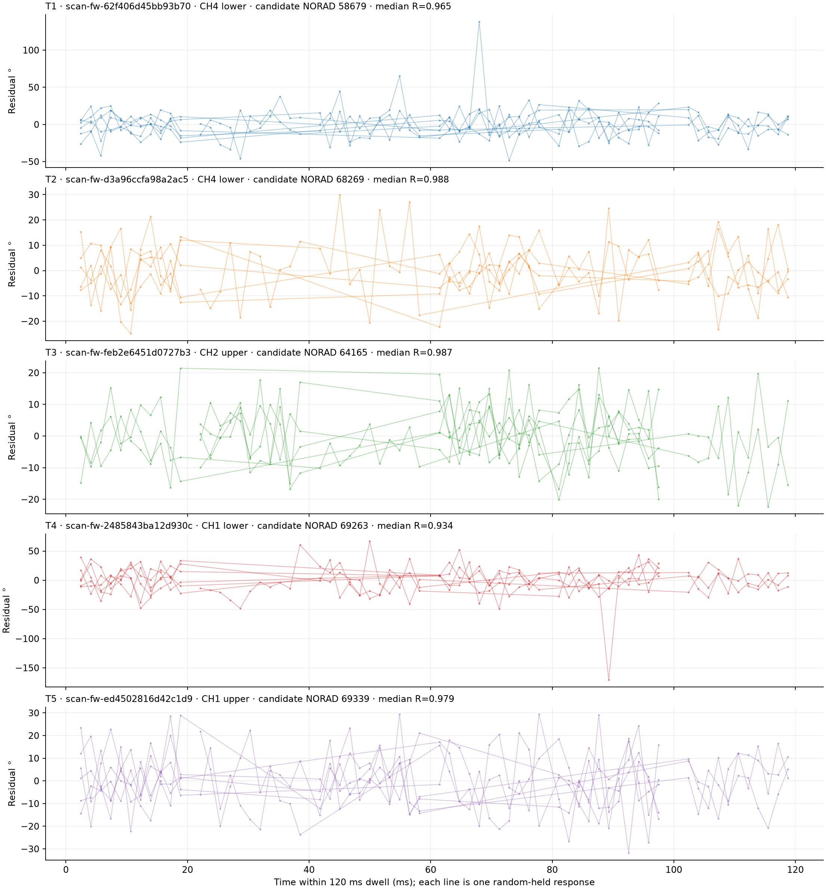
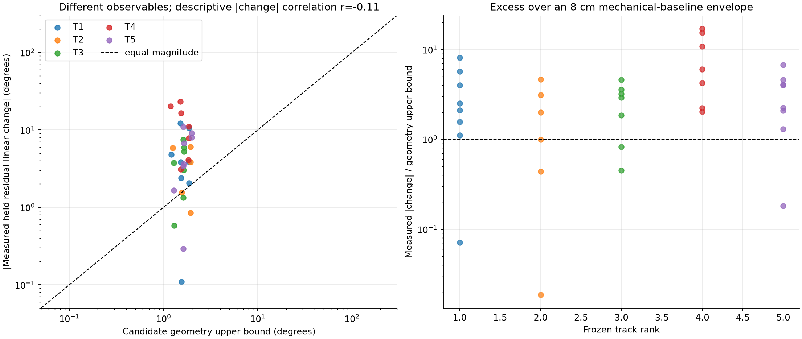

# Five late September 24 dual-RX tracks: phase stability and candidate geometry

Five phase-blind tracks from the 23 captures recorded after `15:39:44Z` have
strong simultaneous RX0/RX1 GLRT coverage and strong random-held phase
stability. Across 36 track-overlapping dwells, every replay passes the existing
held-waveform gate. Median circular phase concentration is **R = 0.9761**
(minimum `0.9076`), median tracked coherence is **0.1766**, and median
wrong-pair coherence is `0.00589`.

The phase is not yet a calibrated satellite-geometry observable. A descriptive
held residual changes by a median `3.99°` over its evaluated span, while the
candidate orbit permits at most a median `1.62°` of differential geometric
change for an optimally oriented 8 cm mechanical baseline. Only 7 of 36
measured magnitudes lie within that generous envelope, and their magnitude
correlation with the candidate bounds is `r = -0.11`. This does not reject the
candidate associations: it shows that receiver/channel terms still dominate
the extracted RX1−RX0 phase change.

## Frozen phase-blind selection

The population is every finalized 2.5 MS/s simultaneous dual-RX adaptive
capture begun on September 24 UTC after the earlier report cutoff. Tracks are
ranked by the smaller of their RX0/RX1 tracking-observation counts, then by the
number of previously phase-blind selected GLRT dwells overlapping both exact
tracklets. Phase `R`, coherence, phase change, TLE score, and catalogue number
do not enter the ranking. The exact IDs and digests are frozen in the
[selection artifact](figures/2026_09_24_late_dual_rx_track_phase/selection.json).

The final five also require agreement between the physical-group leading TLE
hypothesis and the individual RX0/RX1 track reviews. One initially attractive
track was excluded because those catalogue leaders disagreed. This consistency
check does not turn a candidate into an identity.

| Rank | Capture suffix | Lane | RX0 / RX1 observations | Assessed dwells | Candidate NORAD | Held runner NLL margin |
| ---: | --- | --- | ---: | ---: | ---: | ---: |
| 1 | `62f406d45bb93b70` | CH4 lower | 65 / 68 | 8 | 58679 | 29.561 |
| 2 | `d3a96ccfa98a2ac5` | CH4 lower | 85 / 50 | 6 | 68269 | 21.925 |
| 3 | `feb2e6451d0727b3` | CH2 upper | 48 / 56 | 7 | 64165 | 4.867 |
| 4 | `2485843ba12d930c` | CH1 lower | 64 / 36 | 7 | 69263 | 15.004 |
| 5 | `ed4502816d42c1d9` | CH1 upper | 28 / 48 | 8 | 69339 | 6.125 |

All catalogue numbers are **candidate-only associations**. The source tracking
manifests set `candidate_only=true` and `identity_claimed=false`. Their TLE
scorers use deterministic random observation partitions; no chronological
holdout is introduced here.



## Random-held phase tracking

This report reuses the sealed September 24 random-group protocol. Seed
`20260924`, session ID, and visit index assign complete 20 ms groups within each
120 ms dwell to a deterministic 50/50 split. Carrier seeding, carrier fitting,
response normalization, frequency-bin selection, and inner model selection use
training groups. In each held block, frequency band A predicts disjoint held
band B. A one-to-one cross-group pair is the control. There are **no time
holdouts**.

`R` is the equal-held-group circular resultant of the B-band residual phase,
the same requested correlation statistic as the full-day report. It measures
phase concentration, not Pearson correlation. The fixed support gate remains
tracked coherence above `max(0.05, 3 × wrong-pair coherence)` and `R > 0.8`.

| Track | Median R | Minimum R | Circular SD | Median tracked / wrong coherence | Median held residual change |
| --- | ---: | ---: | ---: | ---: | ---: |
| T1 | 0.9649 | 0.9094 | 15.3° | 0.1462 / 0.00725 | 3.86° |
| T2 | 0.9880 | 0.9747 | 8.9° | 0.2088 / 0.00658 | 2.70° |
| T3 | 0.9871 | 0.9844 | 9.2° | 0.2265 / 0.00502 | 3.74° |
| T4 | 0.9342 | 0.9076 | 21.1° | 0.1309 / 0.00588 | 11.08° |
| T5 | 0.9788 | 0.9723 | 11.9° | 0.1932 / 0.00562 | 5.20° |

The aggregate circular standard deviation is `12.6°`. T2 and T3 are the
cleanest tracks. T4 remains supported in all seven assessed dwells but has the
lowest median `R`, the broadest circular spread, and the largest median phase
change. The traces retain all held points, including isolated large residuals;
no dwell is dropped or replaced after phase inspection.



The plotted traces are local to each dwell. They are centered only for display
and are never joined across retunes. Continuous integer cycle count is not
resolved between visits.

## Comparison with candidate satellite phase change

The measured phase product is `RX1 × conjugate(RX0)` after a train-only relative
carrier and response correction. Satellite transmitter phase and most radial
Doppler are common to the receivers and cancel. The remaining geometric term,
if the electrical baseline were calibrated, would be approximately

```text
φ10(t) = (2π fRF / c) b·u(t) + receiver/channel terms  (modulo 2π).
```

There is no reviewed electrical phase-center vector or baseline orientation for
this radio. The comparison therefore propagates each agreed candidate TLE from
its exact causal archive snapshot and computes the largest possible geometric
change over the same held interval:

```text
Δφmax = (2π fRF / c) × 0.08 m × ||u(t2) − u(t1)||.
```

This maximizes over every possible orientation of the 8 cm mechanical baseline,
so it is an upper envelope rather than a fitted or signed prediction. No phase
value or phase rate is used to select the candidate, TLE time offset, or track.



The median measured-to-envelope ratio is `2.71`; its 10th–90th percentile range
is `0.44–7.42`. Twenty-nine of 36 dwell changes exceed the envelope, and the
descriptive Pearson correlation between absolute measured change and the
candidate-specific bound is `-0.114`. Because the comparison is between an
instrument-inclusive residual and an uncalibrated best-case geometry bound,
these values do not score satellite identity. They rule out interpreting the
present residual slopes directly as satellite angular motion.

The candidate associations still have useful, separate Doppler evidence: their
held runner negative-log-score margins range from `4.87` to `29.56`, and each
leader persists across its randomized TLE evaluation. That evidence supports
conditional catalogue compatibility. The phase evidence supports a stable
shared waveform. A physical phase-versus-orbit test needs an independently
measured electrical baseline and receiver/channel phase calibration held fixed
across dwells.

## Reproduction and limits

The [artifact README](figures/2026_09_24_late_dual_rx_track_phase/README.md)
contains the commands. The [summary](figures/2026_09_24_late_dual_rx_track_phase/summary.json)
retains per-track and per-dwell metrics, exact support centers, TLE sources, and
trajectory authorities. The analysis reads saved IQ products, tracking products,
and the local TLE archive without modifying them. It changes no production
analyzer or persisted contract.

The result establishes strong local phase tracking on five well-supported
dual-RX tracks. It does not establish a named satellite, calibrated geometric
phase, direction, position, or velocity.
