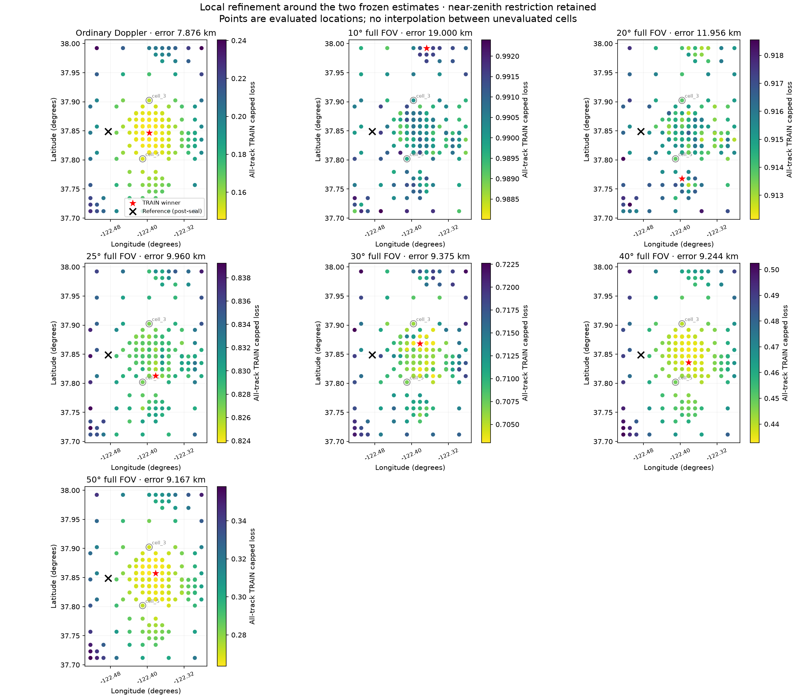

# Local cone-grid position comparison

The near-zenith mount restriction is unchanged. The run evaluated 50 coarse
points at 5 km spacing, 46 additional points at 2.5 km, and 69 at 1.25 km,
using four workers in 134.1 seconds. Each method retained one refinement seed
per region at each stage. This bounded search can miss other local minima.

The baseline remains better than every cone-constrained estimate in this
particular comparison. Improving a method's training score did not necessarily
improve its reference-position error.

Each method selected its location using TRAIN loss only. Reference errors and the black reference marker were added after the inference seal was verified. This is a local TRAIN diagnostic, not independent validation or a global optimum.

| Method | Old error (km) | Finer-grid error (km) | Change (km; negative is better) |
|---|---:|---:|---:|
| Ordinary Doppler | 8.450 | 7.876 | -0.574 |
| 10° full FOV | 8.450 | 19.000 | +10.550 |
| 20° full FOV | 8.450 | 11.956 | +3.506 |
| 25° full FOV | 9.849 | 9.960 | +0.111 |
| 30° full FOV | 9.849 | 9.375 | -0.473 |
| 40° full FOV | 9.849 | 9.244 | -0.605 |
| 50° full FOV | 9.849 | 9.167 | -0.682 |

Evaluated 165 geographic points. Finest requested spacing is 1.25 km; a selected grid centre's error is not a calibrated uncertainty or a resolution guarantee. Scores on the maps include unmatched-track penalties.



Nine tests pass. Independent review verified all global and regional winners
against the TRAIN scores, both receiver mappings at the benchmark points, and
the inference seal. `dependency_receipt.json` is an explicitly post-execution
dependency record, not a claim that those supplemental hashes were presealed.
The stopped preliminary attempt produced no inference result; it was replaced
before the four-worker run to add regional results and actual mapping checks.

Reproduce with the existing authorized local TRAIN corpus:

```bash
OPENBLAS_NUM_THREADS=1 OMP_NUM_THREADS=1 MKL_NUM_THREADS=1 \
  .venv/bin/python reports/2026_09_24_local_cone_grid/run.py --benchmark
OPENBLAS_NUM_THREADS=1 OMP_NUM_THREADS=1 MKL_NUM_THREADS=1 \
  .venv/bin/python reports/2026_09_24_local_cone_grid/run.py
.venv/bin/python reports/2026_09_24_local_cone_grid/evaluate.py \
  --inference reports/2026_09_24_local_cone_grid/inference.json \
  --seal reports/2026_09_24_local_cone_grid/inference.sha256 \
  --output-dir reports/2026_09_24_local_cone_grid
.venv/bin/python -m pytest reports/2026_09_24_local_cone_grid -q
```

Inference SHA256: `1669396f2d7ec3b01d7bae070800316507df8b38291a7d29b6ea2de318fe2830`. Machine-readable post-seal comparison: `evaluation.json`.
