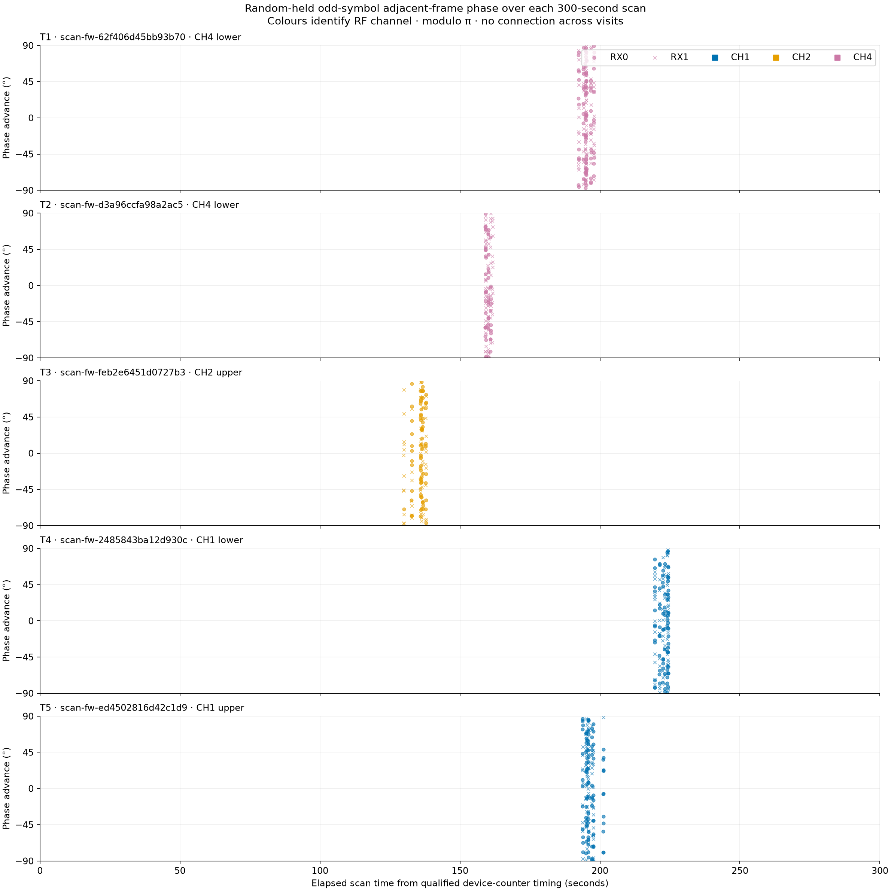
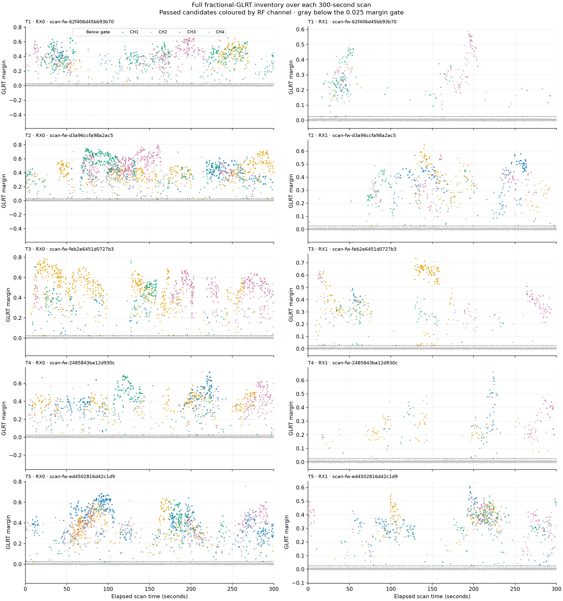
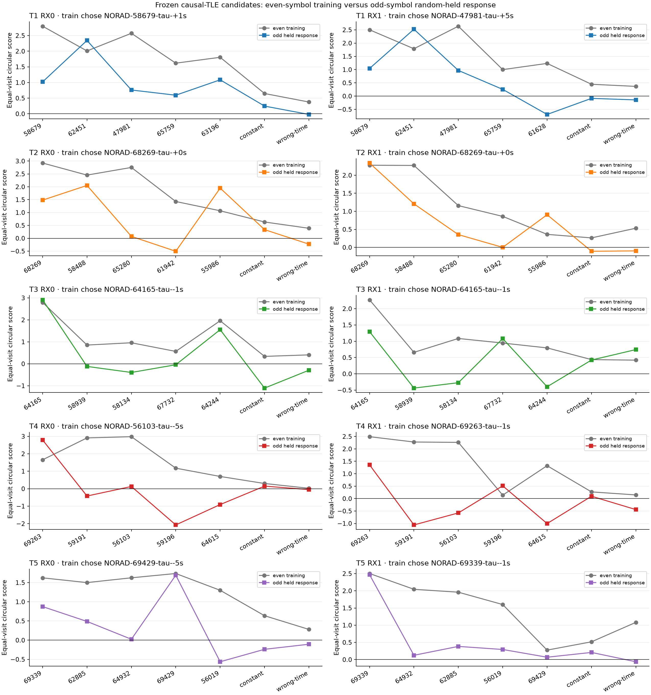
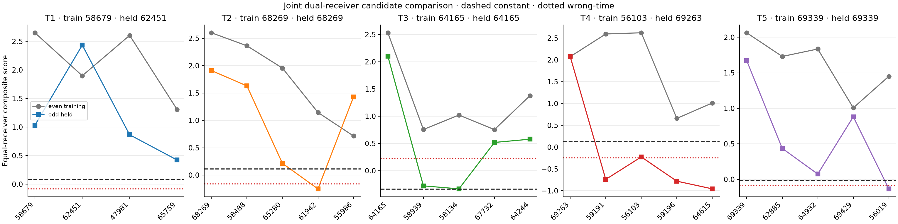
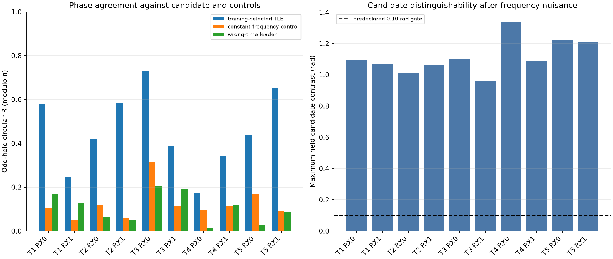
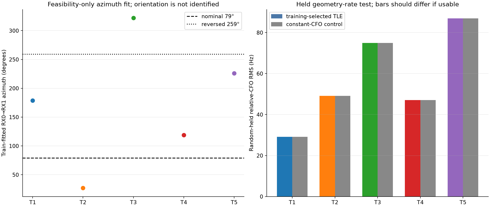

# Phase-to-satellite association on five September 24 dual-RX tracks

The most defensible association observable in the saved scans is the
single-receiver known-pilot phase advance between adjacent frames. Candidate
Doppler predicts that advance, while a receiver-specific frequency offset is
fitted on random training visits. RX0 and RX1 are scored separately and then
combined with equal receiver weight. On the frozen primary random split, the
phase method selects the existing GLRT/TLE leader on 4 of 5 tracks; that leader
is also the best held diagnostic candidate on 4 of 5. The training-selected
candidate beats the constant-frequency control on 4 of 5 tracks and the
mirrored-time control on all 5.

This is conditional candidate compatibility, not satellite identification.
T2, T3, and T5 are the strongest results. T1 prefers the GLRT leader in
training but a runner on held data. T4 selects a runner in training while held
data strongly prefer the GLRT leader. Across 32 additional seeded random
whole-visit splits, the leader's training-selection frequency ranges from 22%
to 84%. Phase therefore adds useful evidence, but it is not stable enough to
replace the existing source association.

## Frozen cohort and random protocol

The five tracks, exact RX tracklets, visits, candidate reviews, and source TLE
snapshots come from the phase-blind [selection artifact](figures/2026_09_24_late_dual_rx_track_phase/selection.json).
No track, visit, candidate, propagation delay, or phase branch was selected
from these results.

The primary split uses seed base `2026092420`. Complete visits are assigned
randomly to training and held partitions, with the same assignment on RX0 and
RX1. Even pilot symbols on training visits select the candidate and fit one
frequency nuisance per candidate, receiver, and track. Odd pilot symbols on
held visits provide the primary response. Failed extraction remains an
abstention; visits are never replaced or repartitioned. The 32-split
sensitivity suite also uses seeded random whole-visit partitions. There are no
time holdouts.

For measured adjacent-frame phase advance \(y\), candidate prediction \(p\),
interval \(\Delta t\), and training-fitted frequency offset \(f_b\), the
modulo-π residual is

\[
r = \operatorname{wrap}_{\pi}(y-p-2\pi f_b\Delta t).
\]

The reported phase correlation is the equal-visit circular resultant
\(R=|\operatorname{mean}(e^{2ir})|\). This modulo-π `R` is neither Pearson
correlation nor the earlier broadband 2π `R`. Candidate scores are equal-visit
means of \(4\cos(2r)\); they are not probabilities or p-values.

## Phase and GLRT over the 300-second scans

The phase timeline places all 793 random-held odd-symbol adjacent-frame
measurements on each capture's qualified device-counter clock. Colour denotes
RF channel using the established scan palette; circles are RX0 and crosses are
RX1. Phase is wrapped modulo π to ±90°. The plotted support is limited to the
five frozen tracks and lies between 129.9 and 224.4 seconds depending on the
scan. Blank intervals mean that the selected track has no retained phase
measurement. They are not zero phase, and points are never connected or
unwrapped across visits.



The companion GLRT plot uses the complete published fractional-GLRT inventory
for the same five captures: 110,879 candidate records, of which 10,572 pass the
`0.025` fractional-margin gate. Passed candidates are coloured by channel;
below-gate candidates are gray. Multiple passing peaks can be aliases or
nearby acquisition basins and must not be read as distinct satellites.



## Candidate results

| Track | Training choice | Held-best diagnostic | Selected held score | Constant | Wrong time | Held R, RX0 / RX1 | GLRT leader train / held-best over 32 splits |
| --- | ---: | ---: | ---: | ---: | ---: | ---: | ---: |
| T1 | 58679 | 62451 | 1.032 | 0.081 | -0.082 | 0.58 / 0.54 | 22% / 41% |
| T2 | 68269 | 68269 | 1.911 | 0.114 | -0.162 | 0.42 / 0.58 | 75% / 88% |
| T3 | 64165 | 64165 | 2.103 | -0.341 | 0.226 | 0.73 / 0.39 | 69% / 100% |
| T4 | 56103 | 69263 | -0.225 | 0.122 | -0.246 | 0.17 / 0.15 | 59% / 100% |
| T5 | 69339 | 69339 | 1.672 | -0.014 | -0.084 | 0.24 / 0.65 | 84% / 97% |

Across the ten receiver-level evaluations, 7 select the GLRT leader in
training and 6 have it as the best held diagnostic candidate. The median held
modulo-π `R` of the training-selected receiver candidate is `0.4286`; 9 of 10
beat the constant control and all 10 beat the mirrored-time control. Candidate
phase curves pass the predeclared `0.10 rad` contrast gate after the fitted
nuisance on all ten receiver evaluations. That gate shows numerical
distinguishability within this model, not correct satellite identity.





The held-best candidate is shown only as a diagnostic. It was not used to
select the reported model. RX0 and RX1 share the visits and candidate
provenance, so their equal-weight combination is not two independent
replications.



## LNB orientation and expected differential phase

Orientation matters for a calibrated inter-receiver phase. With directed
RX0-to-RX1 electrical baseline \(\mathbf b\), satellite unit direction
\(\hat{\mathbf s}\), and wavelength \(\lambda\), the geometric term is

\[
\phi_{10}=\beta+\frac{2\pi}{\lambda}\mathbf b\cdot\hat{\mathbf s},
\]

where \(\beta\) contains the receiver, cable, and LNB phase offset. Reversing
the baseline changes the sign. The operator-reported `79°` direction and its
`259°` reverse were therefore retained as explicit reference hypotheses.

The saved broadband phase product cannot fit this angle. It estimates a new
complex frequency response in every dwell, then removes a separately fitted
same-block phase before producing the held residual. Absolute RX1−RX0 phase is
therefore reset across visits. The single-receiver pilot method above also
cancels fixed spatial phase by construction.

As a feasibility check, the analysis fitted an 8 cm horizontal baseline
azimuth and a receiver-CFO intercept per scan and candidate on random training
visits, using the retained relative phase rate. It then evaluated random held
visits. The candidate geometry spans only `0.089–0.121 Hz`, while the observed
relative-CFO standard deviation is `23.0–61.8 Hz`: geometry is only
`0.17–0.38%` of the observed variation. The fitted directions scatter at
`27°, 119°, 179°, 226°, 322°`, select the GLRT leader on 0 of 5 tracks, and
improve on the constant-CFO held control on only 1 of 5 by a negligible amount.
These angles are numerical optima, not orientation estimates.



A calibration-free two-source/two-receiver double difference would cancel the
static receiver phase, but the five sessions contain no second source observed
on both receivers at the required visits. The correct next orientation
experiment is a same-frame raw RX cross-product with a separately qualified
cross-visit phase reference, fitting the 79°/259° hypotheses and a frozen full
azimuth grid on random training visits and evaluating modulo-π `R` on random
held visits. Until that reference exists, differential RX phase should remain
a shared-waveform/link gate and should not rank satellites.

## Recommended association rule

Use phase as a conditional likelihood after phase-blind GLRT/TLE source
binding. Require usable phase on both receivers, candidate contrast above the
frozen gate, improvement over constant and mirrored-time controls, and stable
preference over repeated random visit splits. Keep receiver nuisance fits
separate, then combine scores with equal receiver weight. Abstain when the two
receivers disagree or the random-split winner is unstable. Do not use the
current RX1−RX0 residual as a geometry prediction and do not emit an identity
claim from these five scans.

## Reproduction and artifacts

The analysis is implemented in
[`tools/research/evaluate_late_track_candidate_phase.py`](../tools/research/evaluate_late_track_candidate_phase.py).
Its machine-readable [summary](figures/2026_09_24_phase_satellite_association/summary.json)
records every split, candidate, fitted nuisance, score, `R`, orientation
feasibility result, TLE path, and input digest. The compressed
[phase evidence](figures/2026_09_24_phase_satellite_association/phase-advance-evidence.json.gz)
retains the extracted adjacent-frame measurements.
The compressed [GLRT timeline](figures/2026_09_24_phase_satellite_association/glrt-timeline.json.gz)
retains the full plotted candidate inventory.

```bash
sudo -u leo env HOME=/tmp MPLCONFIGDIR=/tmp/matplotlib \
  PYTHONPATH="$PWD/src:$PWD" \
  .venv/bin/python tools/research/evaluate_late_track_candidate_phase.py
.venv/bin/pytest -q tests/tools/test_evaluate_late_track_candidate_phase.py
.venv/bin/ruff check tools/research/evaluate_late_track_candidate_phase.py \
  tests/tools/test_evaluate_late_track_candidate_phase.py
```

The run reads the saved IQ corpus and archived TLE snapshots without changing
them. Fractional epoch is not corrected, integer cycle continuity is not
asserted across visits, the receiver-to-slot mapping remains provisional, and
the 8 cm mount spacing is not a measured electrical phase baseline.
