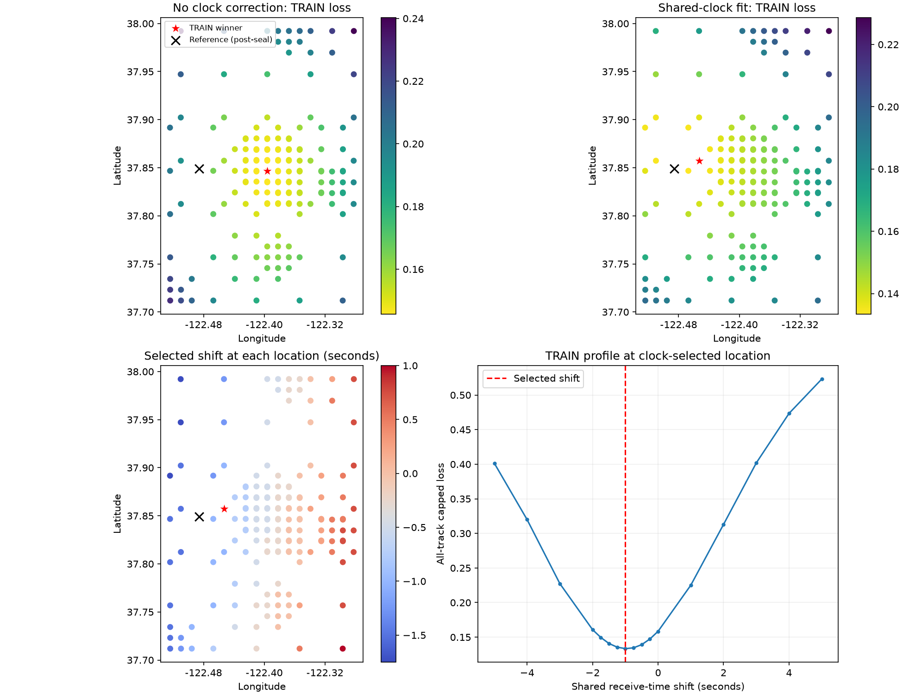

# Shared receive-clock sensitivity on the frozen local grid

The same 165 geographic points and twelve TRAIN scans were used. One time shift is shared across all satellites, tracks, and receivers; constant per-track frequency offsets remain fitted on training rows. Positive tau means predictions are evaluated later than the recorded timestamp. The ±5-second range is an uncalibrated sensitivity bound, not an established clock-error prior.

| Method | Shared shift (s) | TRAIN loss | Held loss | Reference error (km) |
|---|---:|---:|---:|---:|
| No clock correction | +0.00 | 0.145698 | 0.161149 | 7.876 |
| Shared clock sensitivity | -1.00 | 0.133417 | 0.147147 | 3.015 |

Boundary hits occurred at 0 of 165 locations. A boundary solution is not an identified interior clock estimate. Tau-grid spacing is not an uncertainty estimate. Orbit-prediction mismatch can also drive the fitted shift; this experiment does not establish a receiver clock fault.

All point and time-shift selections use TRAIN losses. Reference errors and the black reference marker were added after the inference seal was verified. This is a local TRAIN comparison, not independent generalization or a global geographic optimum.



Inference SHA256: `1b862b50620433c33d8481be5d2f9769960299311e4be00688a73eb73ac8ee27`. Detailed values are in `evaluation.json`; per-point training profiles and selected associations are in `inference.json`.

## Scope, validation, and interpretation

The calculation includes 774 eligible tracks and 12,958 occupied-second support units from twelve TRAIN scans. The objective is occupied-second-weighted capped squared RMS (800 Hz cap), not raw RMS in Hz. All eligible tracks remain in its denominator. Candidate identities and per-track constant CFOs are refitted using randomized training rows; randomized held rows never select the location or time shift. This experiment isolates clock sensitivity without cone filtering.

SOL implemented and ran the experiment; Terra independently approved the sealed result. Fourteen tests passed, including synthetic recovery of a known +1.50-second shift through the actual cached-state Doppler/CFO path, held-measurement mutation isolation, constant-Doppler degeneracy, and post-seal evaluation guards. Tau-zero scores match the previous baseline at all 165 points. The full run took 998.064 seconds (16.63 minutes) with eight workers and one BLAS thread each. The original benchmark and compute-only preexecution amendment are retained.

The selected shift varies systematically with geographic location, demonstrating location–time coupling. No formal confidence interval was estimated; an interior optimum and a 0.25-second refinement step do not quantify uncertainty. A shared shift may absorb orbit/catalogue phase error, candidate reassociation, or position mismatch. The improvement to 3.015 km is encouraging, but does not establish sub-300-m accuracy or independent generalization.

The [timing audit](TIMING_AUDIT.md) found no deterministic half-second convention: GLRT timestamps use fractional support centres, and the recorded host counter brackets are approximately 1.2–1.6 milliseconds wide. These brackets do not independently calibrate absolute RF UTC. Determining the physical cause requires independent timing/orbit evidence, not interpreting the fitted shift as a clock measurement.

## Reproduction

From the repository root, with the original cache paths described in the implementation available:

```bash
.venv/bin/python -m pytest -q reports/2026_09_24_shared_clock_grid/test_run.py reports/2026_09_24_shared_clock_grid/test_review.py reports/2026_09_24_shared_clock_grid/test_evaluation.py
OPENBLAS_NUM_THREADS=1 OMP_NUM_THREADS=1 .venv/bin/python reports/2026_09_24_shared_clock_grid/run.py
.venv/bin/python reports/2026_09_24_shared_clock_grid/evaluate.py --inference reports/2026_09_24_shared_clock_grid/inference.json --seal reports/2026_09_24_shared_clock_grid/inference.sha256 --output-dir /tmp/shared-clock-evaluation
```

The final command evaluates the sealed result and writes plots and a generated summary separately from this reviewed report. No production configuration or RF collection was changed.
