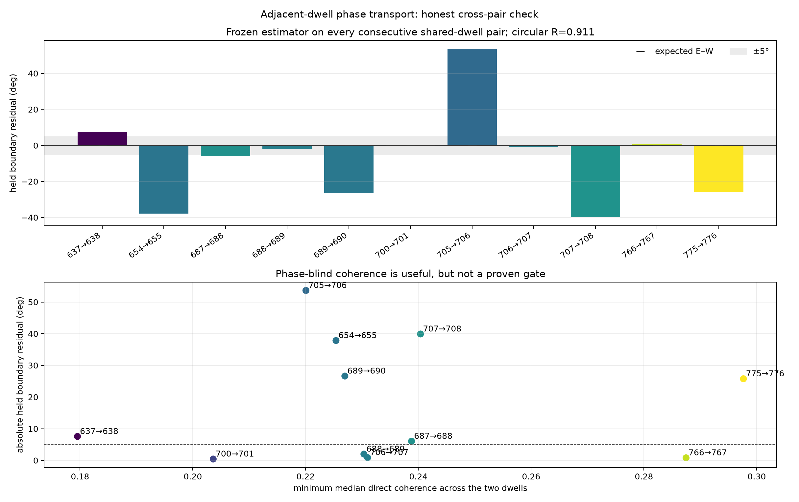
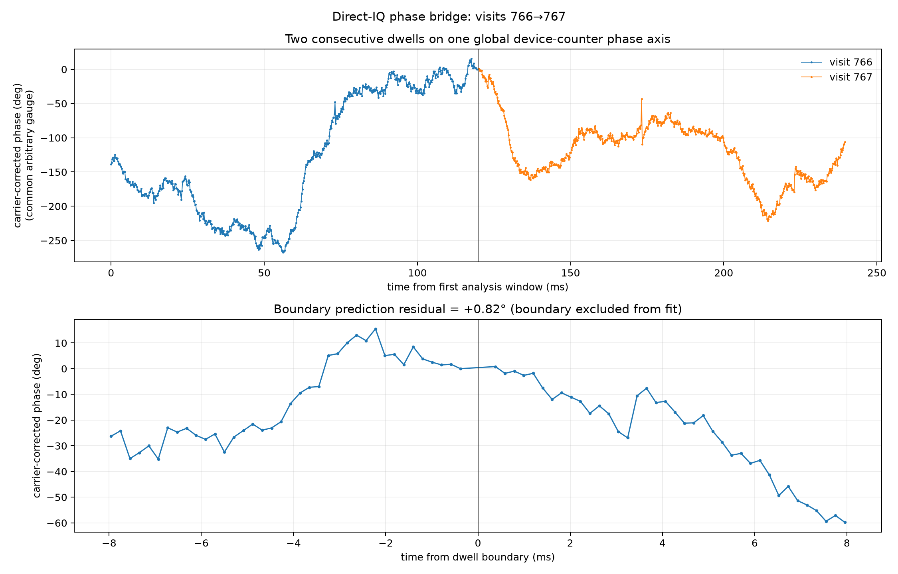
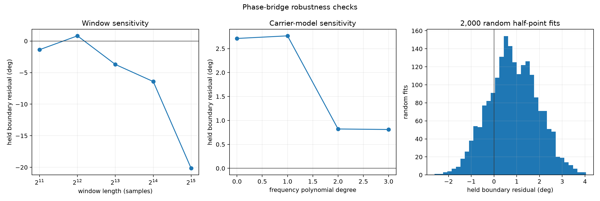

# Direct-IQ phase transport across one adjacent dwell boundary

## Result

There is a real adjacent-dwell phase signal, but it is not yet precise enough for
east–west satellite phase tracking. Across **all 11 consecutive shared-dwell
pairs**, the held boundary residuals have circular concentration **R = 0.911**
around `−7.74°`. A uniform phase-reset null reached that concentration only 6
times in 2,000,000 trials (`p = 3.5×10⁻⁶`). Excluding the exploratory 766→767
pair still gives **R = 0.903** (`p = 1.9×10⁻⁵`). Thus adjacent acquisitions
retain substantial relative phase information; the near-zero 766→767 bridge is
not the only evidence for continuity.

The estimator is not yet accurate pair by pair: only 4 of 11 residuals are within
±5°, the median absolute residual is `7.56°`, and several are `26–54°`. The
satellite prediction across these sub-millisecond boundary windows is only
`0.0032–0.0076°`, so the present observable detects phase continuity but not the
geometric progression.



Visits **766→767** remain the cleanest exploratory phase bridge. They are consecutive
120 ms captures of the same dual-RX target, on the same channel and fastlock
profile, with only **156.6 µs** between valid payloads. A quadratic relative-carrier
model fitted to phase increments inside both dwells predicts the deliberately
excluded boundary increment to **+0.82°**.

Two thousand fits made from random halves of the available points across both
complete dwells give a median boundary residual of **+0.81°**, a 5–95% interval of
**−0.95° to +2.65°**, and 100% within ±5°. This is evidence that the receiver-pair
phase gauge can remain continuous across this particular non-retuned boundary.
It does not establish continuity across scanner retunes.



## East–west satellite prediction

The array baseline is horizontal east–west. The candidate-64797 TLE predicts an
east–west geometric change of **±0.6313° between the dwell centers**. The sign is
unknown until the physical RX0/RX1 ordering is recorded.

The held boundary estimator does not span the dwell centers. Its final visit-766
window center and first visit-767 window center are only **758.2 µs** apart. The
corresponding predicted satellite change is just **±0.00398°**. Therefore the
measured `+0.82°` boundary residual is compatible with phase continuity, but its
roughly degree-scale uncertainty is far too large to resolve the satellite's
millidegree boundary motion.

## What is fitted

For each 4,096-sample Hann-squared window, the direct cross-product is

```text
z[k] = Σn hann[n]² · conj(RX0[n]) · RX1[n]
       · exp(−j 2π · 674853.358086 Hz · global_device_time[n])
```

The wrapped phase increment between adjacent windows is divided by their time
separation to produce a residual-frequency observation. A degree-2 polynomial
in time is fitted to those frequency observations using phasor-amplitude
weights. The increment that crosses 766→767 is excluded from the fit and is the
held prediction target. Integrating the polynomial predicts accumulated carrier
phase on the same absolute device-counter timebase.

There is no relative timing delay, no complex channel response, no global phase
intercept, and no per-dwell phase intercept. Random training points are spread
over both full dwells rather than held out chronologically.

The critical change from the earlier per-dwell analysis is the **global timebase**:
the carrier rotation does not restart at phase zero when visit 767 begins.
Restarting it would discard the very accumulated carrier phase needed to bridge
the acquisition boundary.

## Robustness and limitations



The residual is stable for polynomial degrees 2 and 3 (`+0.82°` and `+0.81°`).
It is less stable as the window grows: 2,048 through 32,768 samples give residuals
from `−1.37°` to `−20.16°`. Longer windows place their centers farther from the
actual boundary and average more of the strong within-dwell phase structure.

This pair was selected after inspecting phase behavior, so its individual result
is discovery evidence. The estimator was subsequently frozen and applied to all
11 consecutive shared-dwell pairs; the aggregate circular test above is the more
honest evidence. All of those boundaries remain on target index 3 / CH4 lower, so
this result does not establish transport across a target-changing retune.

The next technical problem is precision, not detection. Boundary-local carrier
fits improve some long-gap pairs but not all, and the FFT implementation is
mathematically equivalent to the full-band direct cross-product unless bins are
discarded; earlier masked and phase-only FFT tests did not materially improve
concentration. A useful satellite observable will need a phase-blind quality gate
plus either a separately calibrated receiver-frequency model or enough chained
continuous boundaries to distinguish slow east–west geometry from oscillator
drift. Fitting that slow term from the same phase samples would absorb the
satellite signal and is therefore not a valid detection.

The reproducible analysis is in [analyze.py](analyze.py), and all numerical
evidence is retained in [results.json](results.json).
