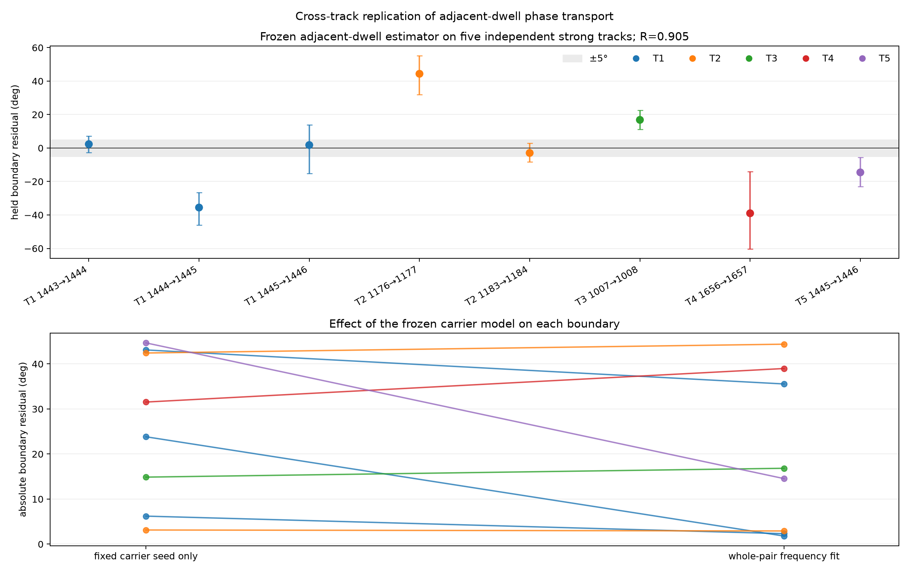
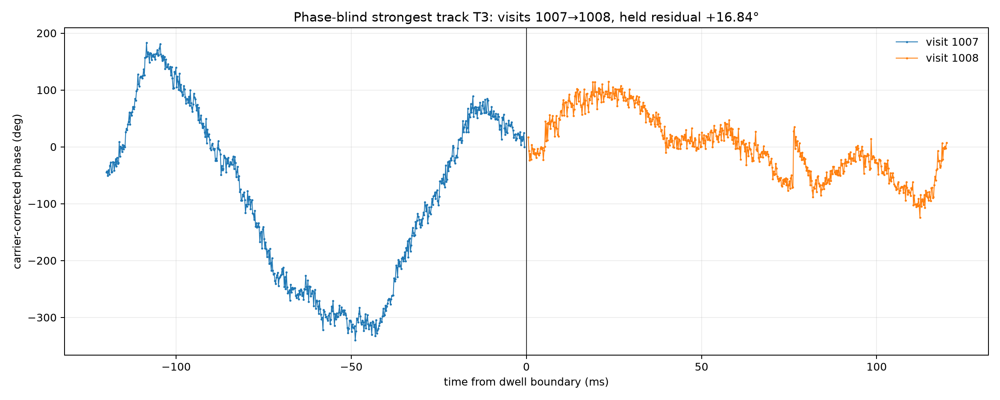

# Cross-track replication of adjacent-dwell phase transport

## Result

The adjacent-dwell phase bridge **replicates across other strong tracks**. The
frozen analysis was applied to every consecutive pair in five independently
selected, phase-blind, long dual-RX tracks from September 24. These tracks span
CH1, CH2, and CH4 and five separate recording sessions.

Across eight boundaries, the modeled residual phases have circular concentration
**R = 0.905** around `−3.58°`. A uniform independent-reset null reached at least
that concentration 318 times in 2,000,000 trials (`p = 1.59×10⁻⁴`). The fixed
carrier seed alone gives `R = 0.877`; the frozen whole-pair frequency model raises
it to `0.905`.

This confirms the earlier 10 MS/s result on independent 2.5 MS/s recordings:
adjacent captures retain substantial RX1−RX0 phase information and do not behave
like unrelated random phase resets.

## Boundary results

| Track | Boundary | Residual | Random-half 5–95% | Payload gap |
|---|---:|---:|---:|---:|
| T1 | 1443→1444 | `+2.32°` | `−2.77°, +7.10°` | 17.2 µs |
| T1 | 1444→1445 | `−35.56°` | `−46.04°, −26.59°` | 253.2 µs |
| T1 | 1445→1446 | `+1.79°` | `−15.21°, +13.96°` | 520.8 µs |
| T2 | 1176→1177 | `+44.38°` | `+31.87°, +55.22°` | 514.4 µs |
| T2 | 1183→1184 | `−2.92°` | `−8.25°, +2.97°` | 511.6 µs |
| T3 | 1007→1008 | `+16.84°` | `+11.10°, +22.52°` | 456.4 µs |
| T4 | 1656→1657 | `−38.98°` | `−60.23°, −13.98°` | 228.4 µs |
| T5 | 1445→1446 | `−14.54°` | `−22.98°, −5.60°` | 407.2 µs |

Three of eight boundaries land within ±5°. The median absolute residual is
`15.69°`, worse than the `7.56°` median from the earlier 10 MS/s track. The
replication is therefore strong evidence for **population-level phase continuity**,
but not yet a precise per-boundary satellite phase observable.

## Phase-blind strongest track

T3 was the strongest of the five tracks by the frozen phase-blind priority, so
its only consecutive pair, 1007→1008, was selected for detailed display before
looking at its boundary phase. It bridges at `+16.84°`; high GLRT strength does
not by itself guarantee a near-zero boundary residual.

## Frozen method

The physical analysis support was held fixed across sample rates. The original
4,096-sample window at 10 MS/s is 409.6 µs, so these 2.5 MS/s captures use 1,024
samples with a 512-sample stride. For each track, one carrier seed is the median
of its frozen per-dwell carrier estimates. That seed is applied on a global
device-counter time axis across both visits.

As before, a degree-2 residual-frequency polynomial is fitted to phase increments
inside both complete dwells. The boundary increment is excluded and predicted by
integrating the polynomial across the actual gap. Each uncertainty interval comes
from 1,000 fits using random halves of the available within-dwell increments.

The constraints remain unchanged:

- relative timing delay is exactly zero;
- no complex channel response is used;
- no global or per-dwell phase intercept is fitted;
- no chronological holdout is used;
- no boundary phase enters track or pair selection.

The FFT route was not repeated because the previous full-bin implementation was
numerically equivalent to this direct cross-product, while masked and phase-only
bin averages did not materially improve phase concentration.

## Interpretation

The replication answers the first question: **yes, the adjacent-dwell phase signal
is real across tracks**. The remaining problem is estimator precision. Frequency
model error over the sub-millisecond payload gap produces tens of degrees on some
boundaries, and random-half intervals can be broad. The next useful iteration is
a boundary-local frequency estimator validated across whole held-out tracks,
rather than choosing its window or polynomial separately for each boundary.

The frozen cohort is in [selection.json](selection.json), the reproducible analysis
is in [analyze.py](analyze.py), and numerical evidence is in [results.json](results.json).
