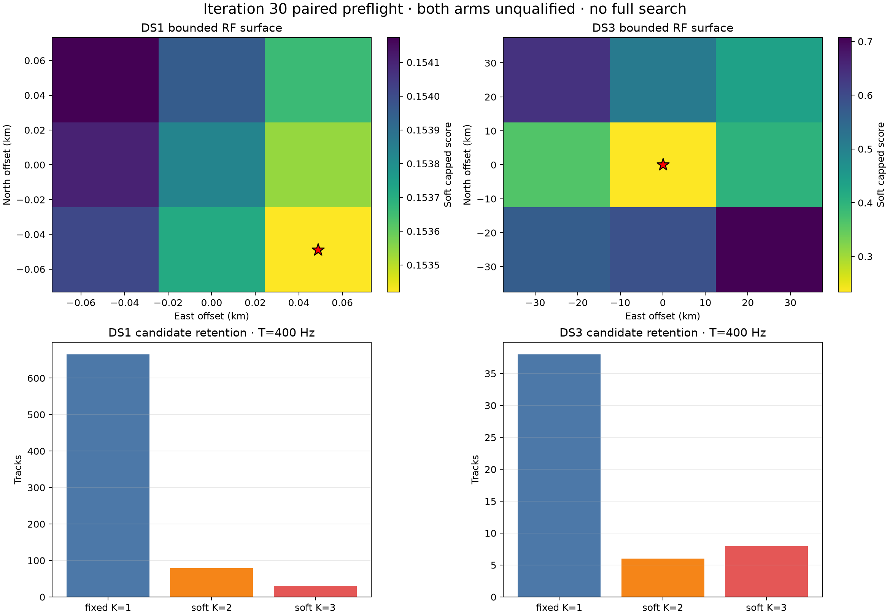

# Iteration 30: paired fixed top-K soft-association preflight

## Decision

**No-go.** Both dataset arms are terminal `unqualified_preflight`, and no full
geographic search was launched. The paired runner generated candidates from
each dataset's own causal all-sky cache, fixed those candidates before spatial
scoring, and evaluated only the prospectively sealed bounded stencils.



| Quantity | DS1 | DS3 measured one-session preflight |
| --- | ---: | ---: |
| Sessions | 12 | 1 |
| Eligible tracks | 774 | 52 |
| Fixed leader tracks | 665 | 38 |
| Ambiguous tracks | 109 | 14 |
| Retained top 2 / top 3 | 79 / 30 | 6 / 8 |
| TRAIN-fold temperature | **400 Hz, upper grid edge** | **400 Hz, upper grid edge** |
| Mean posterior entropy | 0.110 nat | 0.244 nat |
| Leave-one-session winner agreement | 11 / 12 | not applicable |
| Leave-one-source winner agreement | 236 / 237 | all sources |
| Maximum one-source score shift | **0.01351** | **0.12508** |
| Sealed maximum allowed shift | 0.01000 | 0.01000 |
| Runtime | 6.93 s | 0.46 s |
| Terminal status | `unqualified_preflight` | `unqualified_preflight` |

The paired wall time was 7.39 seconds with one worker. All 18 coordinate
scores were finite and reproduced exactly. The failure is therefore a model
and acceptance result, not a numerical or runtime failure.

## What was tested

The plan was sealed before the authoritative v2 candidate or score artifacts.
It prohibited surveyed coordinates, HELD rows, and a full geographic search.

For each track, the runner:

1. evaluated every visible causal catalogue candidate at the dataset-local RF
   anchor;
2. assigned IQ-derived frequency observations to five deterministic randomized
   TRAIN folds;
3. estimated candidate-specific CFO on four folds and scored the fifth;
4. bootstrapped the five fold losses 256 times;
5. retained the leader alone unless a challenger had a 10th-percentile margin
   no larger than 25 Hz or at least a 10% chance of beating the leader; and
6. selected one continuous log-sum-exp temperature from the predeclared
   25/50/100/200/400-Hz grid using TRAIN-fold predictive likelihood.

Spatial scoring froze those candidate sets. Track losses were weighted by
occupied seconds inside each session, a 1.5-MAD Huber location combined equal
sessions inside each group, and DS1 retained iteration 27's frozen RF-only
group weights. The influence audit recomputed every bounded-cell rank after
deleting each session or leader source.

DS1 used the twelve iteration-27 sessions, anchor, group timing and group
weights. DS3 independently selected `scan-fw-ed4502816d42c1d9` because it had
the largest eligible-track count among the sealed 56-session inventory, with
lexical tie-breaking, then used that session's sealed reference-free RF anchor.
No DS1 coordinate, identity, nuisance parameter or cache state entered DS3.

## What worked

Candidate generation and fixed-candidate scoring are fast enough to be used as
a gate before expensive searches. DS1 retained uncertainty for 14.1% of its
tracks, while DS3 retained uncertainty for 26.9%. All candidate, margin,
posterior and entropy rows are preserved in machine-readable form.

Winner ranks were more stable than raw objective magnitudes. Removing one
source preserved the DS1 winner for 99.58% of sources and the DS3 winner for
every source. Removing one DS1 session preserved the winner for eleven of
twelve sessions. Exact repeat evaluation produced zero score difference.

The DS3 limited stencil selected its centre, so the independently generated
soft evidence did not immediately run toward the 25-km boundary. This is a
useful measured preflight result, but it is not an all-56 position estimate.

## What failed

Both arms violated the sealed absolute source-influence shift threshold. DS1's
largest shift was 0.01351 after removing NORAD 65351. That same source was the
only one whose deletion changed the bounded winner, from southeast to
northeast. DS3's largest shift was 0.12508 after removing NORAD 69429; its
winner nevertheless remained the centre.

The identical 0.01 raw-score gate is poorly scaled across a twelve-session
aggregate and a one-session aggregate. The runner correctly failed closed;
changing the gate after seeing these values would be retrospective selection.

Both temperature fits selected the 400-Hz upper endpoint. This shows that the
predeclared mixture scale was not closed. The likely cause is that this first
association preflight used nominal full-catalogue state curves with
candidate-specific constant CFO, while iteration 27's rate posterior and exact
phase atlas exist only for the hard-selected identities. Alternative top-K
candidates do not yet have their own cross-fitted rate posterior. A larger
temperature alone would absorb that missing evolution rather than distinguish
identity uncertainty from orbit-rate nuisance.

The DS1 spatial direction also changed materially. Iteration 27's hard,
rate-marginal stencil selected southwest; this fixed soft preflight selected
southeast. The south component agrees, but the east-west reversal confirms
that identity uncertainty is large enough to change the local gradient.

## NORAD 66961

NORAD 66961 appears among the top three in six tracks from
`scan-hop-2ea5bcf9b18778cc`:

| Role | Count | Result |
| --- | ---: | --- |
| Fixed leader | 1 | Retained with posterior 1.0 |
| Ambiguous runner | 1 | Retained with posterior 0.460; bootstrap runner-win probability 0.316 |
| Rejected runner/top-three candidate | 4 | Fold margins certified the other leader as stable |

The retained ambiguous case is real: its 10th-percentile leader-to-66961 margin
was -51.3 Hz. However, 66961 was not the deletion that destabilized the DS1
cell rank; NORAD 65351 was. The full six-row evidence remains in the candidate
artifact rather than being collapsed to the historical hard identity.

## What we learned

Soft identity uncertainty is tractable after reducing each track to a fixed
top-K set, and raw sample volume is enough to certify most tracks as stable.
The remaining ambiguous minority is still influential enough to rotate the
local geographic gradient.

The next bottleneck is nuisance separation. Candidate identity, constant CFO,
and TLE-age rate cannot be represented honestly by only widening one residual
temperature. The exact iteration-27 machinery must be extended to the retained
alternatives before this model can authorize a broad search.

## Next iteration

The next paired plan should be sealed with these changes before scoring:

1. Build dataset-local exact phase states only for retained top-K candidates.
2. Fit each candidate's causal rate posterior on the four TRAIN folds and
   score the omitted fold, keeping CFO fold-local as in this preflight.
3. Recalibrate a wider temperature grid and require an interior selected
   value; do not accept another endpoint.
4. Replace the cross-dataset absolute 0.01 shift gate with a predeclared
   scale-aware influence rule that combines winner agreement, normalized
   winner-gap change, and effective source support.
5. Repeat the same bounded DS1 and measured DS3 preflights. Only if both pass
   may a separately sealed DS1 search and DS3 all-56 search start.

## Artifacts and reproduction

- `paired-plan-v2.json`: authoritative paired plan sealed before v2 outputs.
- `candidate-table-v2.json`: every top-three candidate, fold-bootstrap margin,
  retained posterior and entropy.
- `influence-table-v2.json`: every leave-one-session/source cell score and
  winner.
- `preflight-v2.json`: paired result, gates, runtime and terminal disposition.
- `findings.json`: sealed fail-closed findings and terminal statuses.
- `failure-v1.json`: records the rejected first write, where deleting the sole
  DS3 session was represented as non-JSON `NaN`; no v1 scientific result was
  accepted.

```bash
.venv/bin/pytest -q \
  reports/2026_09_25_ds1_ds3_iteration30_soft_association_preflight/test_run.py
.venv/bin/ruff format --check \
  reports/2026_09_25_ds1_ds3_iteration30_soft_association_preflight/*.py
.venv/bin/ruff check \
  reports/2026_09_25_ds1_ds3_iteration30_soft_association_preflight/*.py

# Reproduction must use a fresh directory because sealed outputs are immutable.
timeout --signal=TERM 1800s .venv/bin/python \
  reports/2026_09_25_ds1_ds3_iteration30_soft_association_preflight/run.py --run
```
