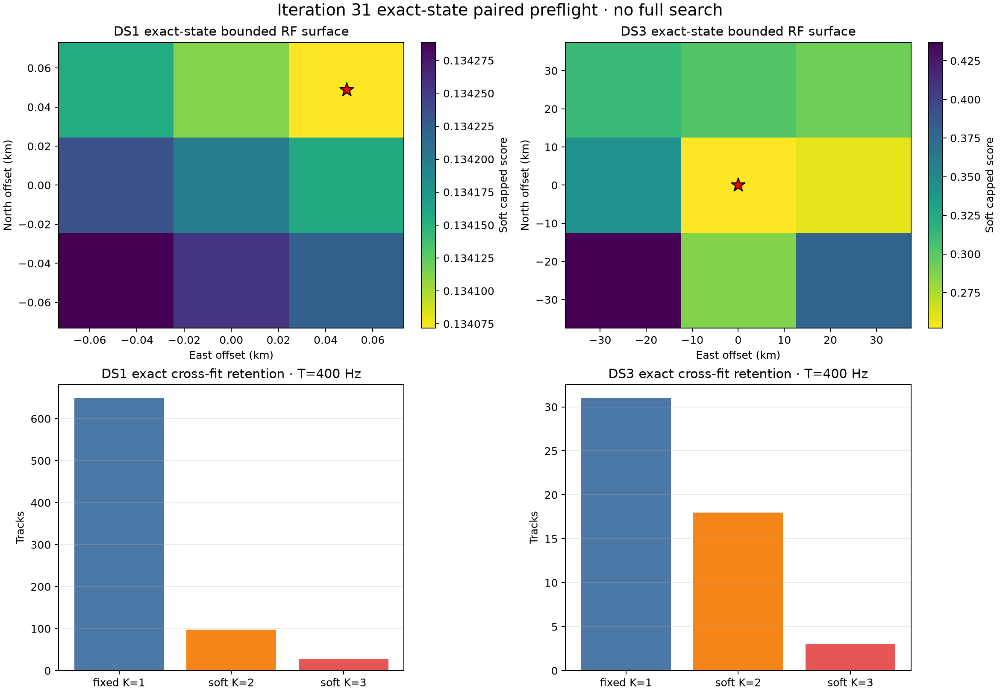

# Iteration 31: exact candidate-state soft-association preflight

**No-go.** The paired bounded preflight did not authorize a geographic search.
Both arms now have an interior temperature optimum, but DS1 remains unstable to
session and source deletion and the one-session DS3 arm has three influential
sources. No reference position, geometry truth, HELD rows, or full search was
read or run.



| Quantity | DS1 | DS3 measured one-session preflight |
| --- | ---: | ---: |
| Eligible tracks | 774 | 52 |
| Retained exact state records | 566 | 48 |
| Candidate-session observations propagated | 53,913 | 3,492 |
| Ambiguous retained tracks | 125 | 21 |
| Cross-fitted temperature | 400 Hz, interior | 400 Hz, interior |
| Bounded winner | +48.8 m E, +48.8 m N | anchor cell |
| Leave-one-session winner agreement | 7/12 | not applicable: one session |
| Leave-one-source winner agreement | 90.8% | 87.0% |
| Max normalized surface deformation | 2.318 | 0.442 |
| Terminal status | `unqualified_preflight` | `unqualified_preflight` |

The previous preflight had two confounds: it used nominal cached state curves
for alternative identities, and both temperature fits ended at the 400 Hz
upper grid endpoint. This iteration first discovers only the dataset-local
top-three all-sky RF candidates at the sealed anchor. For every such candidate,
it then propagates each sample from the receipt-bound causal TLE at nine exact
orbit-rate nodes from -0.25 to +0.25 s/h. Earth rotation stays at receive time
plus the sealed group time shift. The scoring step does not interpolate these
states: it uses a discrete rate posterior.

For each of five deterministic folds, each NORAD's rate posterior and each
track CFO are fitted only on the other four folds, then score the omitted fold.
Those five out-of-fold candidate errors determine both the fixed top-K support
and the temperature. This is cross-fitting within the original TRAIN corpus,
not chronological held-out evaluation. The temperature grid was sealed as
25, 50, 100, 200, 400, 800, and 1600 Hz, with either endpoint disqualifying
the preflight. Both arms selected 400 Hz, so the temperature condition passes.

The new influence rule measures selection-relevant deformation rather than raw
objective scale. For every source deletion it compares all relative cell gaps
with the full-stencil gaps, normalizes their largest change by the full stencil
range, and also requires 90% winner agreement. DS1 exceeds the sealed
deformation threshold of 1.0 (2.318) and only 7 of 12 leave-one-session fits
retain the northeast local winner. Its largest source deformations are NORAD
68077 (2.318), 66961 (2.254), and 63152 (2.219); this is distributed evidence,
not a single-source failure. DS3 has acceptable deformation but source
deletions of 100302, 100159, and 53154 move its winner, leaving 20/23 agreement.

The meaningful improvement is diagnostic: exact candidate-specific causal
states remove the temperature-boundary failure in both independent datasets.
They do not yet justify a position estimate. The next experiment should remain
paired and bounded, increase the independently selected DS3 sessions so that
session stability can be measured, and investigate predictive source influence
before changing a sealed admission or aggregation rule.

Machine-readable evidence:

- `paired-plan-v2.json`: sealed prospective method and gates.
- `exact-phase-atlas.json`: one digest-bound exact state record for every
  candidate/session state block.
- `candidate-table.json`: exact cross-fitted top-K support and rate posterior
  means.
- `influence-table.json`: every bounded cell under each source and session
  deletion.
- `preflight-v2.json` and `findings.json`: final fail-closed result.

Reproduce the result after verifying the sealed causal caches:

```bash
.venv/bin/python reports/2026_09_25_ds1_ds3_iteration31_exact_soft_preflight/run.py --create-plan
timeout --signal=TERM 1800s .venv/bin/python reports/2026_09_25_ds1_ds3_iteration31_exact_soft_preflight/run.py --run
.venv/bin/python reports/2026_09_25_ds1_ds3_iteration31_exact_soft_preflight/plot.py
.venv/bin/python reports/2026_09_25_ds1_ds3_iteration31_exact_soft_preflight/summarize.py
.venv/bin/pytest -q reports/2026_09_25_ds1_ds3_iteration31_exact_soft_preflight/test_run.py
```
