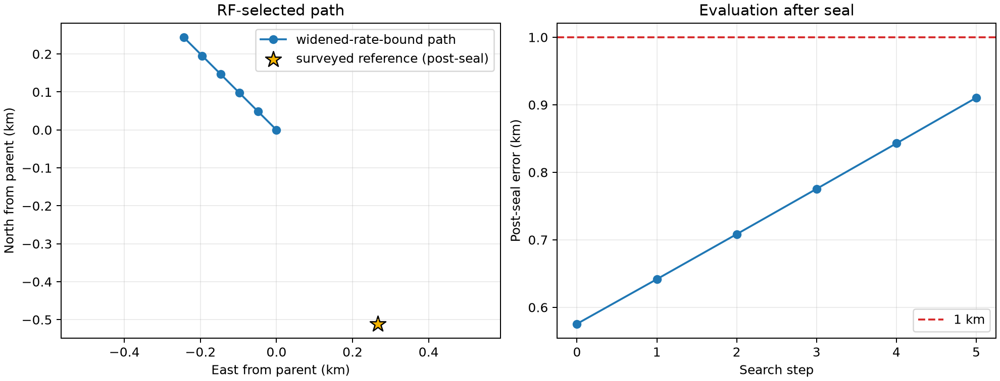

# DS1 iteration 19: rate-bound qualification audit

## Result

Iteration 19 rejects the previously reported **0.575577 km** iteration-15
result under its own stated nuisance-bound requirement. Four selected
per-NORAD rates were only `9.57e-8 s/hour` inside the old `+/-0.25 s/hour`
guard, while the scalar optimizer tolerance was `2e-7 s/hour`. The old
boundary detector used a `1e-8` margin and the qualification script did not
require a zero boundary count.

The matched audit widened only that guard to `+/-0.50 s/hour`. Identities,
group timing, group weights, rate prior, per-track CFO treatment, observations,
and geographic objective remained frozen. The widened basin moved northwest
on all five predeclared 48.828 m translations and never closed. Its terminal
diagnostic point is **0.910457 km** from the surveyed coordinate, but it is an
edge point and is **not a position estimate**.



| Quantity | Iteration 15 control | Iteration 19 audit |
|---|---:|---:|
| Rate guard | +/-0.25 s/hour | +/-0.50 s/hour |
| Numerically guarded selected rates | 4 | 0 |
| Rates beyond the old guard | 0 | 4 |
| Basin status | Reported closed | Open northwest |
| Qualification under corrected gate | **Fail** | **Fail: open basin** |
| Post-seal distance | 0.575577 km | 0.910457 km diagnostic |
| Group-coordinate fits | 104 | 58 |
| Runtime, four workers | 486.8 s | 284.2 s |

The four rates that leave the old guard are NORAD 56306 (`+0.35856 s/hour`),
68674 (`-0.41341`), 68737 (`+0.26938`), and 68739 (`-0.27054`). None reaches
the new guard. An initial audit also flagged NORAD 57646, but the sealed
iteration-15 selected fit places it at `+0.24637`; the exact optimizer-aware
`1e-6` margin therefore counts four selected terms, not five.

## What worked

The experiment isolates the hard rate guard. It reuses the iteration-15 hard
associations, taus `-0.75/-0.50 s`, information weights `0.2742/0.7258`,
Gaussian rate prior, cap-800 selection score, and exact SGP4 construction. The
surveyed coordinate is absent from inference and is introduced only by the
post-seal evaluator.

The corrected boundary policy uses
`max(5 * optimizer_xatol, 1e-6 s/hour)` and qualification explicitly requires
zero guarded rates. The rate fitter uses active-set continuation: it first
reproduces the old `+/-0.25` scalar fit and searches the adjacent outer
interval only when that fit touches the old guard. This was necessary because
the orbital-phase rate objective can have multiple scalar minima over the
wider interval.

## What did not work

The widened model did not yield a qualified replacement position. The winner
was on the northwest edge at every translation:

| Translation | East from iteration 15 | North from iteration 15 |
|---:|---:|---:|
| 0 | -48.828 m | +48.828 m |
| 1 | -97.656 m | +97.656 m |
| 2 | -146.484 m | +146.484 m |
| 3 | -195.312 m | +195.312 m |
| 4 | -244.141 m | +244.141 m |

The regularized selection score rises when a formerly clipped rate moves
farther from its zero-mean prior, even when the robust data-fit objective
improves. That is expected because the fit objective and the final capped
geographic score are related but not identical. It does not restore basin
closure.

## What we learned

The strongest earlier DS1 sub-kilometre results from iterations 12, 13, and 15
share the same boundary-detection defect and the same saturated sources. They
remain reproducible diagnostics, but they are no longer qualified evidence of
sub-kilometre positioning. Grid spacing was not the limitation: relaxing a
nuisance constraint changed the basin direction before any finer lattice was
reached.

The failure is concentrated. Four sources in three recording sessions move
outside the old guard, and the whole analysis uses only 12 of the 151 DS1
TRAIN sessions. This supports a source/session observation-model systematic
or association error rather than a need for another finer geographic grid.

## Next iteration

Iteration 20 should remove per-session nuisance absorption from geographic
selection without adding another free calibration term. Use the same frozen
iteration-15 inputs, but score each geographic cell by whole-session
prediction with held-session per-NORAD rates fixed at their zero-mean prior.
Every selected NORAD is confined to one of the six sessions in its group, so
ordinary leave-one-session-out fitting cannot transfer a learned satellite
rate. A predictive zero-rate score is the falsifiable comparison.

Run the predeclared 48.828, 24.414, and 12.207 m closure only if each preceding
stage closes. Audit the four unstable sources separately, then expand to
non-overlapping TRAIN bundles before claiming transfer. A session-frequency
slope arm remains useful as a later diagnostic—the residual audit found
session-time structure—but adding it now would increase the same
nuisance/geography degeneracy exposed here.

## Reproduction

```bash
OPENBLAS_NUM_THREADS=1 OMP_NUM_THREADS=1 MKL_NUM_THREADS=1 \
  .venv/bin/python reports/2026_09_25_ds1_iteration19_rate_bound_audit/run.py \
  --output reports/2026_09_25_ds1_iteration19_rate_bound_audit/inference.json \
  --checkpoint-dir reports/2026_09_25_ds1_iteration19_rate_bound_audit/checkpoints \
  --workers 4
.venv/bin/python reports/2026_09_25_ds1_iteration19_rate_bound_audit/qualify.py \
  --inference reports/2026_09_25_ds1_iteration19_rate_bound_audit/inference.json \
  --output reports/2026_09_25_ds1_iteration19_rate_bound_audit/qualification.json
.venv/bin/python reports/2026_09_25_ds1_iteration19_rate_bound_audit/evaluate_postseal.py \
  --inference reports/2026_09_25_ds1_iteration19_rate_bound_audit/inference.json \
  --output-dir reports/2026_09_25_ds1_iteration19_rate_bound_audit/evaluation
.venv/bin/python reports/2026_09_25_ds1_iteration19_rate_bound_audit/make_comparison.py \
  --control reports/2026_09_24_ds1_iteration15_information_weighted/inference.json \
  --candidate reports/2026_09_25_ds1_iteration19_rate_bound_audit/inference.json \
  --qualification reports/2026_09_25_ds1_iteration19_rate_bound_audit/qualification.json \
  --postseal reports/2026_09_25_ds1_iteration19_rate_bound_audit/evaluation/postseal-evaluation.json \
  --output reports/2026_09_25_ds1_iteration19_rate_bound_audit/comparison.json
```

`plan.json`, `inference.json`, `qualification.json`, and `comparison.json` are
machine-readable. Only `evaluation/postseal-evaluation.json` and its PNG use
the surveyed coordinate.
