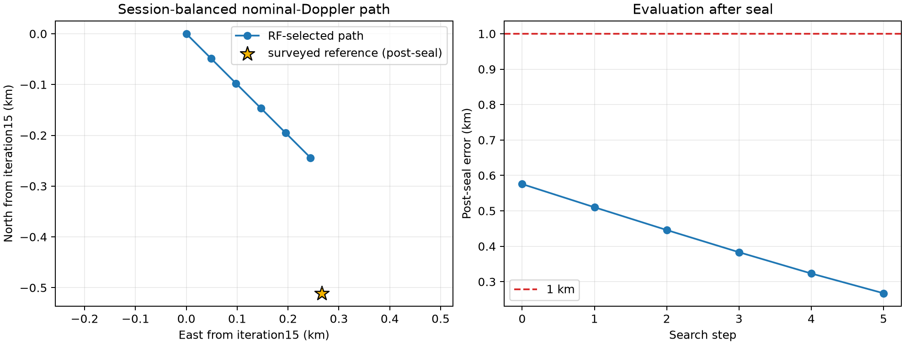

# DS1 iteration 20: session-balanced profiled nominal-Doppler selector

## Question

Does the iteration-15 local basin depend on allowing a large number of
per-NORAD rate corrections to participate in geographic selection?  This arm
uses the same twelve sessions, hard identities, two receive-time offsets,
exact causal Doppler construction, cap-800 residual measure, and frozen group
weights as the iteration-15 contract.  It changes the geographic selector:
the rate of every NORAD is fixed to zero, each session is scored separately
after profiling its track CFOs, and the six session scores in a group have
equal weight.

The iteration-15 file is used only as a complete reference-free origin and
frozen-input contract.  It is not treated as a current scientific
qualification claim.

## Predeclared procedure

The search starts at the frozen origin on a 48.828125 m symmetric lattice,
then uses 24.4140625 m and 12.20703125 m lattices.  A stage may translate at
unchanged spacing at most four times; it advances only after an interior
winner.  Thus a boundary point is never reported as a position estimate.

At the selected interior point, a separate exact rate audit uses a widened
`±0.50 s/h` guard.  It begins with the matched `±0.25 s/h` scalar solution
and explores only the adjacent outer interval when that control solution is
at its own guard.  This active-set continuation prevents a scalar optimizer
from jumping between orbital-phase minima.  A rate is considered effectively
on the widened guard at `|rate| >= 0.50 - max(5*xatol, 1e-6) s/h`, so the
audit cannot quietly accept an optimizer result within scalar tolerance of the
bound.  Direct exact SGP4 replay must also remain within 0.2 Hz.

## Result

The selector moved southeast at every one of the five permitted 48.828125 m
stage-0 lattices.  It therefore exhausted the sealed transition budget before
an interior minimum and is **unqualified**.  It does not provide a replacement
DS1 position estimate.

| Quantity | Result |
| --- | ---: |
| Unique group-coordinate fits | 58 |
| Runtime, four workers | 278.0 s |
| Geographic stages reached | 1 of 3 |
| Final offset from iteration15 | +244.141 m east, -244.141 m north |
| Final session-balanced objective | 0.15420025 |
| Group 00 / 16 equal-session losses | 0.14562273 / 0.15744075 |
| Post-seal parent / final-boundary error | 0.575577 / **0.267450 km** |
| Geographic disposition | Unqualified boundary diagnostic |

The boundary path happens to approach the surveyed coordinate monotonically:
0.510, 0.446, 0.383, 0.323, then 0.267 km.  That error sequence is only a
post-seal diagnostic.  It cannot choose a stopping point, expand the lattice,
or turn the final boundary cell into an estimate.



The zero-rate direct-SGP4 fidelity gate passes in both groups with 0 Hz maximum
surrogate discrepancy at zero phase.  The widened-rate audit did not run: it
is intentionally downstream of an interior geographic winner and no such
winner exists.  It is diagnostic only and never contributes to geographic
selection or qualification.

## What worked

The objective has a clear, stable southeast direction even after removing
per-NORAD rate freedom from geographic selection.  This means the open
direction seen here is not created solely by the rate hierarchy.  It also
demonstrates why session representation matters: each session has one vote
inside its group rather than being dominated by its number of tracks or
occupied seconds.

The frozen group weights remain intentionally unequal: group 00 contributes
0.2742 and group 16 contributes 0.7258, so a group-16 session has 2.65 times
the aggregate-group authority of a group-00 session after each group has been
internally session-balanced.  This is a carried-forward information weighting,
not equal weighting over all twelve sessions.

## What did not work

Session balancing and zero per-NORAD rates did not close a geographic basin.
The selector continued toward the southeast over 244 m, reaching the first
stage boundary.  The result rules out neither further nominal-Doppler
improvement nor a closer surveyed location; it only says that the frozen
experiment has not established an interior optimum.

This is also not held-session prediction or leave-one-session-out training.
Every session contributes to every selector score through its own profiled
track CFOs.  Calling it predictive would overstate the evidence, especially
because no selected NORADs recur across the six-session groups.

The separate association audit identifies 13 identity-sensitive tracks across
four NORADs that each occur in only one DS1 session.  NORAD 68674 is among
them.  These tracks cannot support a transferable per-NORAD rate estimate;
they must be treated as a small unstable subset in a future rate comparison,
rather than evidence that the geographic direction is a robust orbit-rate
effect.

## What this can establish

An interior basin with a passing zero-rate fidelity gate would show that a
selector which does not use rate flexibility can localize the same fixed
observations.  It would not prove that orbit-rate corrections are physical;
that nuisance is deliberately excluded from qualification here.

The next iteration should first make the rate question transferable rather
than add another nuisance.  It will use the existing randomized TRAIN/HELD
time masks to compare (a) zero-rate nominal Doppler and (b) rates fitted only
on TRAIN, then score both on HELD observations at the same frozen geographic
cells.  A cached session-deletion influence diagnostic will accompany the
comparison, without inventing a post-run deletion threshold.  The four
single-session NORADs, including 68674, remain explicitly flagged.

The session-slope nuisance remains a later diagnostic.  Its observed
within-session structure is interesting, but adding freedom now risks
recreating the same geography/nuisance degeneracy that this zero-rate arm was
designed to isolate.

## Reproduction

```bash
.venv/bin/python -m pytest -q \
  reports/2026_09_25_ds1_iteration20_session_predictive/test_run.py

OPENBLAS_NUM_THREADS=1 OMP_NUM_THREADS=1 MKL_NUM_THREADS=1 \
  .venv/bin/python reports/2026_09_25_ds1_iteration20_session_predictive/run.py \
  --output reports/2026_09_25_ds1_iteration20_session_predictive/inference.json \
  --checkpoint-dir reports/2026_09_25_ds1_iteration20_session_predictive/checkpoints \
  --workers 4

.venv/bin/python reports/2026_09_25_ds1_iteration20_session_predictive/qualify.py \
  --inference reports/2026_09_25_ds1_iteration20_session_predictive/inference.json \
  --fidelity reports/2026_09_25_ds1_iteration20_session_predictive/zero-rate-fidelity.json \
  --output reports/2026_09_25_ds1_iteration20_session_predictive/qualification.json

.venv/bin/python reports/2026_09_25_ds1_iteration20_session_predictive/evaluate_postseal.py \
  --inference reports/2026_09_25_ds1_iteration20_session_predictive/inference.json \
  --qualification reports/2026_09_25_ds1_iteration20_session_predictive/qualification.json \
  --output-dir reports/2026_09_25_ds1_iteration20_session_predictive/evaluation
```
