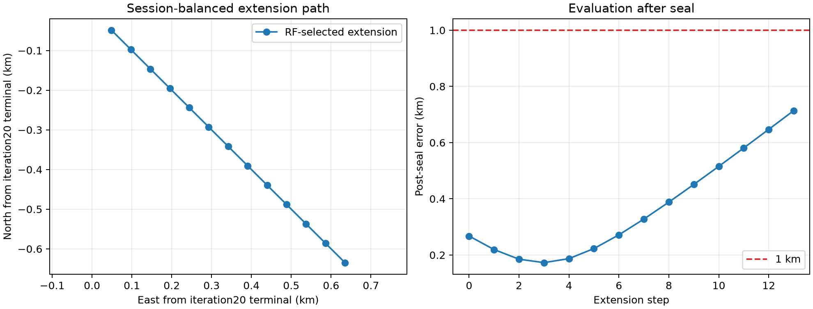

# DS1 iteration 21 — session-balanced closure extension

## Result

This was a **reference-free continuation**, not an independent validation.  It
started at iteration 20's sealed terminal boundary and followed its
predeclared 48.828125 m boundary rule for up to twelve more translations before
any refinement.  Every one of the thirteen evaluated stencils selected its
southeast edge.  The run therefore ended at its cap without geographic
closure, is **not qualified**, and did not enter either finer grid.

The final RF-selected coordinate was 37.8457274223°, -122.4786852660°,
0.634765625 km east and 0.634765625 km south of the iteration-20 terminal
coordinate.  The frozen session-balanced profiled nominal-Doppler objective
continued to fall from 0.1539466805 at extension step 0 to 0.1512452862 at
step 12.  The reference was introduced only after the inference and its
qualification were sealed: the terminal diagnostic error is 0.713795 km.
This is an unqualified diagnostic, not an accuracy result.



## Frozen inference contract

The geographic objective is exactly iteration 20's **session-balanced
profiled nominal-Doppler** objective: hard iteration-10 satellite identities,
fixed group time offsets (-0.75 s for `20260921_00`, -0.50 s for
`20260921_16`), exact Doppler, cap 800 Hz, a profiled per-track CFO, and rates
fixed to zero.  Within each group, each of the six sessions has equal weight;
the two groups retain the frozen information weights 0.2742 and 0.7258.  Thus
this is not equal weighting across all twelve sessions: a `20260921_16`
session retains more aggregate authority than a `20260921_00` session.

The parent was accepted only as a *sealed reference-free terminal boundary*,
not as a qualified solution.  The reference position was unavailable to the
runner.  The plan, parent, objective source, runner, and all sealed
post-processing artifacts are SHA-256-bound in the machine-readable outputs.

| Stage | Grid spacing | Predeclared maximum translations | Result |
| --- | ---: | ---: | --- |
| 0 | 48.828125 m | 12 | 13 southeast edge winners; cap reached |
| 1 | 24.4140625 m | 4 | Not entered: stage 0 did not close |
| 2 | 12.20703125 m | 4 | Not entered: stage 0 did not close |

## Qualification and fidelity

| Gate | Result | Evidence |
| --- | --- | --- |
| Interior geographic closure | **Fail** | Final stage-0 winner is on its southeast edge |
| Per-coordinate session-score coverage | Pass | Both groups retain all six session scores at every cached coordinate |
| Zero-rate direct SGP4 replay | Pass | 8,285 and 9,686 observations; RMS, p99, and maximum discrepancy are 0 Hz in the two groups |
| Widened rate fit | Not a gate | Deliberately excluded from selection and qualification |

The zero-rate replay evaluates the iteration-21 winner itself and keeps Earth
rotation fixed at receive time plus the frozen group time offset.  It confirms
the scorer is reproducing its intended exact SGP4 nominal-Doppler model; it
does not demonstrate that the geographic optimum has been found.

## Post-seal diagnostic only

The unobserved reference happens to be closest at extension step 2 (0.172805
km).  RF scoring still preferred the southeast continuation, so the terminal
diagnostic worsened to 0.713795 km.  That mismatch is why reference data were
not allowed to stop, reverse, or refine this run.  It indicates a remaining
systematic direction in the frozen zero-rate objective rather than evidence
for a sub-300 m result.

## Sensitivity context inherited from iteration 20

The exact iteration-20 cached-cell sensitivity audit found that frozen group
weights and literal 1/12 session weights had the same strict ordering across
all 29 cached cells.  Each of the twelve leave-one-session deletions selected
the same five-step southeast path (60 of 60 decisions).  Dropping each
identity-sensitive NORAD separately, or all four together, also preserved that
path.  The unstable sources are 13 tracks from four single-session NORADs,
including 68674.  This is evidence that the iteration-20 boundary direction
was not caused by those particular cached-cell perturbations.  Its scope ends
at the cached iteration-20 cells; it supplies no counterfactual evidence
beyond that boundary.

## Artifacts and reproducibility

Run the stages in this order from the repository root:

```bash
OPENBLAS_NUM_THREADS=1 OMP_NUM_THREADS=1 MKL_NUM_THREADS=1 \
  .venv/bin/python reports/2026_09_25_ds1_iteration21_session_balanced_closure/run.py \
  --output reports/2026_09_25_ds1_iteration21_session_balanced_closure/inference.json \
  --checkpoint-dir reports/2026_09_25_ds1_iteration21_session_balanced_closure/checkpoints \
  --workers 4
OPENBLAS_NUM_THREADS=1 OMP_NUM_THREADS=1 MKL_NUM_THREADS=1 \
  .venv/bin/python reports/2026_09_25_ds1_iteration21_session_balanced_closure/zero_rate_fidelity.py \
  --inference reports/2026_09_25_ds1_iteration21_session_balanced_closure/inference.json \
  --output reports/2026_09_25_ds1_iteration21_session_balanced_closure/zero-rate-fidelity.json
.venv/bin/python reports/2026_09_25_ds1_iteration21_session_balanced_closure/qualify.py \
  --inference reports/2026_09_25_ds1_iteration21_session_balanced_closure/inference.json \
  --fidelity reports/2026_09_25_ds1_iteration21_session_balanced_closure/zero-rate-fidelity.json \
  --output reports/2026_09_25_ds1_iteration21_session_balanced_closure/qualification.json
.venv/bin/python reports/2026_09_25_ds1_iteration21_session_balanced_closure/evaluate_postseal.py \
  --inference reports/2026_09_25_ds1_iteration21_session_balanced_closure/inference.json \
  --qualification reports/2026_09_25_ds1_iteration21_session_balanced_closure/qualification.json \
  --output-dir reports/2026_09_25_ds1_iteration21_session_balanced_closure/evaluation
```

The primary artifacts are `inference.json`, 13 immutable stage checkpoints,
`zero-rate-fidelity.json`, `qualification.json`, and
`evaluation/postseal-evaluation.json`; the latter three have SHA-256 sidecars.
The qualification and evaluator also bind the exact inference SHA-256.

## What worked, what did not, and next

The implementation correctly preserved the frozen objective, produced
per-session score records for every tested coordinate, and rejected the result
despite a seemingly attractive post-seal early point.  The extension did not
find the required interior basin, so it cannot support the planned finer
resolution or a position claim.

The next experiment should not add a new session-slope nuisance to this
degenerate basin.  Instead, use a true randomized-time TRAIN/HELD experiment
to compare zero rate against train-fitted but transferable rate corrections,
and retain cached session-deletion influence as a diagnostic.  Any future
geographic extension needs a predeclared way to handle this persistent
one-direction nominal-Doppler trend before treating a finer lattice as a
resolution measurement.
