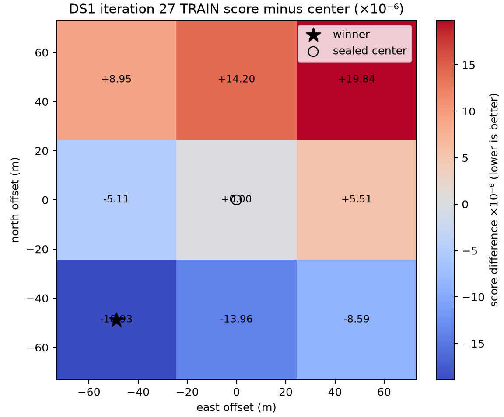

# DS1 iteration 27: exact phase-state cache and sealed stencil

## Decision

**No-go.** The repaired anchor smoke passed every numerical gate, so the predeclared nine-cell 48.828125 m stencil ran. The stencil then failed the two scientific location gates: its exact-material winner was the southwest cell, not the sealed center, and all 12 leave-one-session reranks also selected southwest. The exact and atlas winner matched, and the winning gap passed, so this is not a surrogate failure.

The inference used the original randomized TRAIN rows only. Identities, group taus (`-0.75/-0.50 s`), group weights (`0.2742/0.7258`), per-track profiled CFO, rate prior, quadrature, robust energy, cap-800 score, and all thresholds are inherited from iteration 26. Truth and HELD were absent from association, cache construction, scoring, gates, and selection. A separately labelled post-seal evaluation read the surveyed coordinate only after `stencil.json` was sealed.

## Worked

The `ds1-phase-state-cache/v1` repair removed iteration 26's remote quartic extrapolation. It holds exact ECEF position and velocity arrays for 250 source/session relations under `/tmp/ds1-iteration27-phase-state-cache`. Its manifest binds group, session, causal snapshot/archive payload, capture epoch, NORAD, integer tau, TRAIN-time vector, schedule, frozen assignments, runner, raw IEEE-754 rate/phase nodes, and exact per-row nanosecond corrections. Chunk payloads contain only ECEF position/velocity arrays.

The atlas contains 18,516 phase nodes in 250 chunks (33,937,081 bytes). Initial one-second knots plus endpoints and zero were sufficient; deterministic midpoint validation requested zero additional knots. The sealed manifest is 22 MB because it records the exact numeric identities and per-row corrections. Its anchor midpoint maximum was `3.8073365e-05 Hz`, far below `0.2 Hz`.

The anchor smoke passed:

| Gate | Result |
|---|---:|
| Repeat difference | `0` |
| Coarse/fine difference | `1.7178646e-09` |
| 12σ/16σ difference | `1.0794000e-11` |
| Maximum transformed-tail mass | `6.7399724e-58` |
| Maximum atlas/direct error | `3.8073365e-05 Hz` |
| Direct-material minus full-atlas score | `8.5750851e-14` |

The final anchor score was `0.06465994040097511`; the direct-material score was `0.06465994040106086`. Transformed tails were propagated directly. Zero, every refined mode, every material node, and deterministic 1% nonmaterial nodes were audited against direct SGP4. The smoke completed in `106.21 s` under the external 1,800-second timeout.

The unlocked stencil also passed its numerical gates. Direct material-node unions were built per source across all nine cells, then replayed at every cell. All adjacent atlas intervals were checked at all cells (7,101,360 receiver/observation comparisons). The maximum error was `3.8074631e-05 Hz`. Exact-material and atlas scoring both selected `E-48.828125_N-48.828125`; the `4.9728809e-06` gap to south-center exceeded the required `2e-6`. The stencil completed in `451.48 s`.



## Failed

The required center cell scored `0.06465994040106086`. The southwest winner scored `0.06464100895381929`, lower by `1.8931447e-05`. Scores rose monotonically from southwest toward northeast on this fixed lattice. Translation and refinement were forbidden and were not run.

Every omitted-session rerank selected the same southwest cell:

| Group | Omitted session | Winner |
|---|---|---|
| 20260921_00 | `scan-hop-24ad6788936de72f` | southwest |
| 20260921_00 | `scan-hop-30ff691861c6bb53` | southwest |
| 20260921_00 | `scan-hop-75ec9d92534c0293` | southwest |
| 20260921_00 | `scan-hop-79cca97e97a1541c` | southwest |
| 20260921_00 | `scan-hop-85afa91453f8847b` | southwest |
| 20260921_00 | `scan-hop-f749f13b64256b8d` | southwest |
| 20260921_16 | `scan-hop-0dcc48743f9f5487` | southwest |
| 20260921_16 | `scan-hop-2ea5bcf9b18778cc` | southwest |
| 20260921_16 | `scan-hop-5f69c606f9bb3a8f` | southwest |
| 20260921_16 | `scan-hop-d026d3a5a705523e` | southwest |
| 20260921_16 | `scan-hop-e1422297a1ff6598` | southwest |
| 20260921_16 | `scan-hop-f354f1c88a654681` | southwest |

The separately sealed post-seal diagnostic reports `1.1128417312 km` error for the southwest winner versus `1.1792853320 km` for the sealed center. This diagnostic did not select a cell or alter the no-go decision.

## Learned

Iteration 26's rejection was numerical, and this atlas repairs it with a large margin. A local four-knot barycentric cubic over exact one-second states is already much more accurate than required throughout the material phase range; adaptive bisection infrastructure remains available if a future source needs it. Direct tails and material corrections change the pooled score by less than `1e-13` here.

The fixed local TRAIN surface still points southwest at its boundary. Its direction is stable to every session omission and agrees under atlas and direct-material scoring. That consistency is useful evidence about the local objective, but the sealed design requires the center to win and explicitly forbids following an edge winner in this iteration.

## Next

Do not translate or refine this stencil under the iteration-27 contract. A subsequent predeclared iteration may investigate why the inherited fixed-center premise disagrees with the stable southwest slope, while retaining the sealed cache provenance and direct material-node checks. It should define any expanded lattice before reading its outputs and should keep truth and HELD outside inference.

## Reproduction and artifacts

```bash
env OPENBLAS_NUM_THREADS=1 MKL_NUM_THREADS=1 OMP_NUM_THREADS=1 NUMEXPR_NUM_THREADS=1 \
  .venv/bin/pytest -q reports/2026_09_25_ds1_iteration27_phase_cache/test_run.py

env OPENBLAS_NUM_THREADS=1 MKL_NUM_THREADS=1 OMP_NUM_THREADS=1 NUMEXPR_NUM_THREADS=1 \
  timeout --signal=TERM 1800s .venv/bin/python \
  reports/2026_09_25_ds1_iteration27_phase_cache/run.py --stage smoke \
  --output reports/2026_09_25_ds1_iteration27_phase_cache/smoke.json

env OPENBLAS_NUM_THREADS=1 MKL_NUM_THREADS=1 OMP_NUM_THREADS=1 NUMEXPR_NUM_THREADS=1 \
  timeout --signal=TERM 1800s .venv/bin/python \
  reports/2026_09_25_ds1_iteration27_phase_cache/run.py --stage stencil \
  --smoke reports/2026_09_25_ds1_iteration27_phase_cache/smoke.json \
  --output reports/2026_09_25_ds1_iteration27_phase_cache/stencil.json
```

`plan.json`, `smoke.json`, `stencil.json`, and `checkpoint.json` are sealed machine-readable records. The external cache manifest and chunks are also sealed and reusable but intentionally remain outside Git. `evaluation/postseal-evaluation.json` is the separately sealed post-inference reference comparison.
